MagicFusion: Boosting Text-to-Image Generation Performance by Fusing Diffusion Models
===
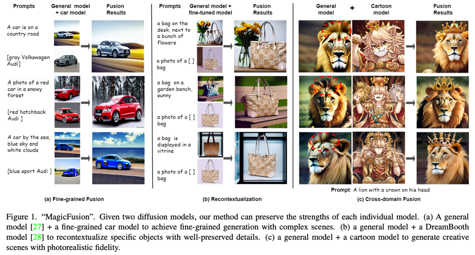
두개의 디퓨전 모델을 효과적으로 앙상블해보자는 연구  
비슷한 연구로 컨셉러닝이나 Blended diffusion처럼 노이즈를 혼합하는 방법들이 있지만 각 모델의 장점을 살려서 혼합하는 것은 아니다.  

* Saliency-aware Noise Blending(SNB)를 제안한다. 추가 학습 없이 두 디퓨전을 노이즈에서 혼합하는 것ㅇ디ㅏ.
* 디퓨전을 앙상블하는 것 자체가 처음 제안되는 주제이다.

> c 예시를 보면 General model은 우리가 아는 사자를, Cartoon model은 사자가 왕관을 쓴다는 비현실적인 모습을 각각 담당한다.
> 의도적으로 General에서는 일반적인 사자의 모습, Cartoon에서는 그림체는 가져오지 않고 왕관에 대한 표현을 가져오는 부분을 각 모델의 장점을 살린다는 표현인 것 같다.

## Method
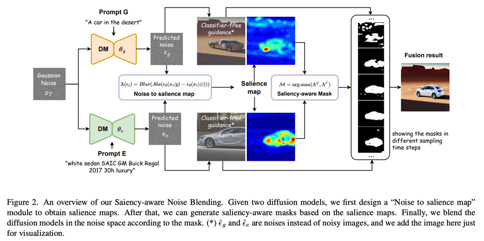

저자들은 Classifier-free Guidance의 difference 부분(condition-uncondition)을 시각화 하였을 때, attention map처럼 중요한 영역이 활성화되는 것을 확인했다고 한다.

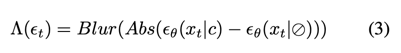

이걸 salience map이라고 부른다.  
   
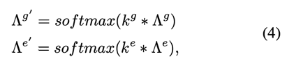

두개를 섞어줄 것이기 때문에 각각 softmax해줘서 상대적으로 집중하는 영역만 보도록함

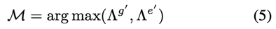

> 두개가 반대인 것 같다. 코드로 봤을 때는 반대가 맞다.

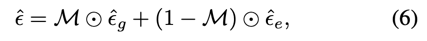

Blended Diffusion에서 제안하는 방법대로 두개의 노이즈를 섞는다.  
expert는 특정 객체 영역이, general은 전역적인 영역의 값이 크기 때문에 Blended Diffusion에서 원본에 배경을 섞는 대신 생성된 배경을 섞는 것이라고 생각하면 쉽게 이해가 된다.
                           
가장 처음에 봤던 Figure 1을 기준으로 a와 b는 이상적으로 salience map이 객체와 배경영역을 집중한다.  
반면에 c의 경우는 General은 고주파 영역, Cartoon은 저주파 영역에 집중한다고 한다.  
> 하지만 이것에 대한 실제 map은 보여주지 않는다.

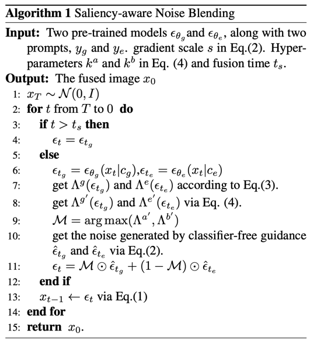

그리고 위 알고리즘에서 슬쩍 언급되는 k는 general과 expert의 비중을 하이퍼파라미터로 조정하라는 내용이다.
> 하지만 이 k값도 몇으로 사용했는지 알려주지 않는다.  
> 코드상에는 1,1 로 하고 있다.

> 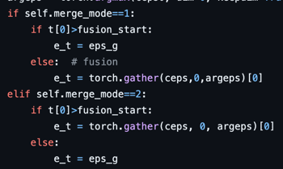   
> Figure 1의 a는 타임스텝이 하이퍼파라미터보다 작을 때 fuison 해주고 (후반부),  
> b는 타임스텝이 하이퍼파라미터보다 클 때 fusion 해준다. (전반부)  
> 이 또한 논문에 설명이 없고 코드에서 확인했다.  
> c에 대한 부분은 없다...
                     
## Experiments
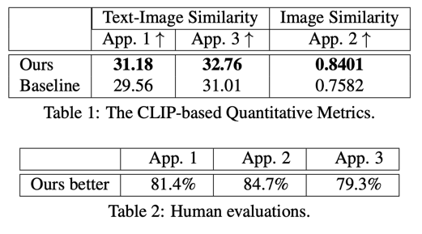

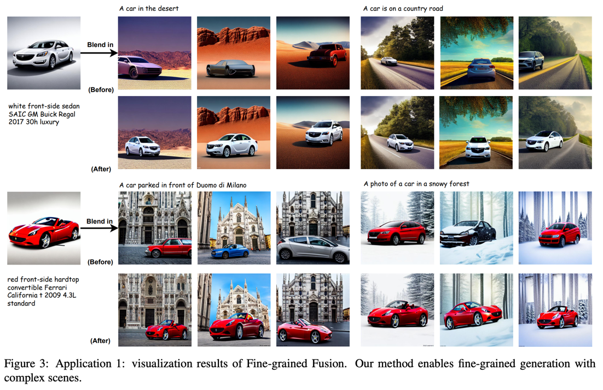

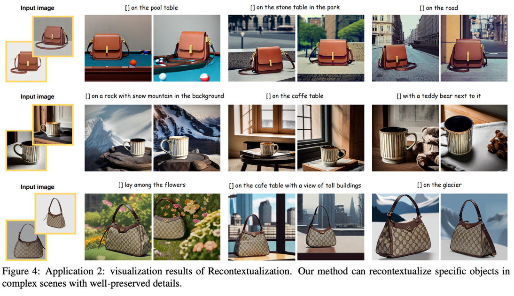

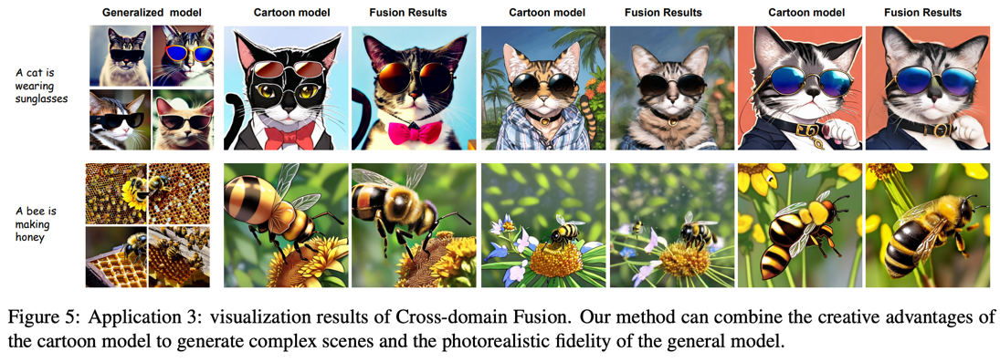
