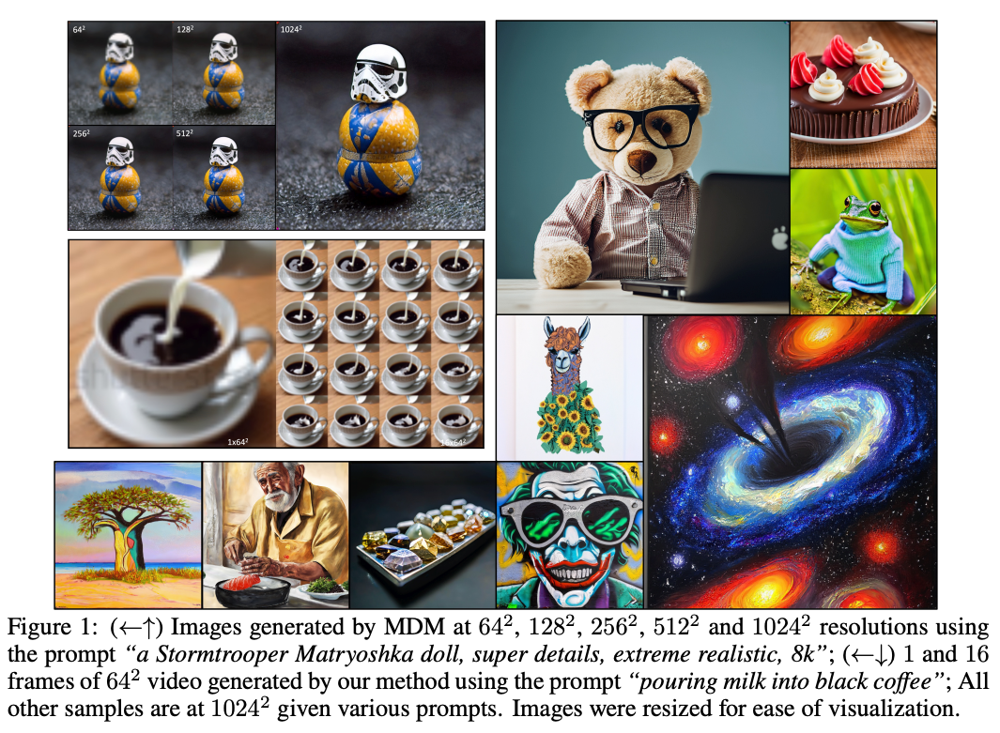
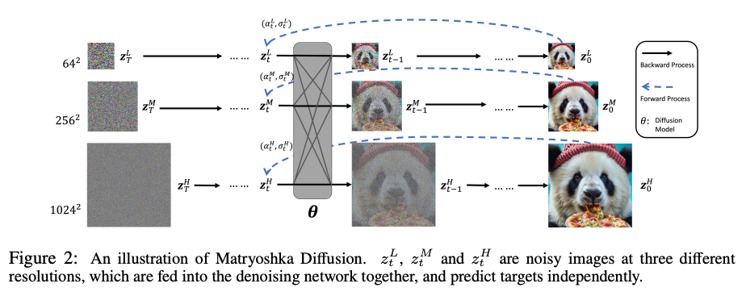
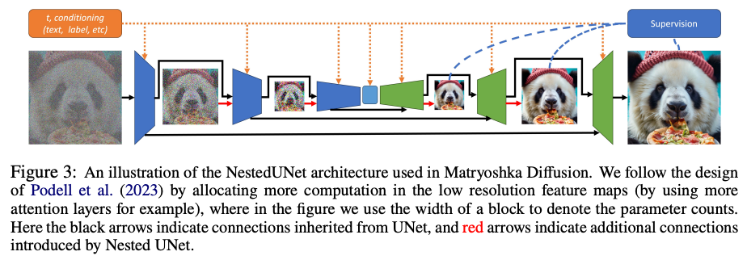
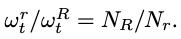
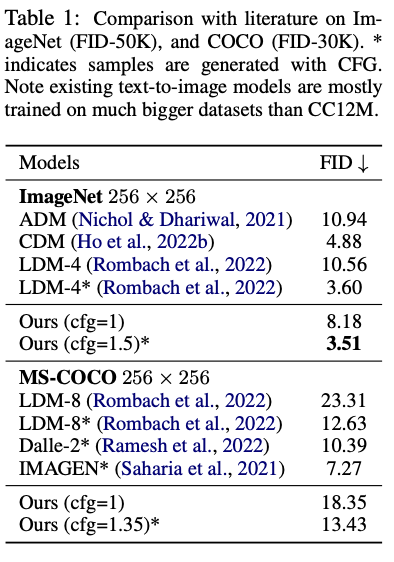
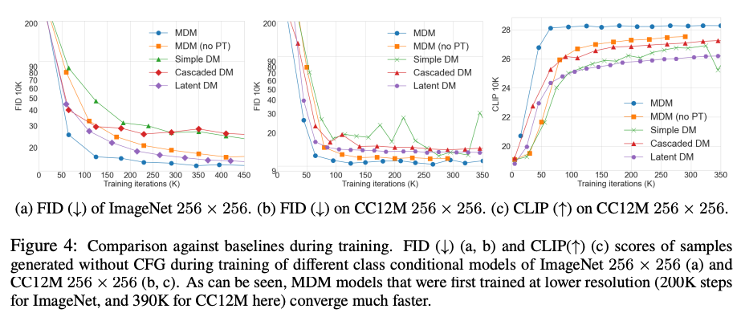
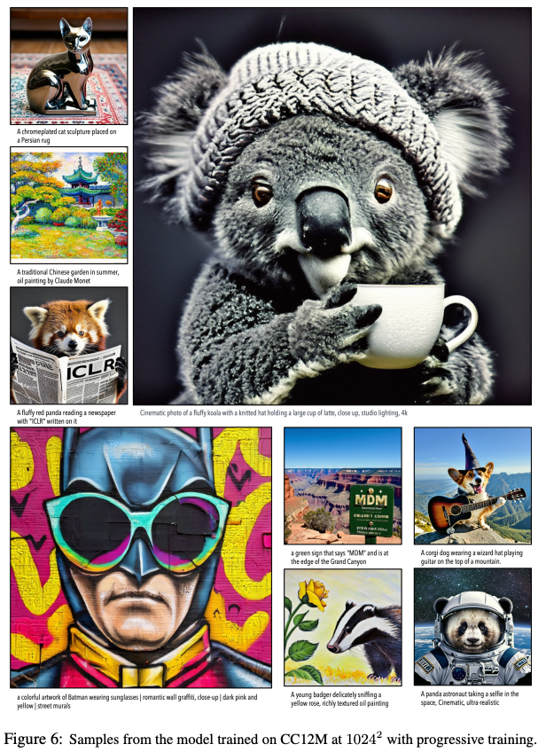
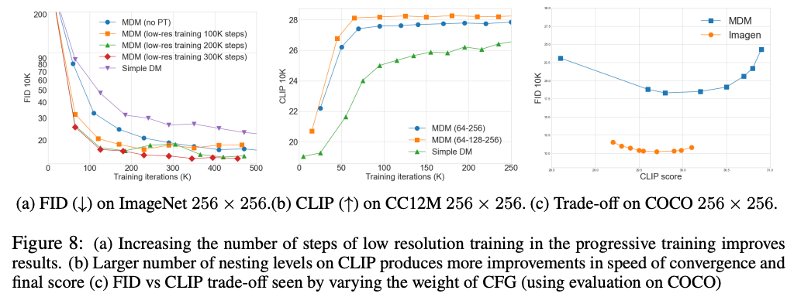
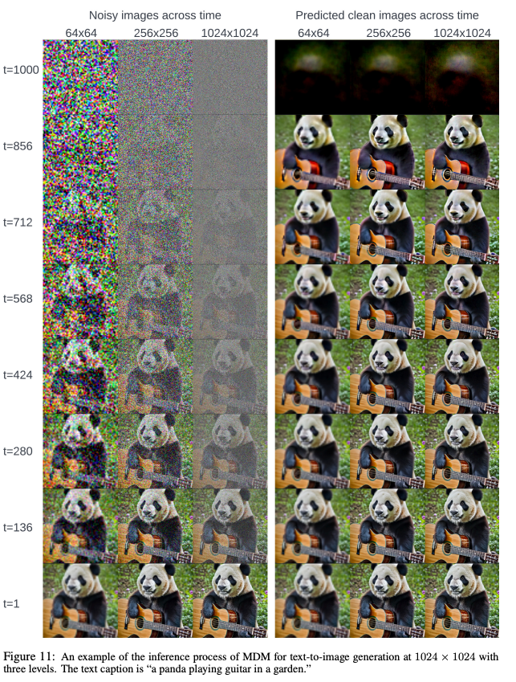

Matryoshka diffusion Models
===
ICLR 2024 / arxiv 23.10 / Apple 
###
  
## Introduction  
기존 방법들은 단계별로 업스케일링을 하기 때문에 큰 해상도를 다시 입력하는 과정에서 많은 리소스를 사용한다.  
리소스를 줄이는 연구도 있지만 품질에서는 떨어지는 모습을 보인다.  
Imagen같은 경우는 3개의 모델을 따로 학습시켜야 한다.  
이를 해결하는 Nested UNet을 제안한다.  
1) multi-resolution loss: 수렴 속도 크게 향상  
2) efficient progressice training schedule  

###
***
## Methods  
### Diffusion Models in extended space  
  
이 논문에 핵심은 다양한 해상도의 이미지를 같은 파라미터로 생성하도록 학습한다는 것이다.  
위 그림처럼 1024로부터 다운샘플링(average pooling) 이미지를 만들고 이것들이 같이 입력된다.   
여기서 당연히 들어야 하는 의문점은 입력사이즈가 다른데 파라미터를 공유한다는 점이다.  
  
이 논문에서 제안한느 Nested UNet의 구조는 그림3을 보면 이해하기 쉽다.  
UNet의 각 레이어(conv->attention + skip_connection)사이마다 각 해상도의 이미지를 입력해주는 것이다.  
* 기존 방법들에서 중간 해상도를 생성하는 정보를 고해상도에서 참고하는 정책을 똑같이 사용하면서  
* 기존 방법들처럼 해상도마다 각각의 모델을 따로 사용하지 않는다.  
> 정확하게 적혀있지는 않지만 다운샘플(1024)와 512를 concat해서 넘겨주는 것 같다.  
> 즉 위 그림을 기준으로 제일 안쪽에는 64x64*3짜리가 입력되는 것이다.  
> 마치 Inpainting에서 마스킹된 이미지가 추가적인 조건처럼 작용하는 것처럼 고해상도의 z를 참고하는 효과를 얻을 수 있다.  
###  
  
각 해상도 별로 L2를 사용한다. w는 해상도에 반비례하게 (작을 수록 큰 ) 가중치를 준다.  
  
###  
학습할 때는 점차적으로 해상도를 키워가면서 학습한다.  
잘 되지도않는데 리소스를 많이 먹는 큰 해상도는 아예 초반에 제외시켜서 학습 효율을 증가시킨다.

###
***  
## Experiments  
64x64로 200k이터만큼 warm-up을 한다. no-PT는 이 과정없이 바로 한 것이다. (progressive training)  
ImageNet은 256*256, CC12M은 1024*1024와 256*256 다 있는 데이터셋이다.  

* 정량적인 평가  
  *   
###
* 수렴 속도 비교  
  * 
###
* 정성적인 평가 (캡쳐본이라 해상도가 떨어지긴하지만...)
  * 
###
* Ablation studies
  * 
    * a: progressive training
    * b: 해상도의 단계를 증가할 수록 더 좋았다.  
    * c: CFG에 따른 비교, Imagen이 데이터셋을 더 많이 사용하기 때문에 FID가 높지만 실제로 CLIP score가 이미지와 시각적 품질에 상관간계가 더 높다고 말한다. 

###
## Apendix  
*   
* 
