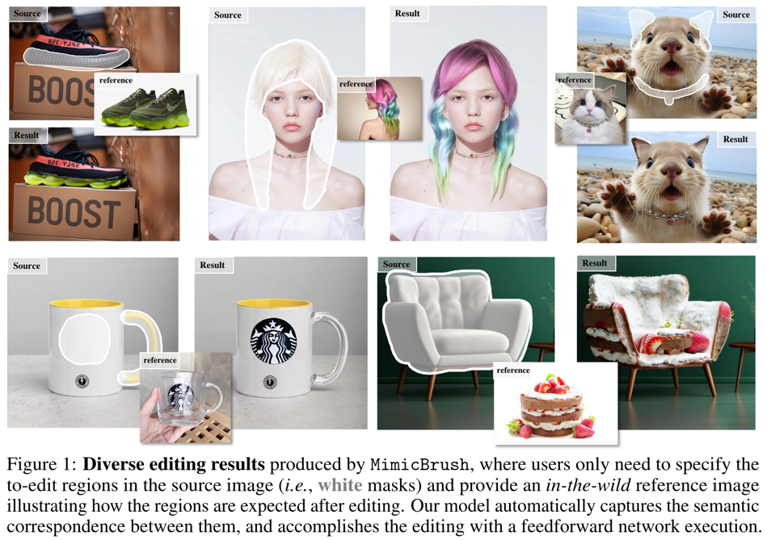
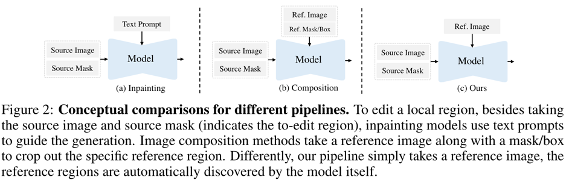
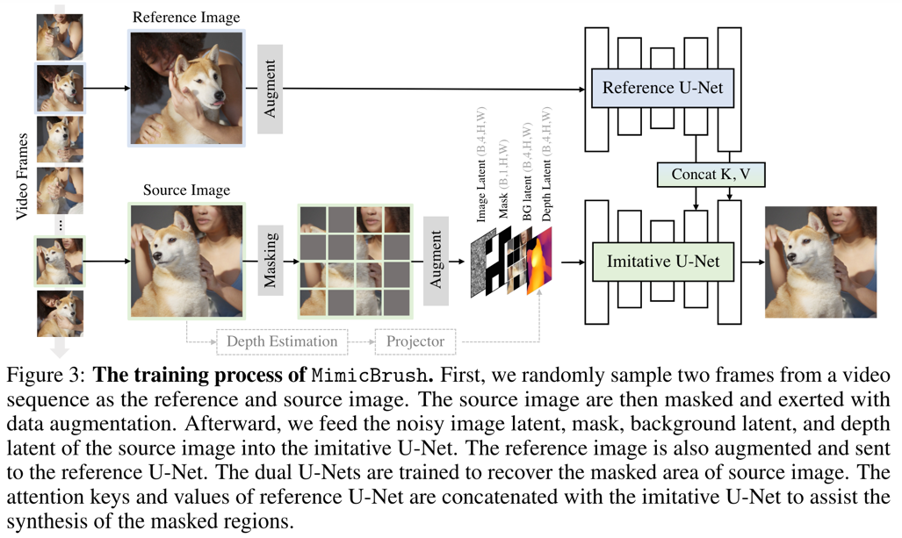
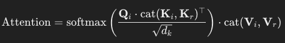
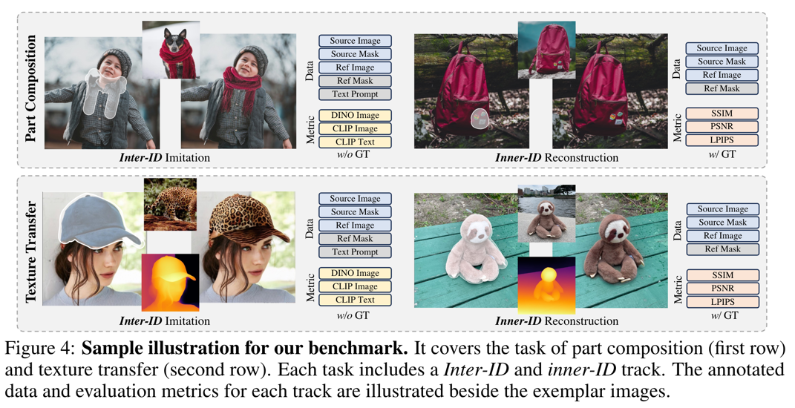
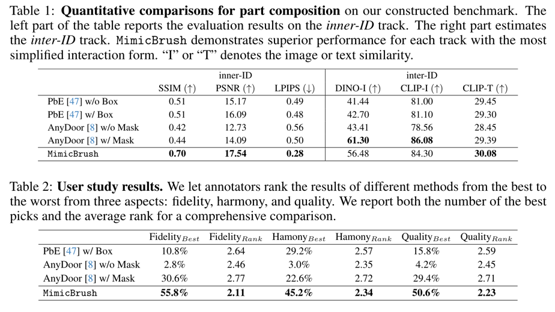
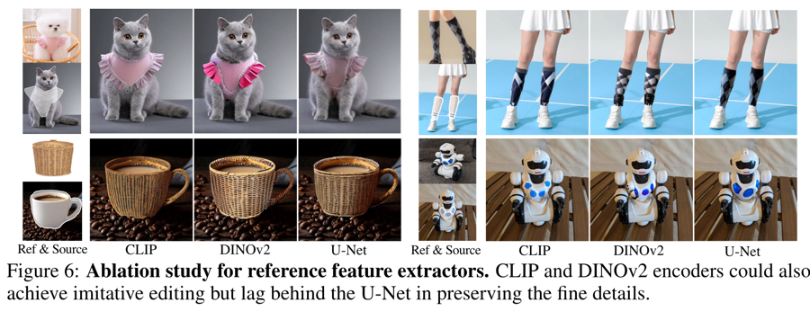
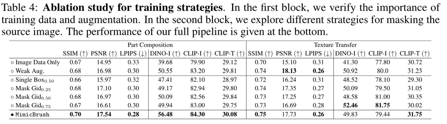

Zero-shot Image Editing with Reference Imitation
===
arxiv 24.06          

  

## Introduction
  
Image Editing task에서 "어떤" 이미지를 생성하게 할지 가이드하는 것이 생각보다 어렵다.  
그림 1의 신발 밑창이나 머리색과 같은 케이스를 텍스트로 표현하는 것은 너무 어렵다.  
때문에 reference image를 사용하는데, 생성하고자 하는 부분적인 요소의 텍스처나 패턴만 따로 입력하는 것이 어렵다.  
그렇다고 해당 부분만 추출해서 사용하기에는 context가 정확히 전달되지 않는다.  
때문에 reference mask를 사용하는 composition 방식이 사용되었다.  
이 논문은 이 reference mask를 제거하는 것을 목적으로 하는 imitating editing을 제안하고 이를 사용한 Mimic Brush라는 프레임워크를 소개한다.  

## Method
  
이를 위해 비디오 데이터를 사용한다.  
여기에 사용된 비디오는 일관된 콘텐츠가 다양한 시각적 변화로 보여지는 데이터를 사용한다.  
1. 비디오 데이터에서 두개 프레임을 선택
2. reference 이미지에서 나온 K,V를 condition으로 Imitative U-Net에 사용한다.  
3. Imitative U-Net은 MAE방식(mask->reconstruct)으로 학습한다.
* (optional) augmentation효과를 주기 위해 Depth Estimation을 하여 입력에 concat한다.

### Model Structure
* Imitative U-Net
  * baseline : Stable Diffuson 1.5 inpainting 모델
  * 기존 CLIP text embedding => CLIP image embedding + projection layer
    * image embedding, projection 둘 다 최적화
####
* Reference U-Net
  * baseline : Stable Diffuson 1.5
  * 
####
즉, reference image의 CLIP image embedding과 U-Net의 K,V를 concat해서 condition으로 사용하는 형태이다.  
optional로 Depth Anything 모델을 통해 예측한 Depth정보를 입력에 추가해서 사용한다. (dropout : 0.5)

### Training Strategy
1. 두 이미지 사이에 correspondence relation이 있어야 한다.
2. 두 이미지 사이에 시각적인 큰 변화가 있어야 한다.

비디오 데이터 수집이 어렵다는 점을 고려하여 이미지에 augmentation을 적용하는 방법도 고려한다.  
마스킹할때 배경영역들이 많으면 너무 쉬우니까 SHIFT 매칭을 통해 객체위주의 마스킹 비중을 높혔다.  

### Evaluation Benchmark
  
DreamBooth와 수동으로 만든 마스크로 이루어진 벤치마크를 제안한다.

## Experiments
  

 
### Ablation study
  
  
이전 연구들에서 U-Net을 encder로 사용하는 연구들이 있었다.  
(cross-attention으로는 16x16패치 토큰이 사용된다.)  
이 방법을 사용했을 때, 정량적으로 큰 차이가 없지만 정성적으로는 디테일을 더 잘 보존하였다.
####
  
* 비디오 데이터를 같이 사용하는 것이 성능이 더 좋다.
  * > 아무래도 비디오가 더 현실적으로 변화하니까 더 좋은 것 같다.
* 마스킹을 할때 제안하는 방법이 더 좋다.
  * 단순한 마스킹은 학습 난이도를 낮추기 때문에 성능이 저하된다.
