Negative-prompt Inversion: Fast Image Inversion for Editing with Text-guided Diffusion Models
===
arxiv 23.05  

## Introduction  
이미지 에디팅에서는 원래 이미지의 세부사항을 재현하는 것이 중요하다. (high fidelity)  
이를 위해서 최신 연구들은 모델 가중치, 텍스트 임베딩, 잠재변수를 최적화하는 방향으로 연구되었다.

이 논문에서 제안하는 것은 이러한 최적화 과정이 필요하지 않고 forward computation만 사용하여 high-quality의 reconstruction을 하는 것이다.  
결과적으로 NTI(null-text inversion)보다 30배 빠르고 성능은 DDIM보다 더 좋다고 한다.  
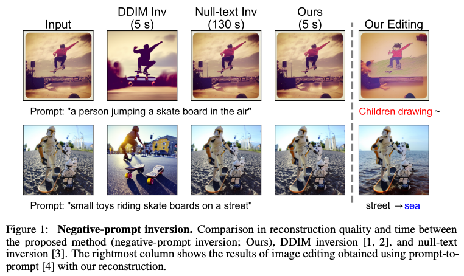  

### DDIM inversion        
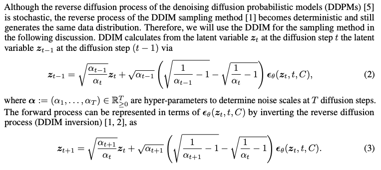  
### Null-text inversion
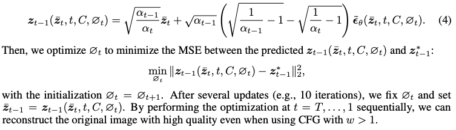  

## Proposed Method  
### Negative-prompt inversion  
* 가정1 : 생성중인 zt-는 원본에서 forward한 zt*과 동일하다. (=학습이 완벽하다.)  
    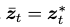  

3번식에서 한스텝씩 낮추어 inversion을 표현하면 아래와 같다.  
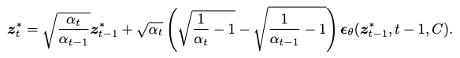  
이 식을 가정1에 의해서 4번식에 대입한다.  
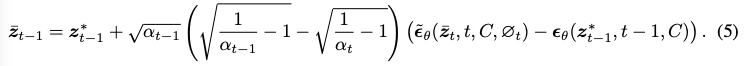  
가정1이 t-1에서도 똑같으니 위 식이 맞으려면 입실론 텀이 0이되어야 한다.  
입실론~는 CFG까지 거친 입실론을 말하는 것이니 아래처럼 정리할 수 있다.  
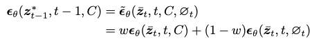   

* 가정2 : 인접한 스텝에서 예측된 노이즈가 동일하다.  
    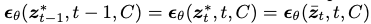    

이렇게 되면 결과적으로 condition이나 uncondition이나 똑같다.  
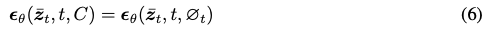  
즉, inversion할 때는 CFG를 굳이 쓸 필요가 없다는 것이다.  
이게 경험적으로 알려진 DDIM inversion 할 때에 CFG를 안써도 잘 작동한다는 관찰에 대한 정당화로 간주할 수 있다.  
Null-text inversion에서 uncondition 결과를 열심히 최적화하지만 사실은 condition 결과와 같아지도록 최적화한 것이라고 설명한다.  
> 그럼 Figure1에서 reconstruct 성능이 더 좋다는 것은 뭐지...
> 식 자체는 DDIM inversion이랑 똑같은 것 같은데...  

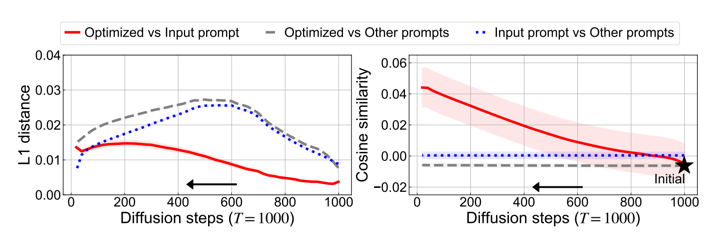  
하지만 가정1은 너무 이상적이다. 그래서 직접 비교하였다.  
좌측은 예측한 입실론, 우측은 프롬프트 임베딩 자체의 유사도이다.  
input은 입력된 프롬프트, optimized는 NTI에서 하는 최적화된 프롬프트, other은 coco 전체 프롬프트의 임베딩 평균이다.  
t가 0으로 갈수록 L1이 커지는 것은 optimize 자체의 오류이고 어차피 노이즈의 영향이 점점 작아지기 때문에 괜찮다고 말한다.  
   
## Results   
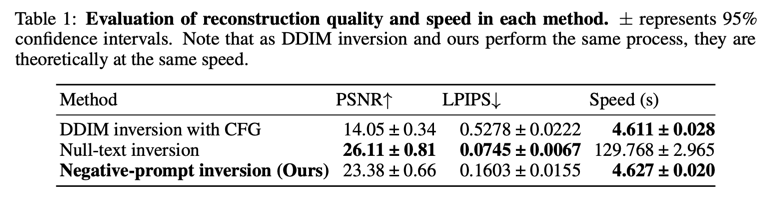  
정량적인 평가  
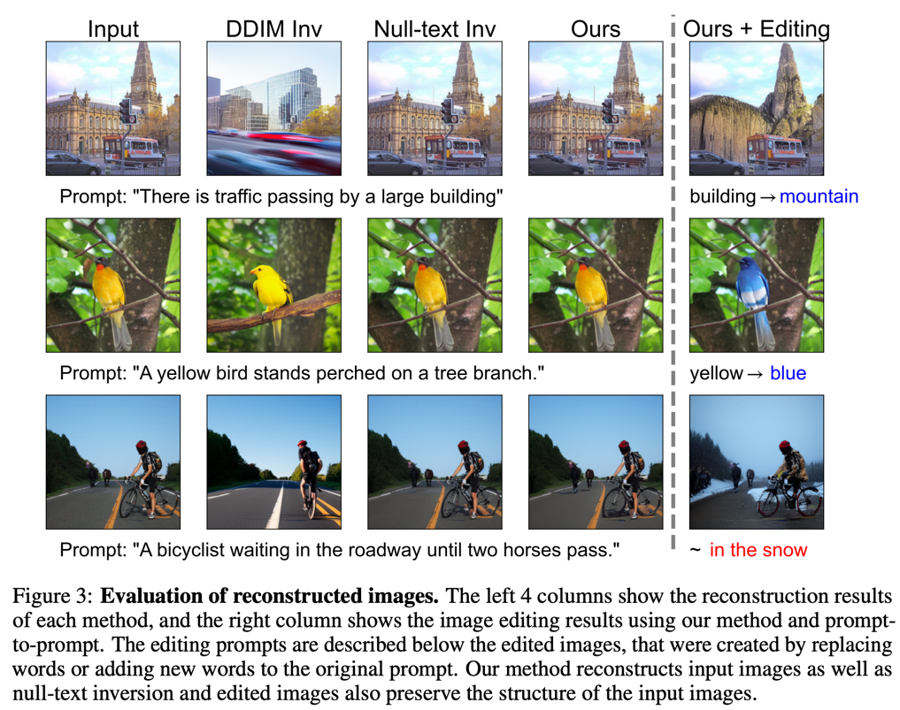  
정성적인 평가  
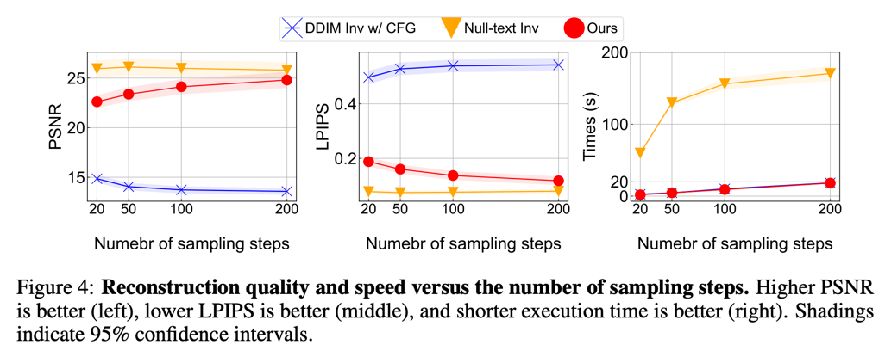  
inversion step에 따른 평가  
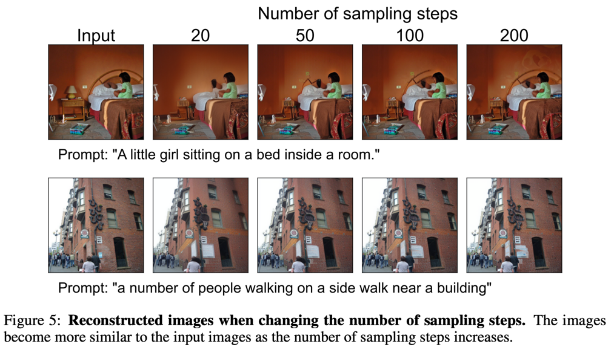   
> 참고로 ADM에서는 250스텝하는 것을 권장하고 있다.  
