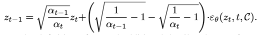
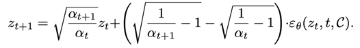
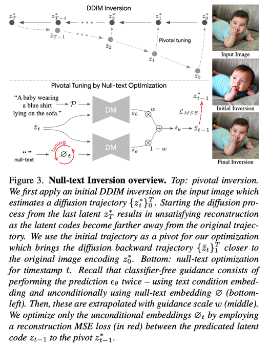
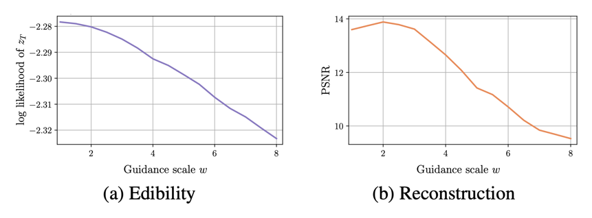
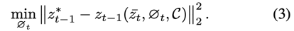
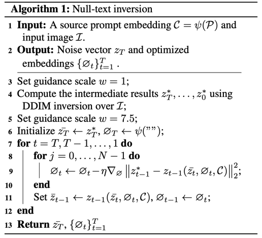
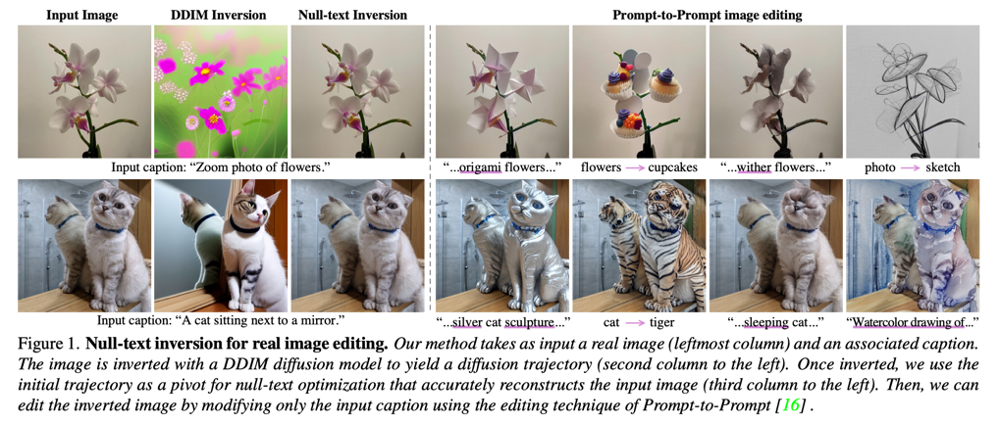
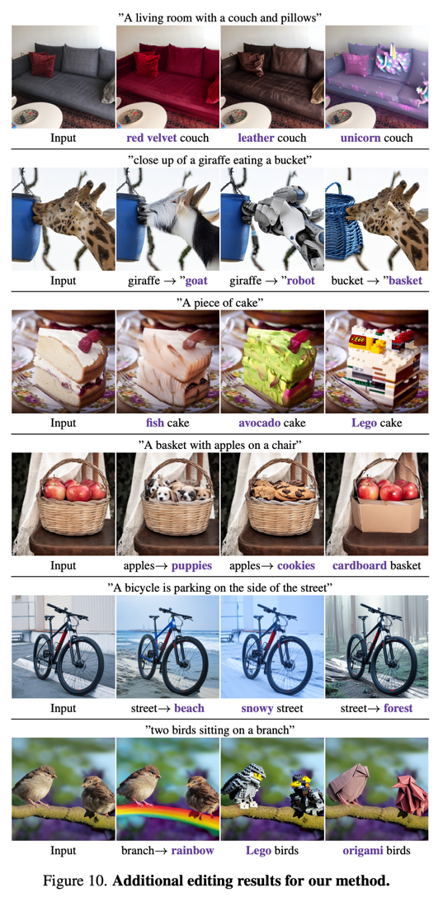

Null-text Inversion for Editing Real Images using Guided Diffusion Models
===
 CVPR 2023

### DDIM Inversion의 한계
  
이건 DDIM에서 Sampling 수식  
  
이건 DDIM Inversion 수식, 즉 "에이 z0 -> z1 정도 차이는 아주 작으니까 괜찮아~"라는 마인드이다.  
때문에 DDIM Inversion을 쓰는 논문은 많은데 DDIM Inversion을 제안하는 논문은 없다.

 
이러한 DDIM Inversion이 unconditional에서는 진짜 무시해도 될정도의 오류였다.  
하지만 CFG(Classifier-free Guidance)를 사용하여 샘플링할 때 문제가 생긴다.  
Naive한 DDIM Inversion에서 무시했던 차이가 CFG에서는 스케일을 반복해서 곱함으로 점점 커져버린 것이다.

  

하지만 그렇다고 CFG를 사용하지 않을 수는 없다.  
LDM은 CFG scale로 7.5롤 제안하고 있는데 그림3처럼 의미론적으론 동일하지만 다른 속성을 갖는 이미지로 복원이 된다.  
이 논문에서 제안하는 방법은 unconditional로 learnable token을 주고 이 token이 기존에 무시하던 오류 감안하도록 학습시키는 것이다.  

최근에 특정 이미지(textual inversion)나 텍스트 인코딩(DreamBooth), 모델 파라미터(iMagic)을 최적화하는 방법들이 있는데,  
이것들은 메모리도 비효율적이고 generality를 감소시킨다.  
이 논문에서는 learnable token'만' 학습한다.  
모델과 텍스트 임베딩은 fine-tuning하지 않는다.

즉 정리하면 전체 스텝은 다음과 같다.
1. 입력 이미지에 대해서 DDIM Inversion을 한다 (Diffusion process).
2. 매 스텝에 대한 pre-trained model로 Denoising process를 시행한다.
3. 이 때, unconditional로는 learnable token이 condition으로 들어가고 이것'만' optimizing한다.
4. 이 후 이 token을 CFG 계산에 unconditional로 사용해서 Denoising하면 된다.  

         

N=20을 사용했다고 한다.  
N과 T를 순서를 바꿔서도 해봤는데 결과는 괜찮지만 수렴하는데 30분 정도 걸린다고 한다.  
제안하는 방법은 A100 기준으로 1분이면 된다.
                                 
  

