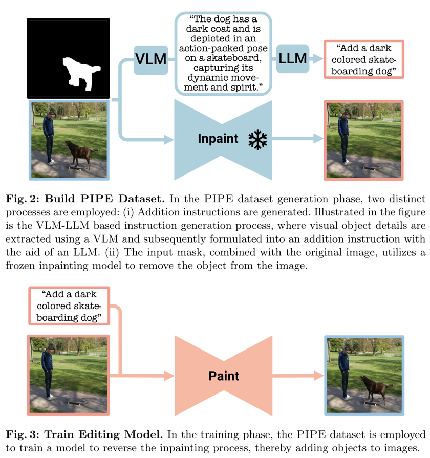
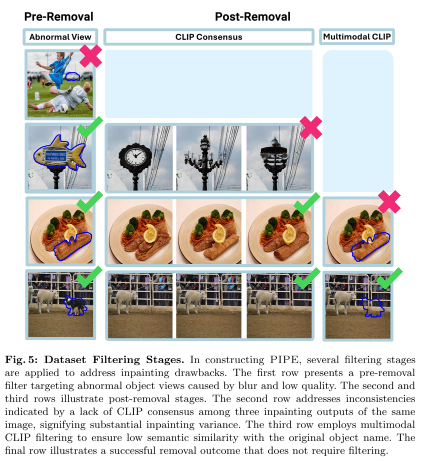
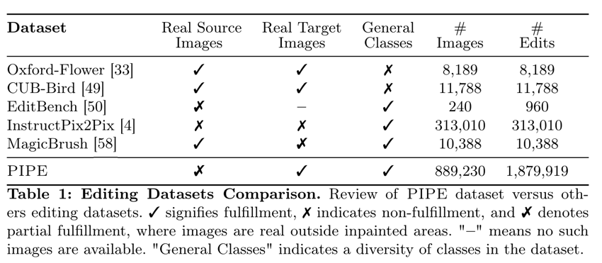
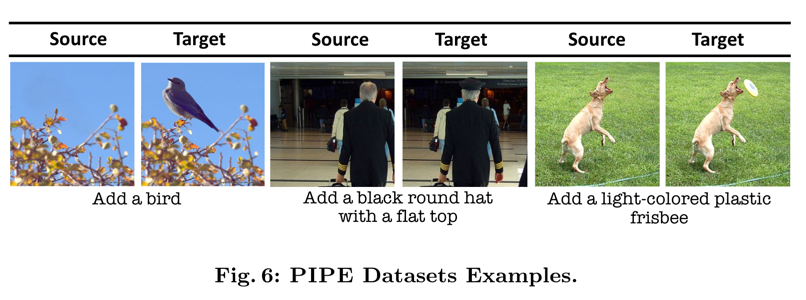
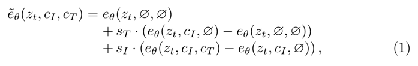
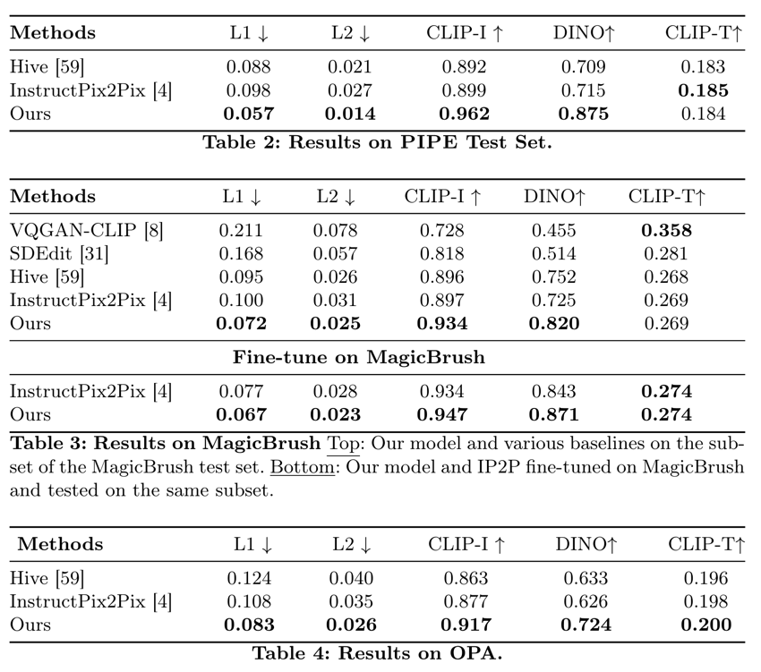
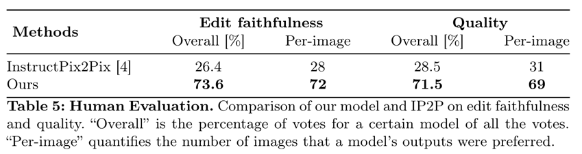

Paint by Inpaint: Learning to Add Image Objects by Remobing Them First
===
arxiv 24.04
####
## Introduction
Image Editing task는 단순히 현실적으로만 생성하면되는 기존 생성에서 글로벌 이미지 context를 이해하는 것을 요구한다.  
[Instruct Pix2Pix](../InstructPix2Pix/main.md)에서는 pair한 이미지와 변경된 내용에 해당하는 instruct 문장을 같이 제공하여 학습한다.  
Instruct Pix2Pix는 소스와 타겟 모두 생성된 이미지로 구성되지만 이 논문에서는 타겟은 실제 이미지를 사용한다.  
이 때, segmentation 데이터셋으로 사용하여 만들기 때문에 결과에 대한 품질이 보증되게 할 수 있다.
> 내가 연기로 했던거네.... 먼저 쓸걸....

100만 쌍, 1400개 이상의 클래스로 구성된 데이터셋인 PIPE(Paint by Inpaint Editing)을 만들었다.
> 24.05.31 기준으로 아직 공개되지는 않았는데, 유용하게 쓸수 있을 것 같다. > [project page](https://rotsteinnoam.github.io/Paint-by-Inpaint/)

  
## PIPE Dataset  
객체 생성보다 제거가 쉽기 때문에 segmentation 데이터셋으로 pair하게 만든다는 아이디어이다.  
데이터 품질의 일관성이 있어야하기 때문에 두 단계의 검열을 추가한다.  
* Pre-Removal  
  * 마스크 크기가 너무 크거가 작은 경우 제거
  * 이미지의 너무 가장자리에 있을 경우 제거
  * CLIP sim을 사용해서 너무 흐리거나 가려진 객체 제거
####    
* Object Removal
  * SD inpaint 사용
  * 마스크는 약간 확장해서 사용
  * positive prompt : "a photo of a background, a photo of an empty place"
  * negetive prompt : "an object, a {class}, where {class}"
  * 10 step denoising, 3개의 지워진 이미지       
####
* Post-Removal
  * CLIP consensus를 제안한다.
    * 출력된 3개의 이미들의 CLIP embedding의 표준편차를 계산한다.
    * 이를 manual threshold보다 크면 객체가 아직 남아있다는 것으로 판단한다.
  * multimodal CLIP
    * 지워지길 의도한 객체명과 CLIP score계산하여 threshold보다 크면 사용하지 않는다.
    * 최종으로 남은 것(1~3개) 중 CLIP score가 가장 낮은 것을 최종적으로 사용한다.
  * Consistency Enforcement
    * 알파 블렌딩을 사용해서 out-mask 영역이 동일하도록 만든다.
  * Importance Filtering
    * 최종적으로 CLIP image encoder로 소스-타겟의 유사도가 manual threshold보다 높으면 제거한다.  
    > 의미론적으로 중요성이 낮은 것을 제거한다고 말하는데,   
    변화량이 적은 것은 제거하는 의도로 이해했다.
#### 

####
### Generating Object Addition Instructions
지시문을 더 다양하게 만든다.
* Class name-based : "add a {class name}"
* VLM-LLM based : 배경은 마스킹 후 객체만 captioning => LLM으로 정리 (Fig. 2 참고)
* Manual Reference based
####

####

###
## Model Training
기본적으로 Instruct Pix2Pix와 동일하다.  
CFG를 두가지 조건에 다 적용하기 위해서 아래와 같이 계산했다.  

###

## Experiments

####

