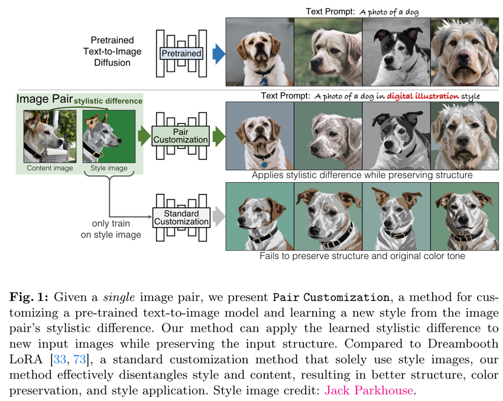
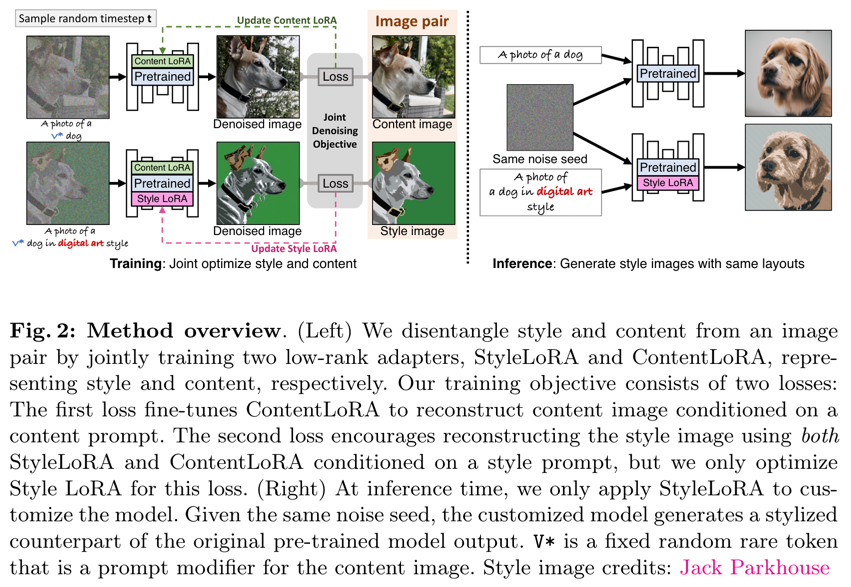
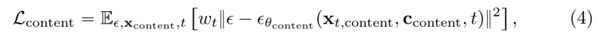
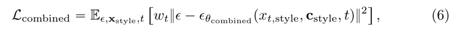
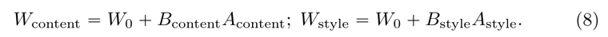
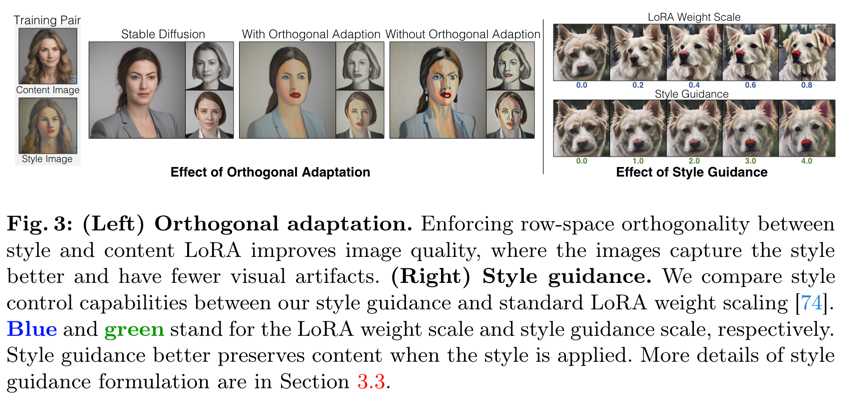
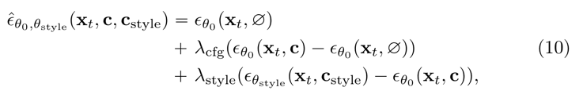
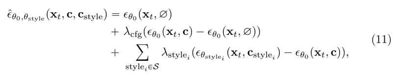
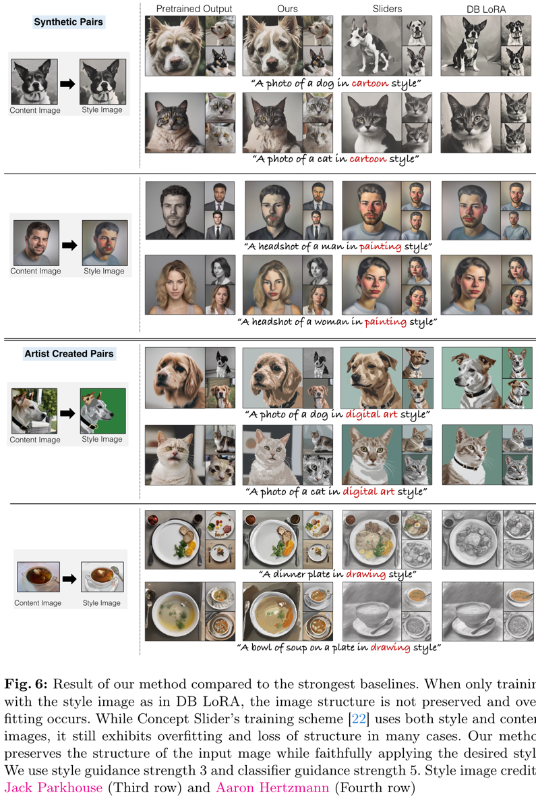
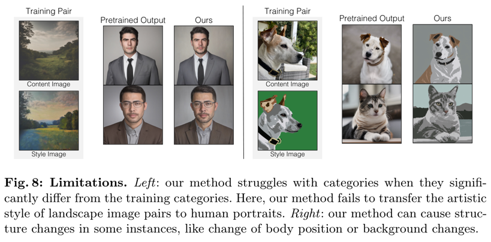

Customizing Text-to-Image Models with a Single Image Pair  
===
arxiv 24.05  

## Introduction
  
기존 style transfer 논문들은 style image만 사용하여 학습하기 때문에 학습했던 데이터에 있는 객체와 같은 content 정보들이 그대로 표현되는 문제가 있다.  
이 논문은 pair한 style 이미지를 통해서 표현하고자하는 style만 학습하도록 한다.  
이로인해 단일 pair image로도 style을 학습할 수 있다.  
구조를 확실하게 유지하기 위해 이 논문은 LoRA를 사용한다.  
Content와 style을 각각 담당하는 LoRA를 사용하는 방식을 제안한다.  

## Method
  
### Style Extraction from an image pair  
style image는 content + style이라는 점에서 착안하여 따로 학습함으로 분리시킨다.  
1. content Loss : content에 대한 text만 사용해서 reconstruction loss   
       
2. combined Loss : style에 대한 text까지 추가, content LoRA는 stop gradient 사용 
    

즉, Content loss는 content RoLA만, Combined loss는 style RoLA에만 학습된다.  
####
  
style과 content를 분리하기 위해 A_content와 A_style을 orthonormal basis로 fix한다.  
B만 0 matrix로 초기화하여 업데이트한다.  
또한 실험적으로 artifact를 줄여주는 효과가 있었다.   
#### 

####
### Style Guidance  
  
CFG를 변형해서 style에 적용할 것을 제안한다.  
> style RoLA의 출력과 pretrained의 출력의 차이에 scale을 걸어준 것이다.  
> 이렇게 해주니 scale이 커질수록 구조 유지가 유리해지는 것 같다.

  
또한 이를 응용하여 여러 스타일을 blending해준다.  
   

## Experiments
  
####

