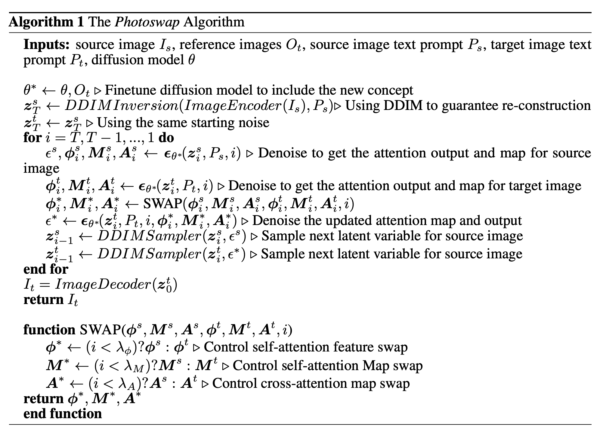

PHOTOSWAP: Personalized Subject Swapping in Images
===
NIPS 2023, arxiv 23.05

Dreambooth + LDM + attention map      

* textual inversion은 타겟 오브젝트에 대한 visual concept을 완벽하게 이해하면서 original subject를 대체해야한다.  
그러면서 자연스럽게 만들어야 해서 어려운 분야이다.  
심지어 조명, 원근감, 모양, 비율, 질감 도 유지해야 한다.

* 다른 논문들은 이를 위해 추가적인 마스크나 브러쉬를 입력해줘야 하거나, 배경을 유지하면서 대상만 변경하지는 못한다.  
  우리는 이걸 self-attention map을 사용해서 해결한다.
  

* Visual Concept Learningtoken을 추가해서 personalization하는 논문들이 많고 우리도 이를 사용한다.

* Controllable Subject Swapping via Training-free Attention Swapping  
(attention map과 attention 값을 Distillation한다고 생각해도 될듯)  
  
  
