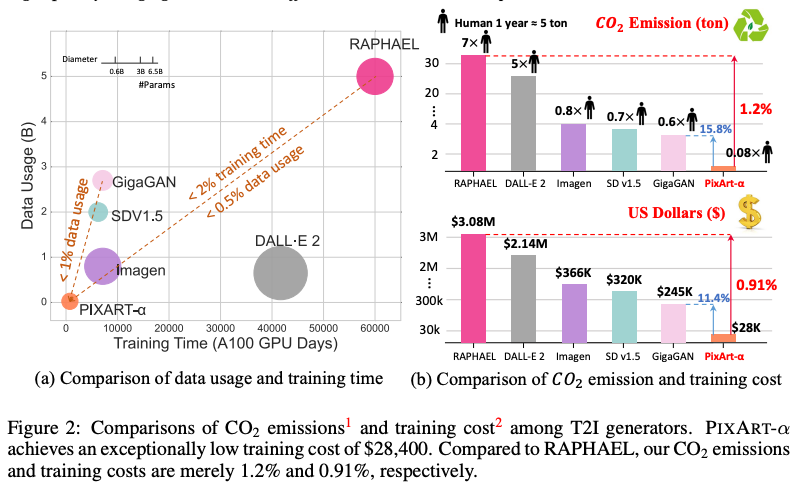
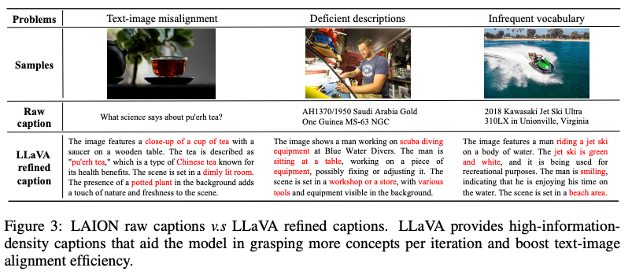
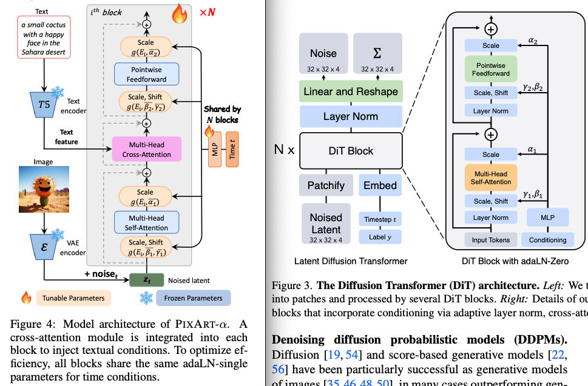
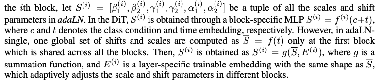
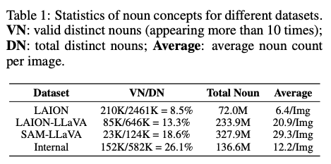
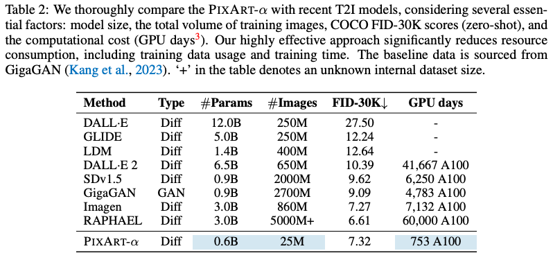
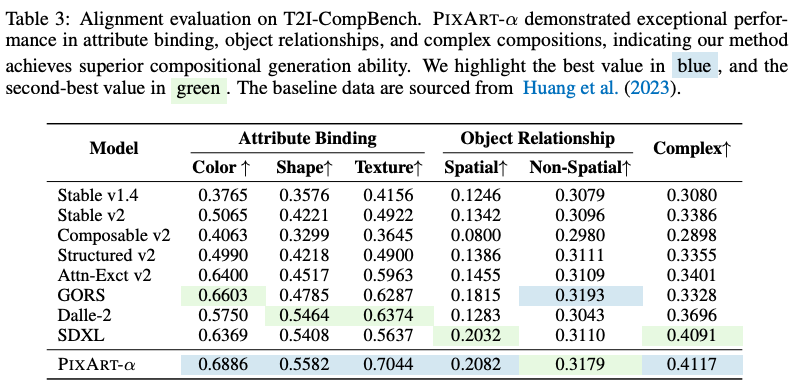
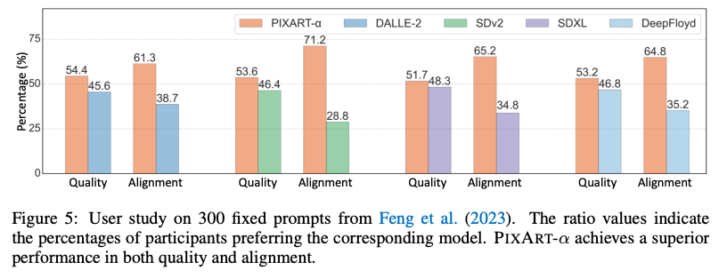
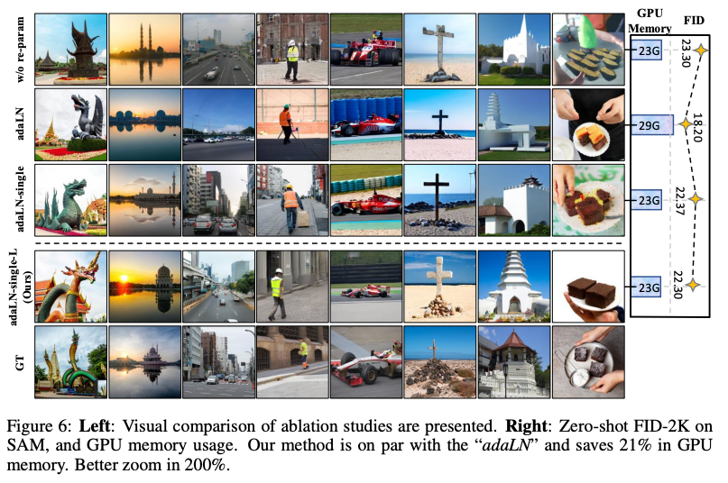

PIXART-α: FAST TRAINING OF DIFFUSION TRANSFORMER FOR PHOTOREALISTIC TEXT-TO-IMAGE SYNTHESIS
===
ICLR 2024 / arxiv 23.10

## Introduction  
Text2Image의 성능이 좋아지면서 T2I 생성 모델 분야가 경쟁적으로 발전하고 있다.  
이 논문은 낮은 훈련 비용으로 1024x1024의 고해상도로 생성하는 것을 목표로 한다.  
  
Stable Diffusion v1.5의 경우 6250 A100 GPU day의 학습이 필요하다.  
하지만 이 논문에서는 753 A100 GPU day로 줄이면서 거의 $300,000를 절약하고(320,000=>28,400), 90% CO2 배출을 줄인다.  

***
## Method  
T2I가 학습이 느린 두가지 이유를 설명한다.  
* Task가 복합적이다.  
    그래서 이 논문에서는 실제 이미지 픽셀 분포 학습, Text-Image allignment, Aesthetic Quality로 Task를 분리하고 단계별로 학습하는 전략을 취한다.  
* 아래 그림3과 같이 LAION 데이터에 문제가 있다.  
    이를 위해 정확한 이미지 캡션을 생성하기 위한 자동 라벨링 파이프라인을 제안한다.  
  

### Training Strategy Decomposition  
  
1. Pixel dependency learning  
    ImageNet을 사용해서 pre-train 한다.  
    이 때에 condition으로는 클래스 이름만 사용된다.  
2. Test-image allignment learning  
    이 과정을 효율적으로 하기 위해서 high concept density의 text-image pair 데이터를 구축한다.  
    구축 방법에 대해서는 후술하겠지만 결과적으로는 모호성이 적은 데이터셋을 사용하여 효율적으로 align할 수 있다.  
3. High-resloution and aesthetic image generation  
    마지막으로 aesthetic dataset으로만 fine-tuning하여 고해상도스러움을 학습시킨다.  
  
### Efficient T2I Transformer  
  
모델의 구조는 DiT를 따르고 있다. (우측이 DiT)  
* Cross-Attention layer  
    pre-trained weight를 잘 활용하기 위해서 cross-attention 이후에 projection layer를 0으로 초기화 한다.
* AdaLN-single
    DiT의 AdaLN을 살펴보니 linear projection이 27%를 차지한다. 이 논문에서는 AdaLN으로 t만을 사용하기 때문에 간소화해도 된다.  
    원래는 condition과 timestep을 모두 받아서 style에 해당하는 평균과 분산을 출력하는데  
    맨 처음 블록에서만 t에 의한 평균 분산을 계산하여 전역적으로 사용하고, 각 블록마다 trainable 임베딩 벡터를 두어 전역 값에 더해주는 방식으로 간소화한다.  

* Re-parameterization  
    이 임베딩은 t=500일 때 똑같은 값을 뽑도록 초기화 한다.  
    사전 학습된 가중치와 호환성을 유지하기 위함이다.  

### Image-text pair auto-labeling  
* LLaVA를 사용해서 "Describe this image and its style in a very detailed manner"로 캡션을 수정하였다.  
* LAION 데이터셋은 주로 쇼핑 사이트의 제품 이미지로 구성되어있어서 객체 조합의 다양성이 떨어진다.  
    그래서 SAM의 데이터셋을 가져와서 LLaVA를 적용하여 데이터셋을 구축한다.  
* 3번쨰 aestetic enhance 단계에서는 JourneyDB를 사용한다.  

데이터셋에서 10회 이상 등장하는 명사를 유효명사라고 했을때, 전체 명사 중 유효명사의 비율이다.  
LLaVA를 이용하여 구축하였을 때에 비율이 증가한 것이 원래 캐바션의 불완전함을 해결한 것이라고 설명한다.  

***
## Experiment
V100 64개로 22일동안 학습  
*   
*   
*   
*   
