Pretraining is All You Need for Image-to-Image Translation
===
109 Citations / arxiv 22.05

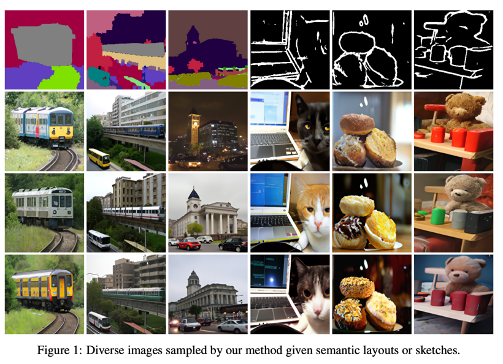  
mask to image, sketch to image 모두 생성모델에서 downstream task이다.  
그렇기 때문에 pre-trained 모델을 잘 활용해야 한다.  
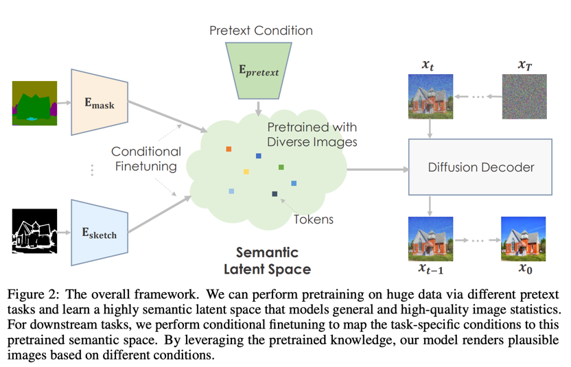  
이 논문에서는 GLIDE를 기반으로 사용한다.  

## Downstream adaptation
xt = D(E(x0, y))  
이 논문에서는 pre-trained Diffusion을 디코더로 생각하여 각 task에 해당하는 인코더를 학습시킨다.  
1. task별 인코더를 학습시켜 기존 text 조건이 가지고 임베딩 공간에 매핑한다.  
2. 이 후 디코더까지 전부 학습을 진행하여 확실하게 align해준다.  
  
이 논문에서는 oversmoothing한 결과를 막기위해서 2가지 loss를 사용한다.  
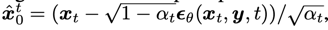  
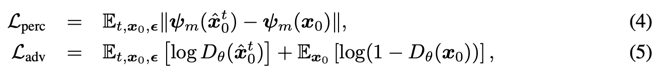  
흔히 볼수 있는 adversarial loss이다.  
* perceptual loss: VGG의 멀티레벨 피쳐간의 차이를 줄인다.  
* adversarial loss: Discriminator를 둬서 real/fake를 구분하게 한다.  

## Normalized classifier-free guidance
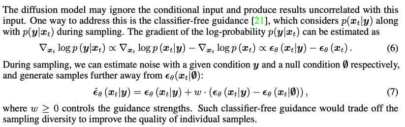  
CFG에 대한 설명  
이 논문에서는 CFG를 사용할 때에 스텝을 거듭하면서 평균과 분산이 의도치 않게 이동된다고 설명한다.  
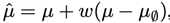  
그래서 명시적으로 normalize하면서 생성하는 것을 제안한다.  
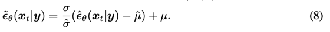  
이렇게 했을 때에 over-smoothed 텍스처와 over-saturated 이미지를 예방할 수 있다고 한다.  

## results
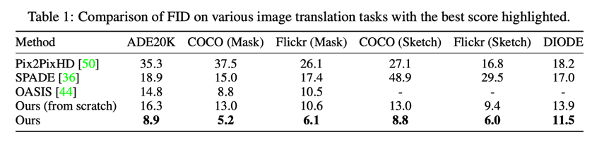  
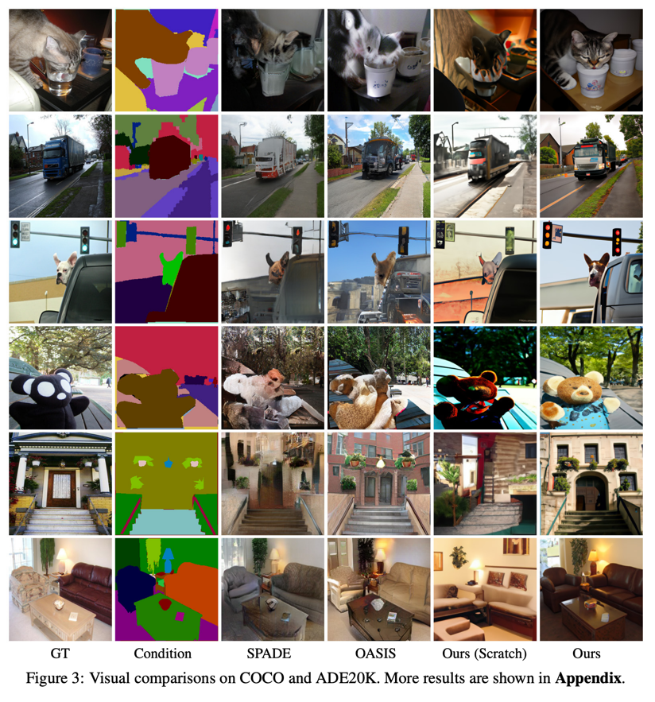  
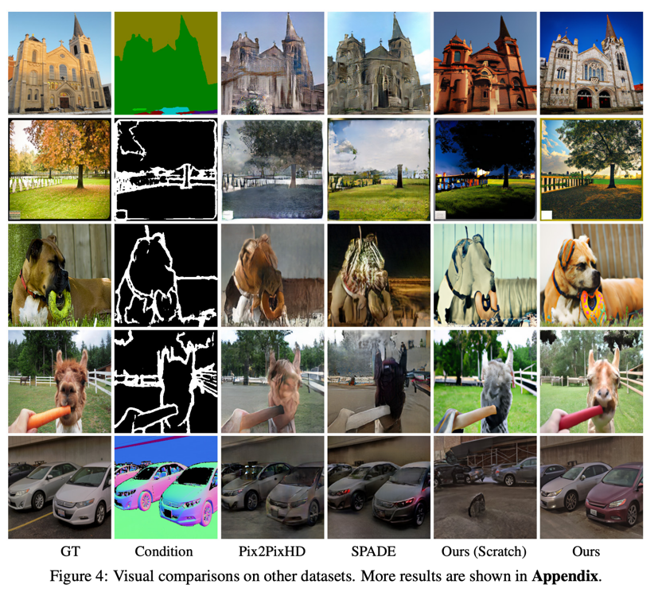  
다른 모델과 비교하여 좋다.  
scratch로 학습한 경우보다 좋다.  
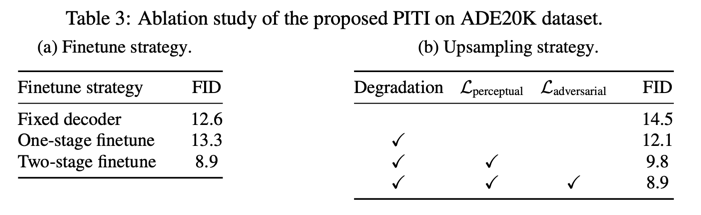  
ablation study이다.  
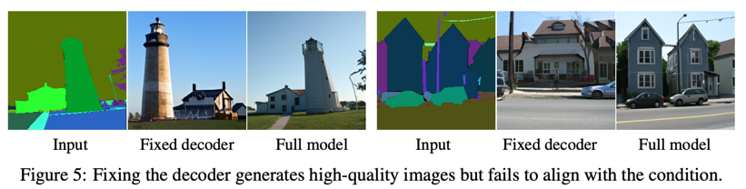  
decoder fine-tuning 여부의 차이이다.  
입력 mask에 대한 해석은 하지만 해당 마스크 모양에 맞게 생성하는 의도는 파악하지 못한다.  
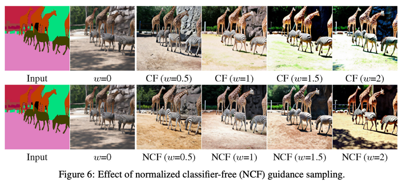  
strength가 커지면서 over-saturate되는 것을 예방할 수 있다.
