Prompt-to-Prompt Image Editing with Cross-Attention Control
===
ICLR 2022 / arxiv 22.08 / citations 814 (24.04.09 기준)
####
## Introduction
기존의 prompt기반의 diffusion은 prompt가 조금만 바뀌어도 출력이 크게 달라진다.
그래서 대부분 연구들은 mask를 이용하여 editing할 범위를 지정해준다.
하지만 mask를 사용하는 것은 mask위치에 있던 객체가 사라지기 때문에, 객체의 특징을 유지하는  것(=editing)은 더 어려워진다.

이 논문에서는 mask를 사용하는 대신 **attention map을 사용해서 editing할 위치를 컨트롤** 한다.

(이 논문은 Real Image Editing은 아니다. 특정 text로 생성될 이미지를 editing하는 것이다.)  
####
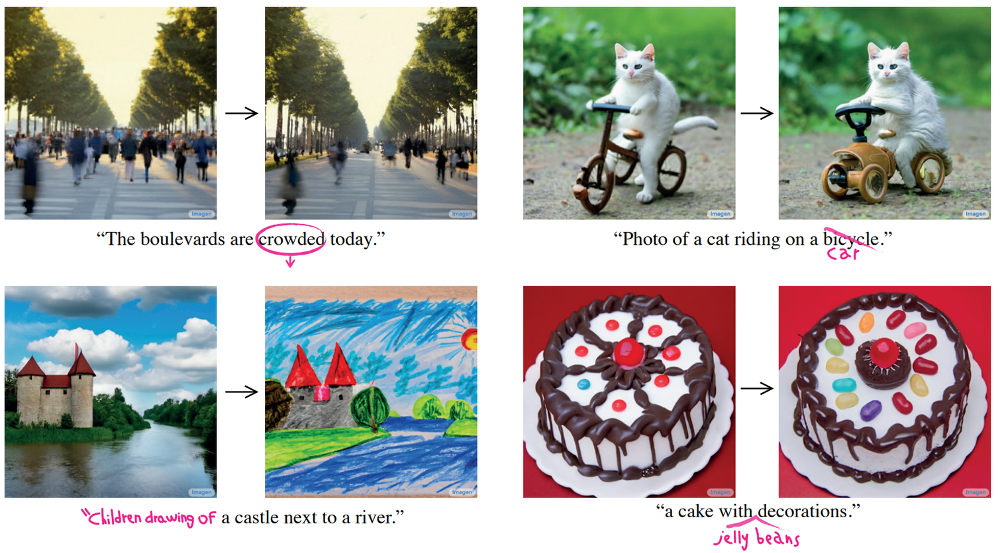  
이 논문에서 목적하는 기능은 3가지이다.

1. Word Swap (그림에 우상단)
   전체적인 구조는 고정하면서, 특정 단어에 대한 token을 변경한다.
2. Prompt Refinement (그림에 하단)
   특정 text를 추가할 때, 기존의 token이 갖는 attention이 유지하면서 변경한다.
3. Attention Re-weighting (그림에 좌상단)
   특정 text에 대한 semantic effect를 증폭시키거나 약화시킬 수 있다.
###
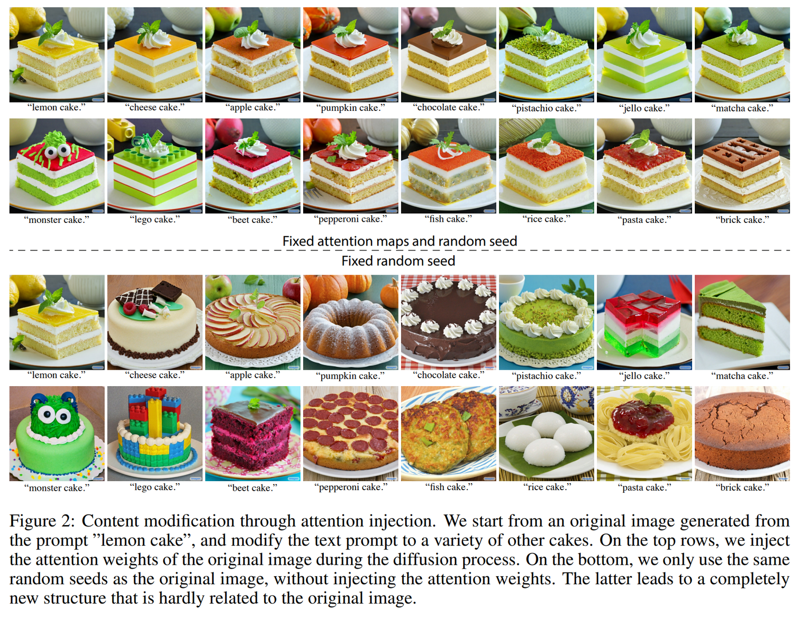  
상단과 하단의 차이는 **attention map이 고정** 되었는지다.
하단도 생성 퀄리티는 좋지만 의도했던 “cake”의 구조가 고정되지는 않는다.

이 논문에서는 이 실험을 통해 전체적인 구조를 유지하기 위해서는 시드만 고정할 것이 아니라
pixel과 text embedding간의 interaction인 attention map도 고정해야한다고 말한다.

> 실제로 Diffusion 사용좀 해보면 동일 시드(=동일 노이즈 z_T)에서 같은 구조의 이미지가 나오는 것을 알수 있다.  
> 때문에 초기에는 시드가 중요하다는 논의가 있었던 것 같다.  
> 하지만 시드만 영향을 미치는 것이 아니라 텍스트 condition도 영향을 미치는 것을 실험적으로 보여주는 것이다.  
> 마찬가지로 Inpainting을 하다보면 concat된 이미지도 일종의 condition처럼 동작하는 것을 알 수 있다.  
> 즉, 시드(=초기 노이즈)도 일종의 condition으로 작용할 수 있다.  
####
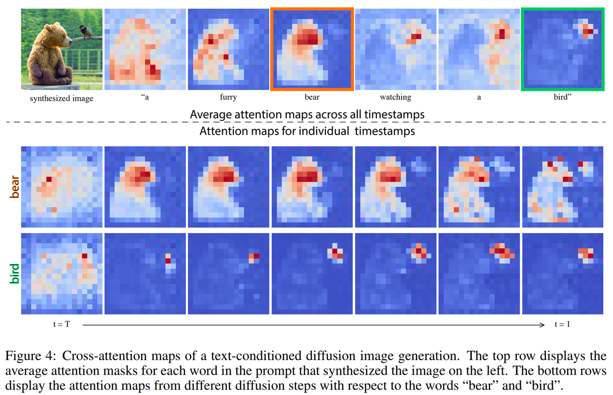  
pre-trained model의 inference과정에서 text와 이미지에 대한 cross-attention map을 확인한 결과이다.

- 각 token에 해당하는 영역에 맞게 활성화되는 것을 확인할 수 있다.
- 게다가 t=T부근, 즉 inference 초반부터 그 구조가 정해지는 것도 확인할 수 있다.
####
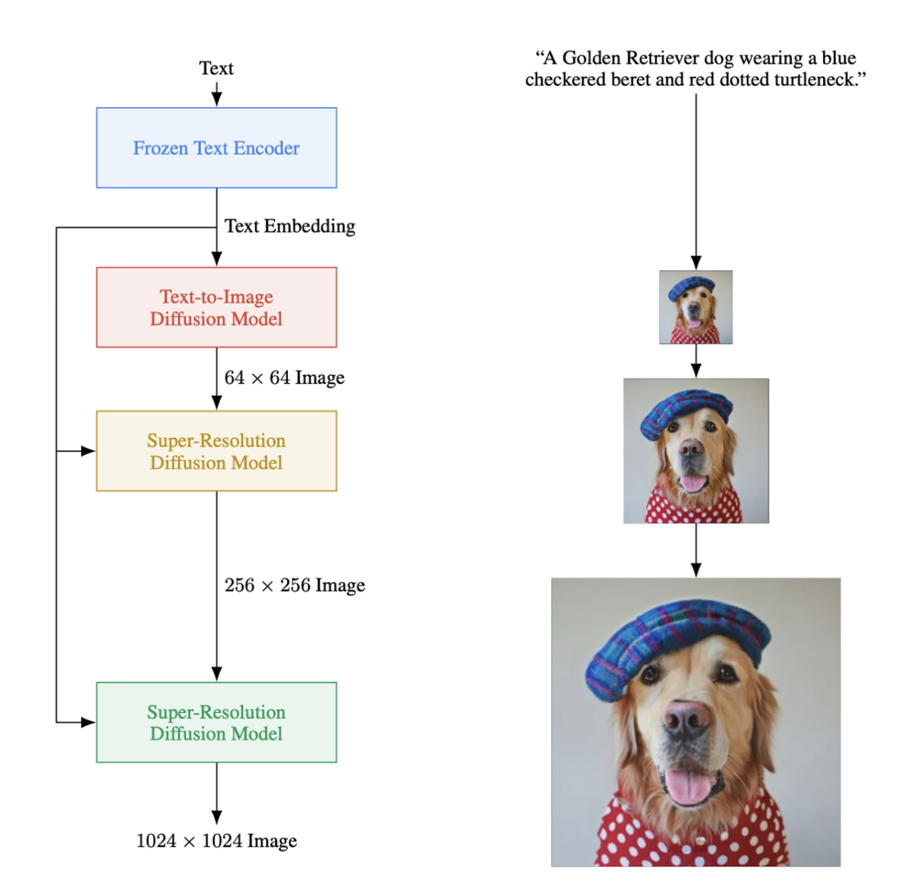  
백본으로는 imagen이 사용되었다.
LDM + SR으로 DIffusion이 text-image 모델이 해상도를 고려하지 않아도 되도록 부담을 덜어주는 컨셉이다.

본 논문에서는 SR부분은 그대로 냅두고 text-image 모델에만 테크닉을 적용한다.
####
## Methods  
  
text-to-image diffusion에서 language와 visual 간의 interaction은 노이즈를 예측하는 과정에서 일어난다.
이 interaction을 위해서 cross-attention 을 사용한다.
Q는 pixel 값에 대한 정보, textual embedding은 key와 value로 들어간다.  
#####

이미지를 생성할 때 사용된 기존의 프롬프트와, 수정을 가한 프롬프트를 동시에 denoising한다.
이 때, 기존 프롬프트의 denoising과정에서 attention map을 수정을 가한 프롬프트의 denoising과정에 주입하게 된다.
주입하는 방법에 따라 처음에 말한 task들을 수행할 수 있게 된다.
####
  
타겟과 소스를 동시에 디노이징하면서 (line 6~7), 계산된 어텐션맵을 특정한 방식으로 “Edit”해준다 (line 8)
이 후, “Edit”된 어탠션맵으로 디노이징을 한다.
즉 1 step에서 디노이징이 3번 진행되는 것이다.  
####
## Results
### Word Swap
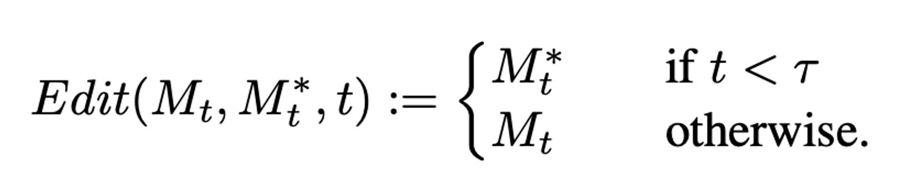  
말그대로 “swap”해준다.
여기서 목적은 object의 위치를 전달해주는 것이기 때문에 초기에만 전달해주고 후기에는 타겟의 어탠션맵을 그대로 사용한다.

### Prompt Refinement  
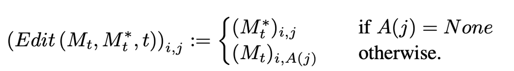  
i : pixel value, j : text token

특정 텍스트 토큰에 대해서 A는 소스에 존재한다면 꺼내주는 함수이다.
즉, 타겟 텍스트 중에서 소스에 포함된 토큰은 소스의 어텐션맵을, 소스에 없는 토큰은 타겟의 어텐션맵을 사용하는 것이다.
####

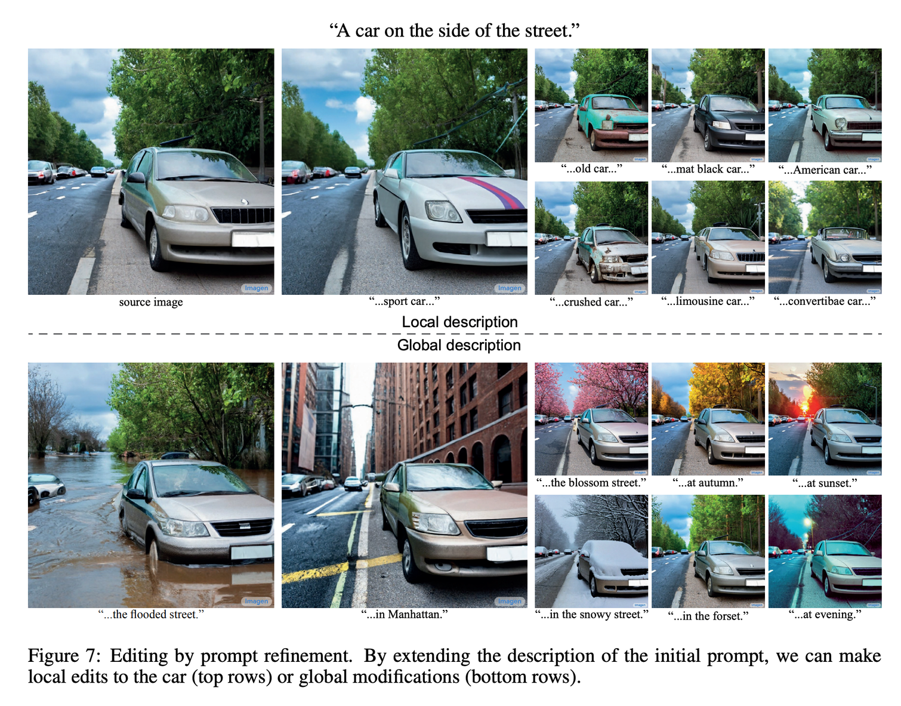  
흥미로운 점은, global 한 부분도 적용이 된다는 것이다.
snowy street 케이스는 object와 global이 모두 적용되었다.
####
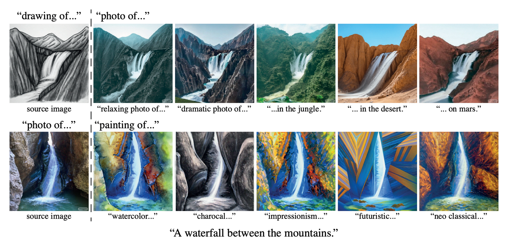  
이 방법으로 stylization도 가능하다. (이전엔 style transfer라고 부르던 task와 같은 듯)
### Attention Re-weighting
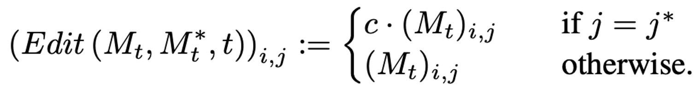  
####
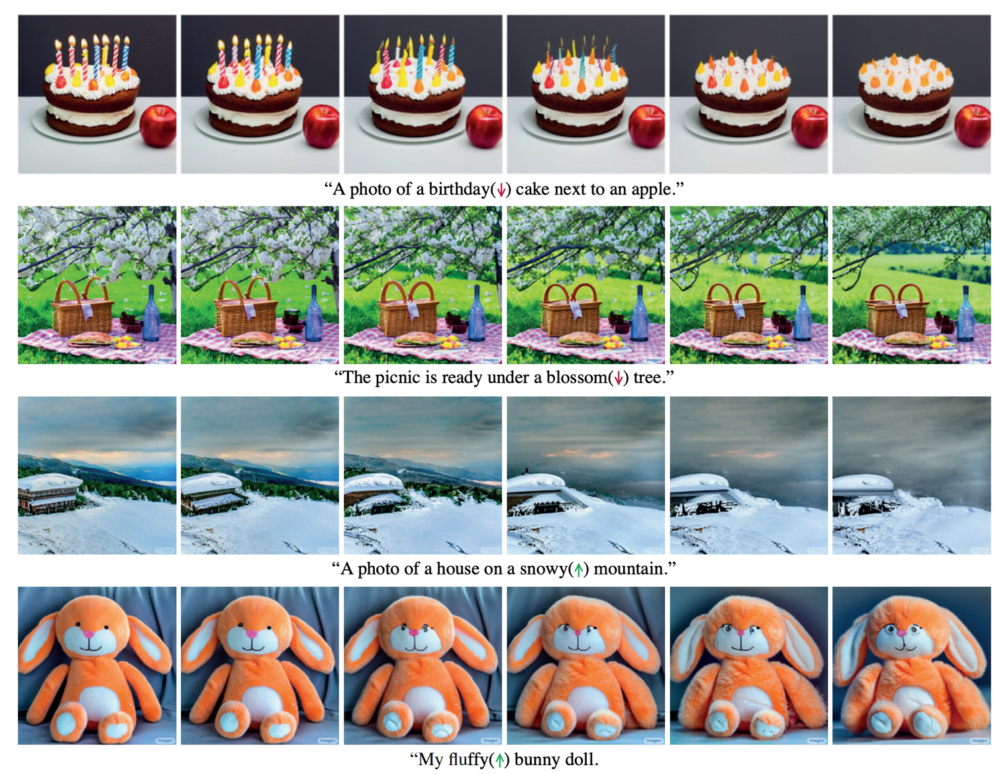  
### Real Image Editing  
이 논문은 Real Image가 아니라 생성된 이미지를 Editing하는 것이 주목적이다.
하지만 실제 수요는 Real Image가 더 많기 때문에 추가적인 실험을 한 것 같다.
이 논문이 버전이 한 번 바뀌었는데, 구 버전에는 없던 내용이다.
####
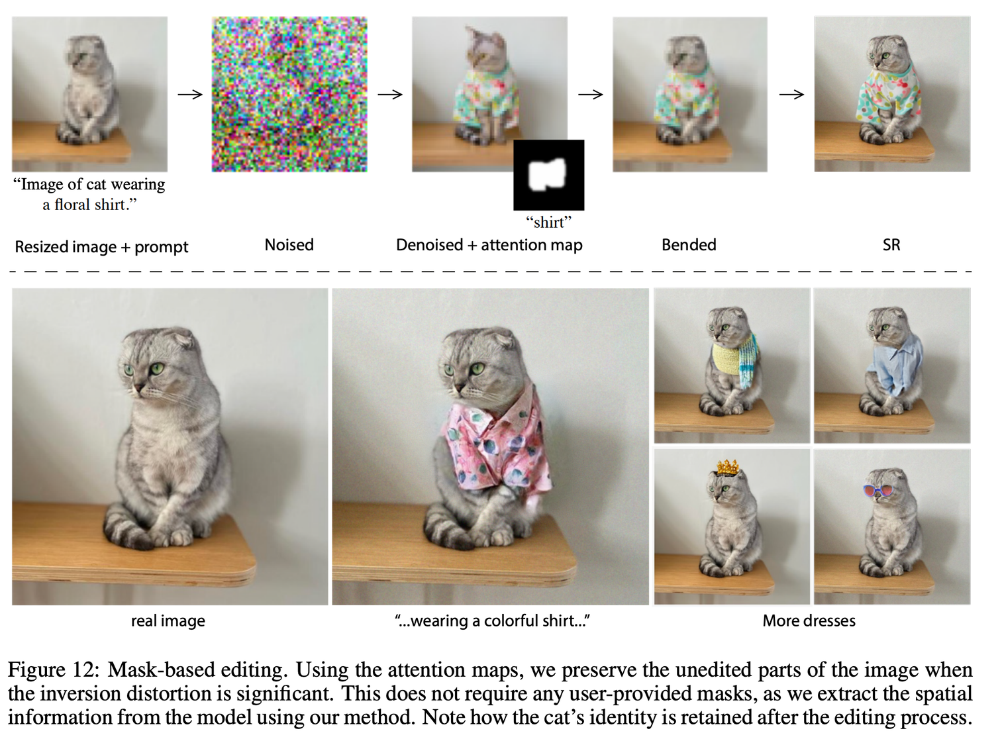 
DDIM inversion을 사용한다.
####
정량적인 평가는 없다.  
  
  

