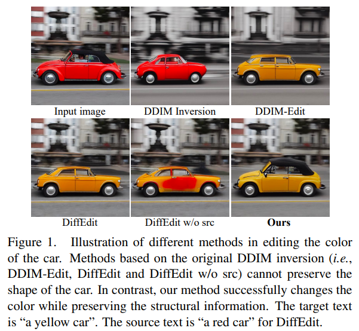
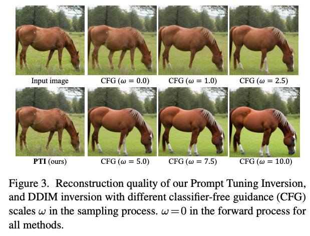
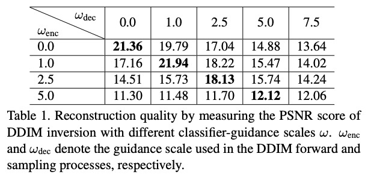
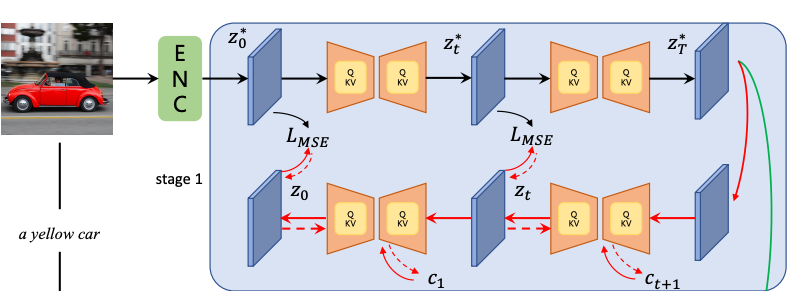
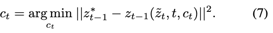
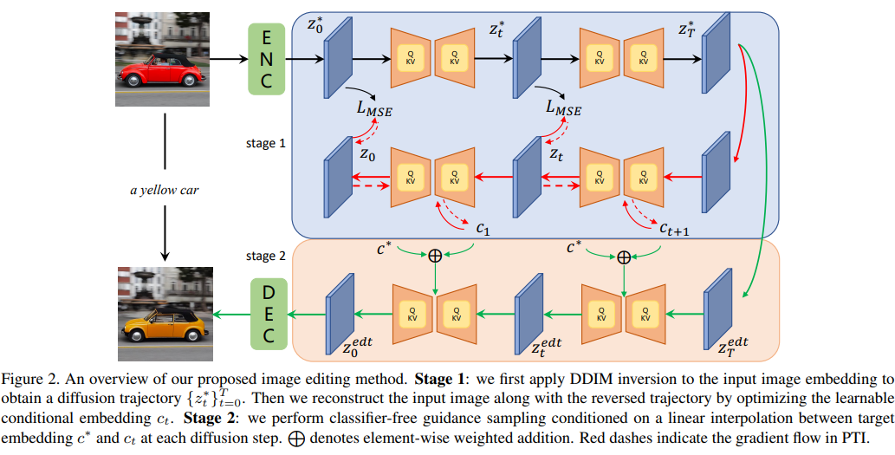
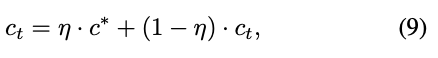
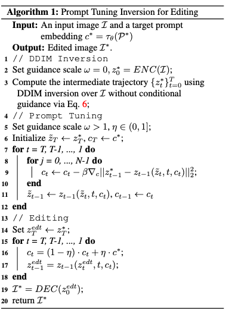
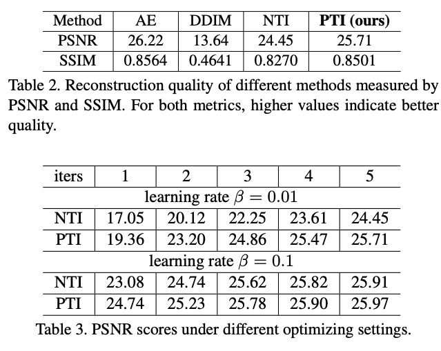
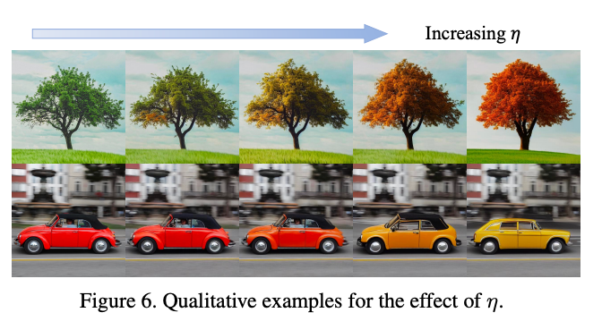

Prompt Tuning Inversion for Text-Driven Image Editing Using Diffusion Models
---

ICCV 2023
                                         

* fidelity를 높이기 위해 Inpainting을 쓰지만 mask를 넣어주는 과정이 user-friendly하지 않다.

* 그래서 DiffEdit과 같은 text를 기준으로 자동으로 mask를 만드는 연구들이 있는데
변경하는 속성이 아닌 나머지를 유지하는 것은 DDIM Inversion에 의존적이기 때문에 그림1처럼 의도치않게 객체의 구조가 변경되는 경우가 있다.

이 논문의 목적은 마스크 없이 텍스트로만 가이드를 줘서 에디팅하는 것이다.  
1. Rconstruction 과정에서 prompt tuning을 통해 학습가능한 "conditional embedding"으로 인코딩한다. 
2. 1에서 만든 embedding과 target embedding을 선형 보간한다.  

이를 통해서 높은 fidelity로 에디팅할 수 있다.  
최종적으로 classifier-free guidance를 사용해서 최종 편집된 이미지를 샘플링한다.

일단 이미지의 주요 요소들은 유지하면서 수정해야하기 때문에 Inversion을 해야 한다.  
Inversion으로는 DiffusionCLIP에서 제안하는 것처럼 ODE Approximaiton을 사용한다.  
> Appendix에 있어서 대수롭지 않게 생각했던 부분인데, 이 내용이 DiffusionCLIP에서 제안되었던 내용이다.  
>   
> DDIM은 Determinisitc하니까 Euler method(https://ko.wikipedia.org/wiki/%EC%98%A4%EC%9D%BC%EB%9F%AC_%EB%B0%A9%EB%B2%95)를 사용할 수 있고,  
> 한 스텝을 기준으로 앞뒤 스텝을 approximation한다.  
> DDIM Inversioin애서 한 스텝씩 shift시켜서 forward를 해주는 근거가 이 부분이다.
                                                                                                             
  
하지만 또 다른 한 편으로는 가이드를 주어야하기 때문에 CFG scale ω > 1 이상으로 주어야 한다.  
하지만 Null-text Inversion에서 주장한 것처럼 이 Approximation이 Conditional일 때 너무 커져서 이미지의 정보가 변경되버리는 문제가 있다.  
위 이미지에서 ω=0인 unconditional에서는 거의 똑같이 reconstruction하지만 커질수록 입력이미지와 차이가 커지는 것을 확인할 수 있다.  
  

## Prompt tuning for inversion

stage 1에서 forward는 ω=0으로, backward는 ω>1로 진행한다.  
동시에 둘 사이의 reconstruction loss로 embedded condition을 최적화한다.  
  

학습이 완료되면 이 condition은 ω>1임에도 원본 이미지를 reconstrucion할 수 있는 condition이 된다.
> 여기서 특이한 점은 c가 t개 만큼 존재한다는 것이다.(c_t-1은 optimized c_t로 초기화한다.)  
> 이유는 잘 모르겠다... 코드도 없다... 
> 기존에 알고 있던 {learnable token} + [cls name] 같은 구조로 사용하면 괜찮을 것 같은데 이에 대한 설명은 없다.  
> null-text inversion에서 처럼 단일 벡터인지 위에처럼 class 이름을 사용한 것인지는 확인되지 않는다.

## Prompt tuning for editing
  
이후 수정하려고 하는 텍스트 condition과 선형 보간하여 사용한다.  
  

## Experiments
  

