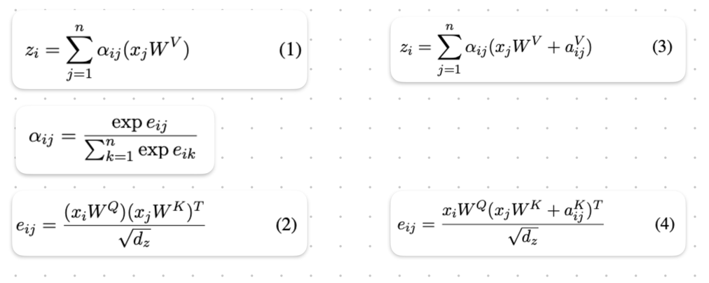
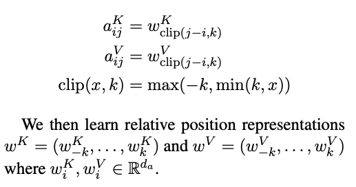
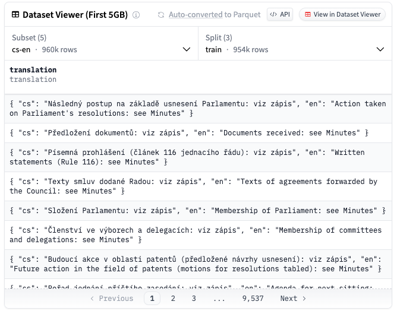
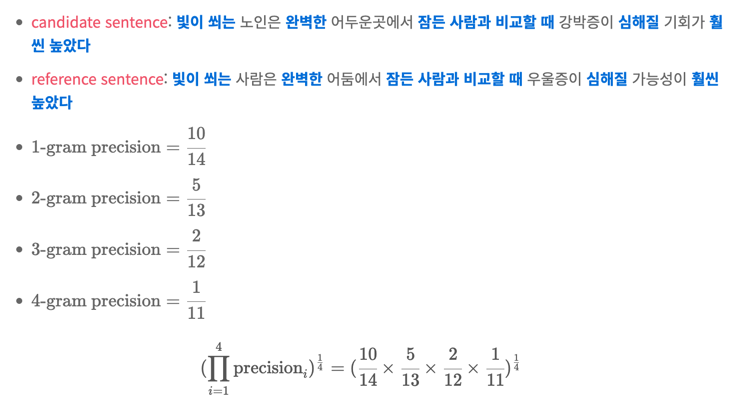
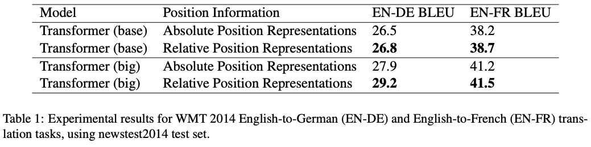
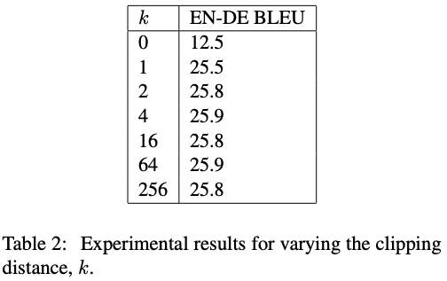
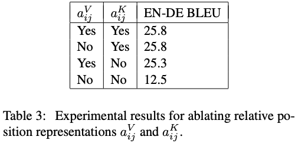

Self-Attention with Relative Position Representations
===
North American Chapter of the Association for Computational Linguistics 2018 (NLP쪽 학회)  
arxiv 18.03

> video diffusion에서 사용되어서 읽은 논문  
> ViT의 appendix에서도 잠깐 소개되고 있지만 실험적으로 성능이 낮아서 사용되지 않았다.

T5에서도 이것이 성능향상에 기여했다.
   
기존의 positional embedding은 파라미터로 학습을 하거나 sinusoidal을 사용한다.  
하지만 이 논문에서는 이 absolute한 방법들이 편향된 attention 가중치를 갖는다고 한다.  
> sinusoidal가 기존의 파라미터를 학습하는 방법에 비해서 이러한 문제가 많이 해결되기는 했지만 완벽한 방법은 아니다.  
> "I"가 문장의 첫번째일 경우가 많지만 항상 그런 것은 아니다.  
> 때문에 절대적인 값으로 embedding할 경우 편향이 발생할 수 있는 여지가 생기는 것이다.  

***
### Relation-aware Self-Attention  
Self-attention에 상대적인 관계를 표현하는 추가적인 learnable vector를 사용한다.  
  
추가적인 벡터로 상대적인 positional embedding을 사용한다.  
a_ij는 z_i와 같은 크기의 벡터이다.  
 
### Relative Position Representations  
그렇다고 NxN개의 벡터 a를 모두 사용하지는 않는다.  
이 논문에서는 거리가 먼 토큰들 사이의 상대적인 위치 정보는 유용하지 않다고 말한다.  
이를 반영하여 거리가 k이상인 경우에는 clipping하여 동일한 임베딩을 사용한다.  
  
즉 상대적인 거리에 따른 임베딩을 사용하기 때문에 i<k일 경우를 고려해서 4k+1개의 벡터만 사용한다.  
> 예를 들어 k=2, w_-2, w_-1, w_0 w_+1, w_+2을 사용한다.  
> 하지만 i<k일 경우, i=1이라고 가정하면 w_-1, w_0 w_+1, w_+2, w_+3을 사용한다.  
> 이를 고려하면 -4 ~ +4까지 필요하기 때문에 4k+1개이다.  

***
## Experiments  
* 영어-독어, 영어-불어 번역 task로 WMT 2014라는 데이터셋을 사용했다.
  *   
#
* BLEU  
  * 
  * 여기에 같은 단어가 여러번 반복되는 경우, 전체 길이가 너무 짧은 경우에 대한 제약이 추가되어있는 metric  
#
*   
*   
* 
