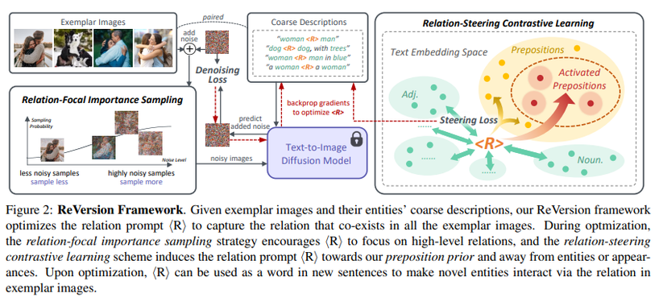
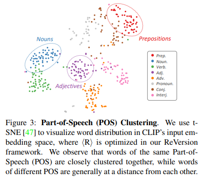
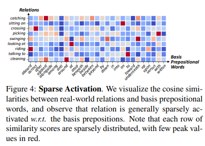
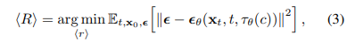
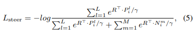
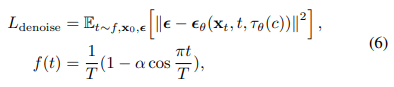

this paper’s goal is capturing object relations from frozen pre-trained text-to-image diffusion model.

1. The relation prompt should capture the interaction between objects.

2. The relation prompt should be disentangled away from object appearances.

their key insight is the “preposition prior”.

1. prepositions are highly related to relations.

2. prepositions and words of other parts-of-speech are individually clustered in the text embedding space.
3. complex real-world relations can be expressed with a basic set of prepositions.

* Prepositions describe relations.
    

* in the text embedding space of language models, embeddings are generally clustered according to their part-of-speech labels.

* they sampled 56 words as activate relation words from list of about 100 prepositions in Oxford dictionary

this is general text-to-image diffusion’s loss function.
<R> : optimized text embedding
<r> : relation prompt being optimized
c : text description

they added contrastive loss to make close with prepositions and far from other part-of-speech words.

they said, the appearance is low-level concept and the relation is high-level concept in exemplar images.
and in sampling process of diffusion, high-level semantics usually appear first, and fine details emerge at later stages.

so they propose ‘Relation-Focal Importance Sampling’.
this is to sample large t with a higher probability so that we can focus more on high-level relationships.
