Estimation of Non-Normalized Statistical Models by Score Matching
===
  MLR 2005, 1055 Citations  
  > 열심히 본다고 봤는데 어려움  
  > 특히 증명부분은 잘못된 설명이 있을 수 있음  

## Introduction

정규화 상수로 나누어져야 한다.   
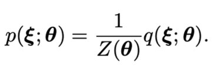

하지만 실질적으로 차원이 커지면 계산하기 어렵다. (논문에서는 n>2)  
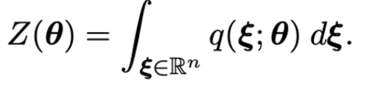

그래서 MCMC나 approximation을 사용하는데 너무 느리거나 부정확할 수 있다.    
이 논문에서는 Z를 명시적으로 계산하지 않고 p를 추정하는 방법을 제안한다.     
관측된 데이터의 score function과 모델의 score function을 최소화하는 것을 기반으로 한다.  

## Score function

여기에서는 log-density를 데이터 포인트에 대해 미분하여 score-function이라고 한다.    
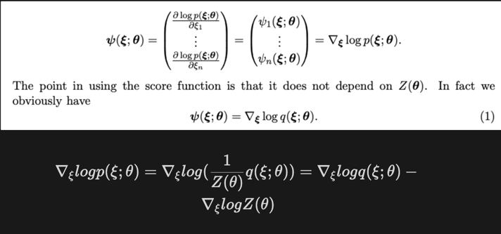  
정규화 상수 Z는 q(x;θ)의 전체 범위에 대한 적분이기 때문에 파라미터 θ에만 의존한다.  
때문에 데이터 포인트 ξ로 미분할때는 상수이기에 Z가 필요없게 된다.    
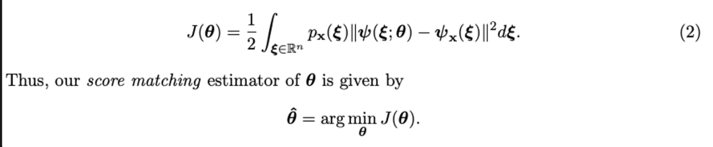  
모델의 score와 데이터의 score의 거리를 최소화하면 된다.  
하지만 θ를 추정하는 것은 여전히 때문에 어렵다.             
이를 할 수 있는 방법을 제안한다.                         
 
## Theorem1
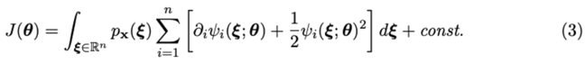  
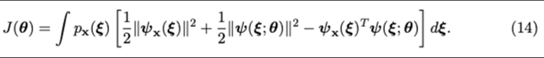  
14번식은 2번식을 전개한 것이다.  
첫번째 항은 θ에 대한 것이 아니니까 무시하고, 두번째 항은 3번식의 두번째 항과 동일하다.  
14번식의 세번째 항이 3번식의 첫번째 항으로 바뀐 부분에 증명이 필요하다.
이 부분은 아래와 같다.                                      
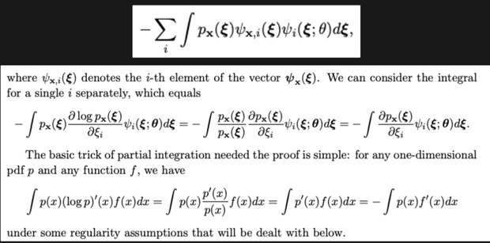  
마지막 항을 풀기 위해서 Lemma가 추가된다.  
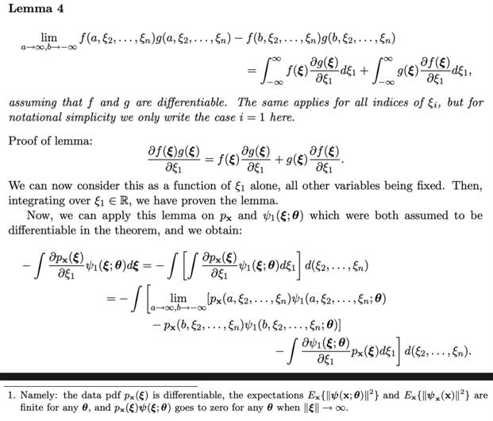  
결국에는 px(ξ)ψ(ξ; θ)는 θ가 무한대일 때 0으로 수렴하기 때문에 아래와 같이된다.
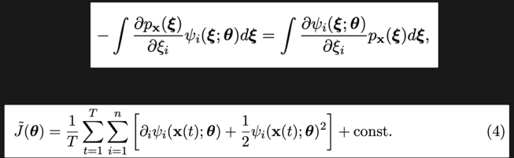  
관측값의 전체 갯수 T가 충분히 많을 때 4번 식이 성립한다.  
T가 충분히 크면 J~는 J로 수렴한다.  
J~이 전역적으로 최소가 되는 지점으로 수렴하면 유일한 참 파라미터 값이다.  

## Example  
### 1. Multivariate Gaussian Density
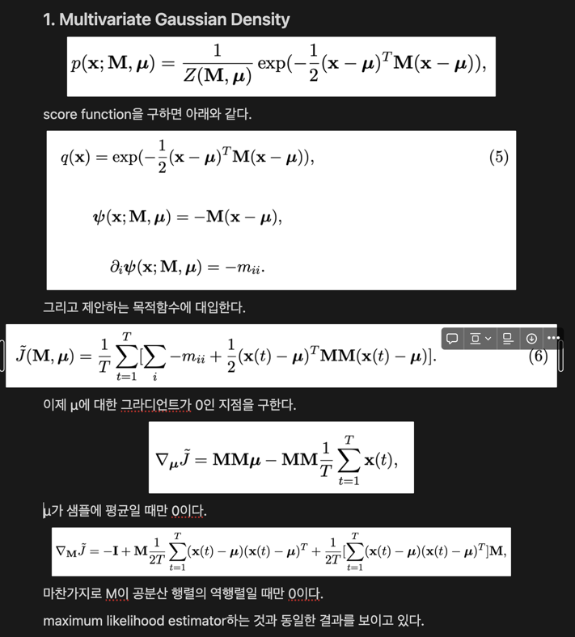      

### 2. Estimation of Basic Independent Component Analysis Model
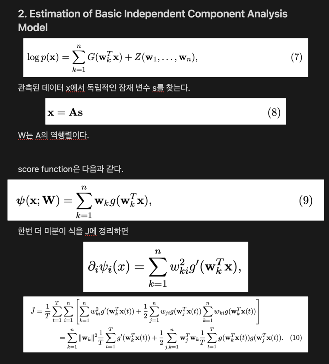  
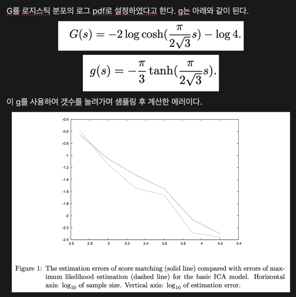  
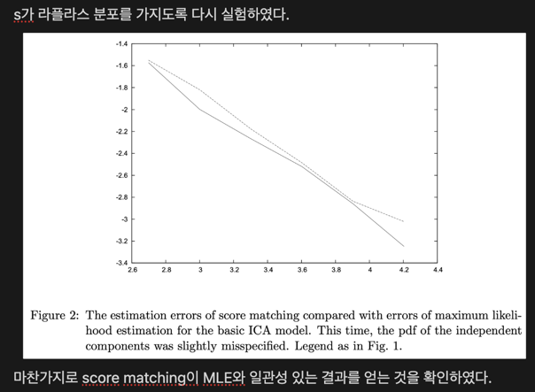
