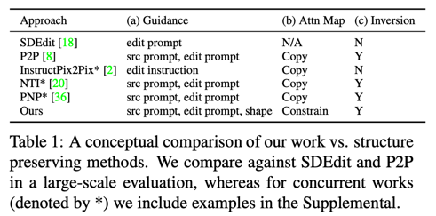
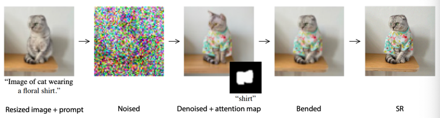
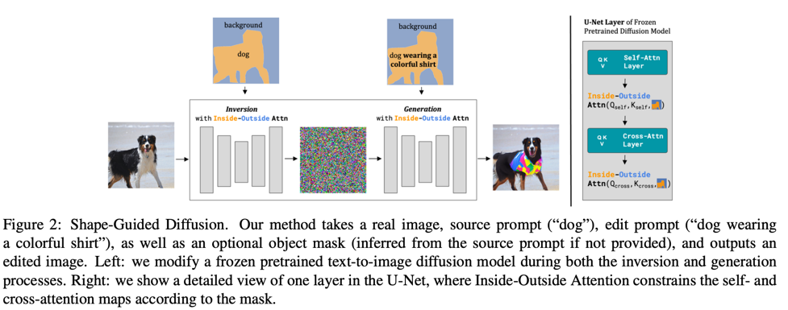
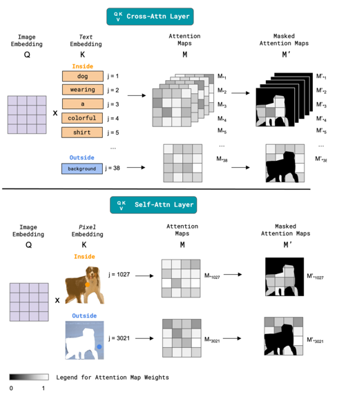
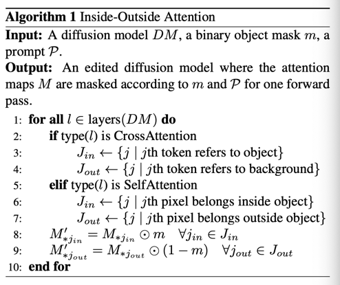
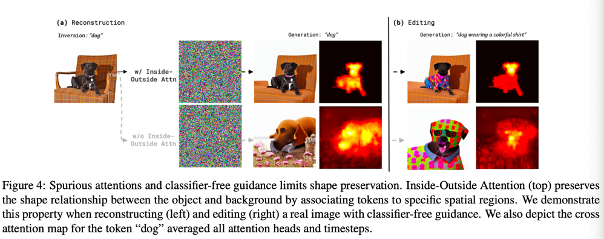
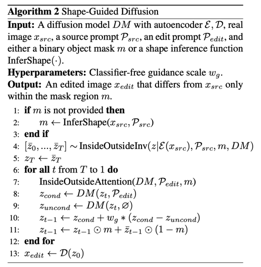
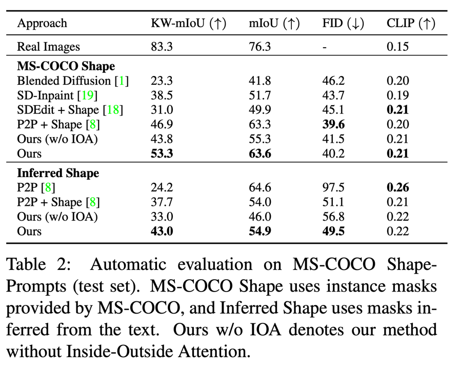
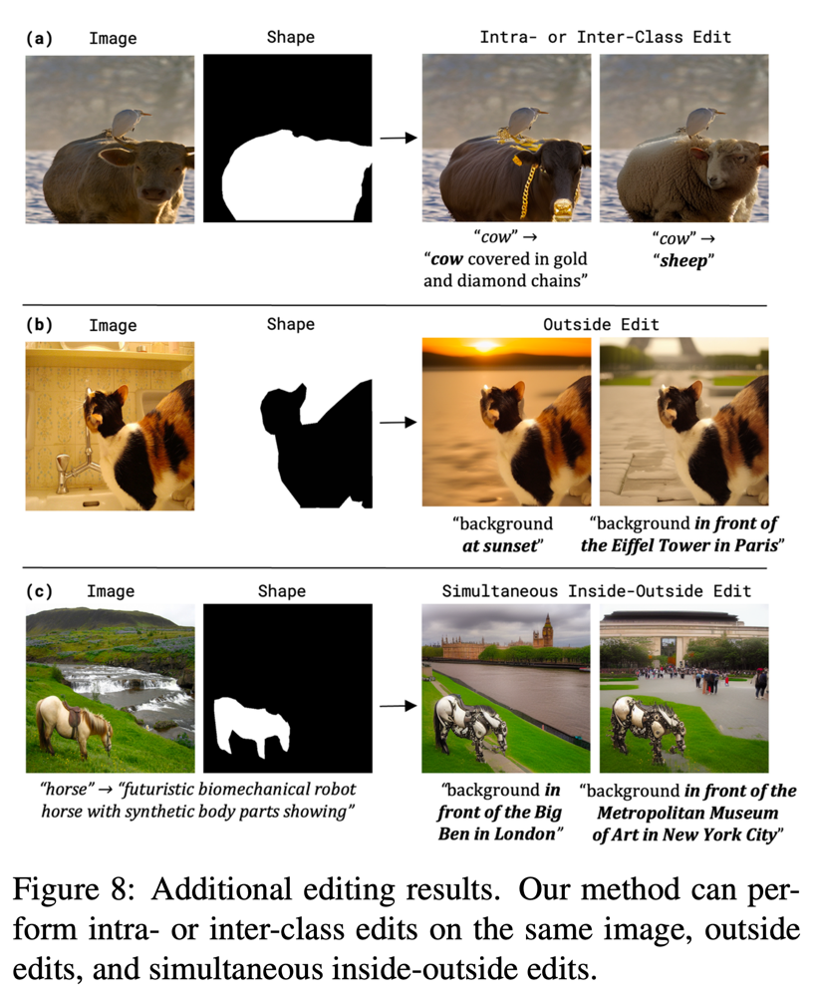

Shape-Guided Diffusion with Inside-Outside Attention
===
arXiv 22.12 / 19 Citiations  

기존의 Editing 방법들은 객체의 형태를 무시하고, 잘못된 크기로 생성하거나 잘려있거나 객체를 생성하지 않고 배경으로 채우게 생성된다.  
이를 위해서 Shape-Geudied Diffusion을 제안한다.  
> 여기서 말하는 모델들은 Inpainting이 아니고 text-based editing 모델들이다.  

  
text-guided editing 모델들이다.  
이러한 모델들은 아래와 같은 문제점들이 있다고 한다.  
* 명시적인 shape guide가 없기 때문에 배경의 일부가 편집되는 경우가 있다.   
* attention map을 바꿔버리는 방법들이 있는데, 우리는 바꾸지않고 constrain을 걸어준다.  
* P2P의 경우 real 이미지에 대해서는 구조 유지가 잘 안된다.  
> 이건 P2P 논문에서도 limitation으로 소개하고 있다.  
> P2P에서는 CFG를 사용할 때 문제가 생기는 것으로 설명한다. (w가 커질수록 reconstruction이 떨어진다고 말한다.)  
> P2P는 이를 해결하기 위해서 attention map에서 pseudo mask를 만들어서 사용한다.  
>   
> null-text inversion에서 지적하는 내용과 동일하다.  
  
## Shape-Guided Diffusion
  
그림을 보면 알다시피 배경과 객체에 대한 attention을 마스크를 기준으로 따로 주겠다는 것이다.  
특이한 점은 self-attention도 사용한다는 것인데, cross는 각 텍스트 토큰에 대해서, self는 각 픽셀(latent에서의)에 공간 정보를 제공하기 위해서 사용한다.  

  
  
attention 연산을 할 때 객체는 객체, 배경은 배경에 대해서만 연산되도록 마스크를 씌워주는 것이다.  
당연하지만 마스크와 어떤 단어가 객체인지에 대한 정보는 유저입력이다. 

## Inside-Outside Inversion  
  
실제 이미지를 사용하기 위해서 Inversion을 사용하는데 P2P나 null-text inversion에서 지적하는 것처럼  
reconstruction과 editing능력에 trade-off를 해결하기 위해서 Inversion할 때에도 이 방법을 쓰는 것을 제안한다.  
> 그러면 segmentation mask가 있어야한다는 건데...  

텍스트가 "dog"이기 때문에 의자 무늬가 변경된 것을 확인할 수 있다.  
배경에 대한 shape를 유지하는데 도움되는 것이다.  
> inpainting 할때 배경만 하는 방식으로 적용가능할 것 같은데  
> 이러면 또 디테일이 다 뭉게지지 않을까 싶다...  
> 이건 해봐야 알듯  

  
2번 줄을 보면 역시 segmentation 모델을 사용한다.  
논문에는 다른 textual grounding 모델도 가능하다고 하는데, box형태로 넣어줄때의 결과는 논문에 없다.  

## Experiment
  
  

