Sliced Score Matching: A Scalable Approach to Density and Score Estimation
===
> 참고:  
> https://yang-song.net/blog/2019/ssm/  
> https://www.youtube.com/watch?v=lapaQrdYIWg&ab_channel=uai2019chairs

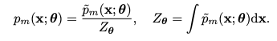  
score matching은 정규화되지 않은 확률모델에 대해서 partition function인 Z의 계산을 우회하는 방법이다.

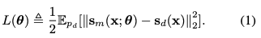  
이를 위해 목적함수를 위와 같이 설정하였다.  
여기에서 log p_data(x)를 직접 계산할 수 없으니 부분적분을 사용하여 아래와 같이 정리했었다.  

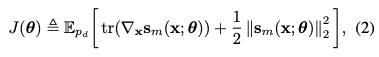   
이계도함수를 계산하는 게 문제이다.

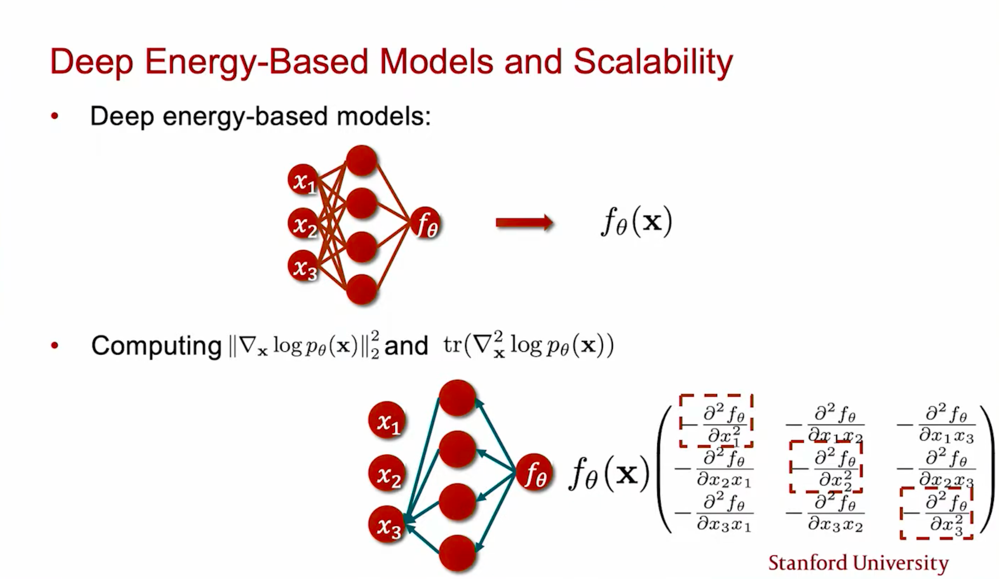  
이 때문에 dimension이 커지면 계산량이 너무 커져서 scalable하지 못하다.

## Sliced Score Matching
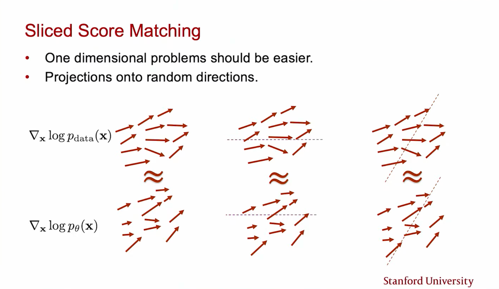  
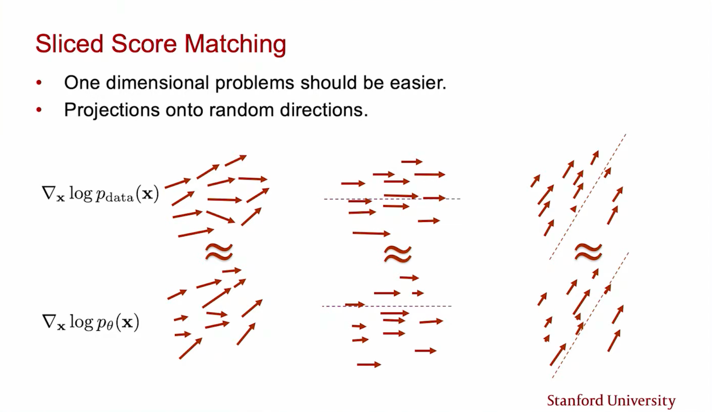  
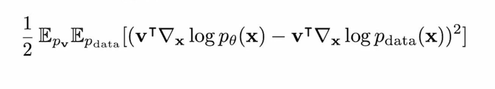  
그래서 저자는 임의의 방향 벡터 v로 투영시켜서 계산량을 줄인다.  
기존 score matching에서 데이터 포인트에 대한 score를 제거하기 위해했던 부분적분 방법을 적용한다.
                                                                          
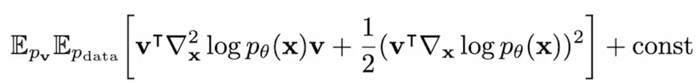  
이렇게되면 두번째 미분을 하는 대신 v벡터 방향으로의 그라디언트를 계산함으로 계산량을 확실히 줄일 수 있다.  

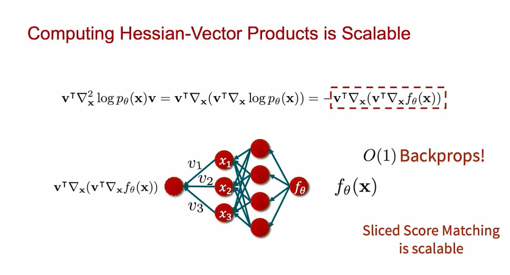  
f(x)는 모델에서 출력으로 나온 스칼라값이다.  
이에 대해서 D개의 x에 대한 그라디언트를 계산하니 1xD가 되는데,  
이걸 vT와 내적해주어 다시 스칼라로 만들어버린다.  
이 과정을 통해 O(D^2)짜리 벡터가 나올 것을 O(1)짜리 스칼라로 계산한다.  

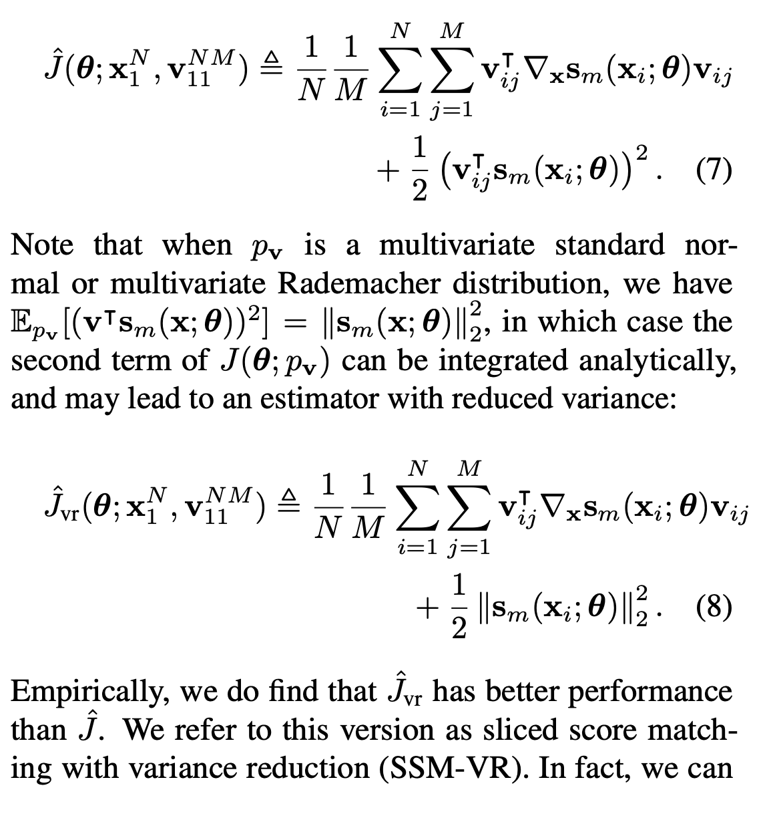  
pv가 Multivariate standard normal distribution이나 Rademacher distribution일 경우 적분시 상수항이 되어버린다.  
이런 경우를 SSM-VR이라고 부른다. 이 경우가 성능이 더 좋았다고 한다.
 
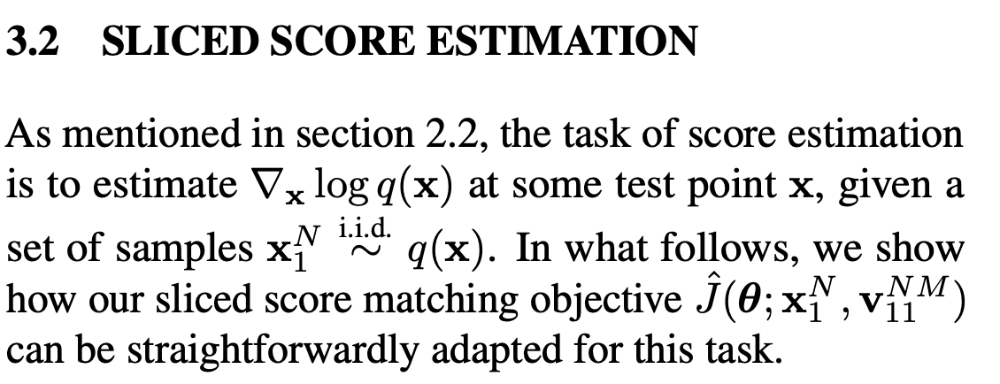  
score function을 딥러닝 모델 h로 대체한다.  
최종적으로는 샘플링되는 데이터의 분포 q(x)와 모델의 차이를 최소화시키는 것이다.

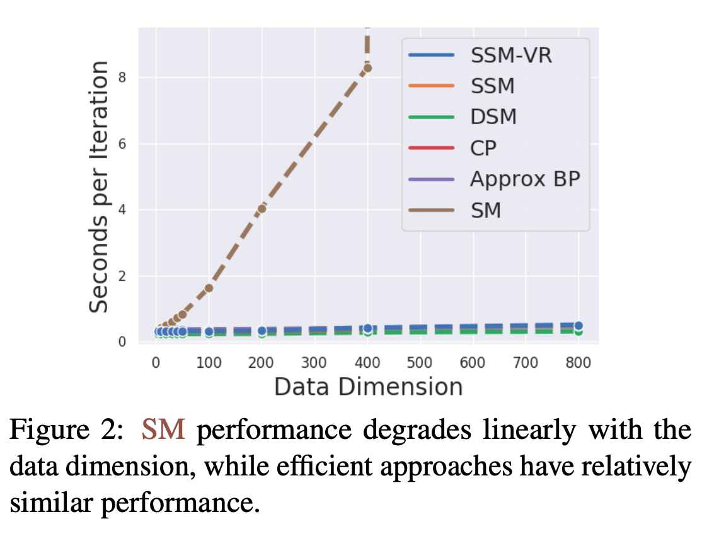  
실제 시간을 보면 기존 SM은 데이터 차원이 커질수록 기하급수적으로 증가하는 데, 이 부분을 해결할 수 있었다.

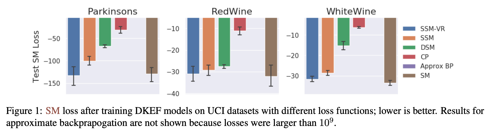  
성능의 측면에서는 기존 SM에 준하는 결과를 보여주고 있다.
