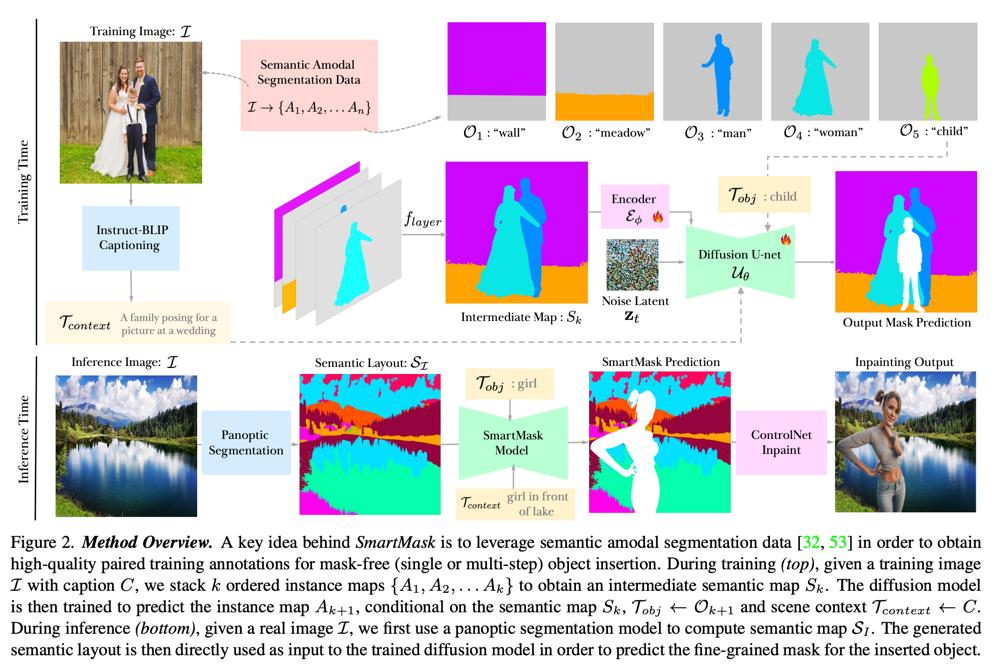
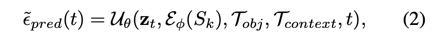
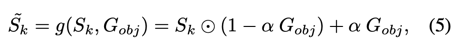
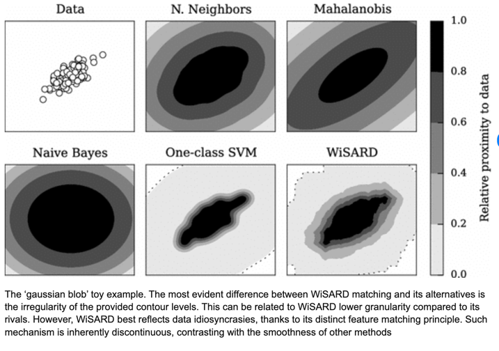
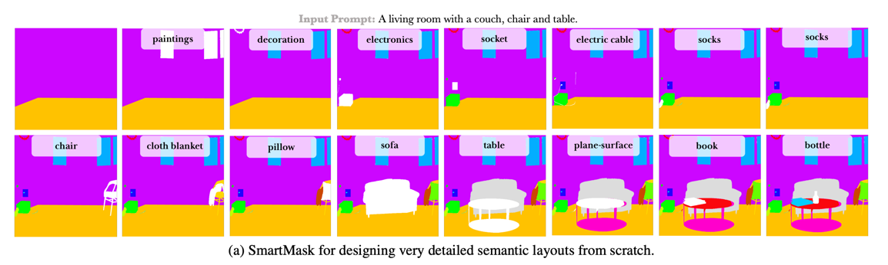
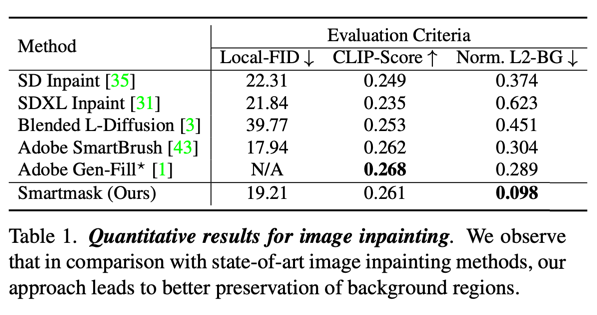
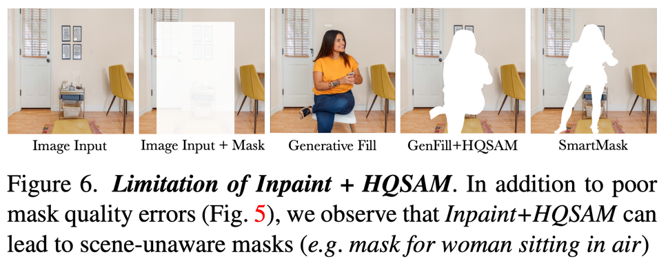
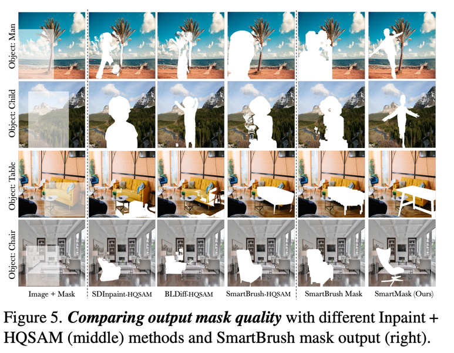
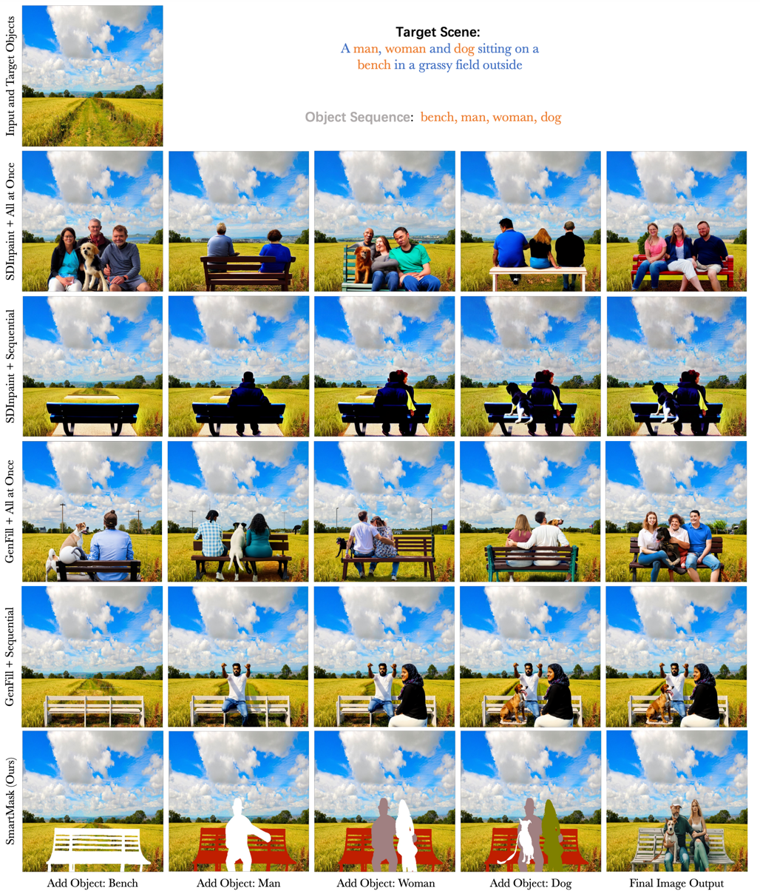

SmartMask: Context Aware High-Fidelity Mask Generation for Fine-grained Object Insertion and Layout Control
===
arxiv 23.12, adobe

Inpainting에서 text prompt는 객체의 의미를, mask는 위치와 크기를 제어한다.  
하지만 대부분 방법들은 coarse-mask를 사용한다. (bbox)  
하지만 이러한 경우 배경 영역이 포함되기 때문에 배경이 변경된다.  
이를 막으려고 scribble을 사용하지만 사람과 같이 세부정보가 많은 객체는 coarse-scribble로는 힘들다.  
게다가 새로운 장소에서는 그 장소에 어울리는 마스크를 만들어줘야 한다.  
  
* 초보 사용자도 배경 보존이 우수한 세밀한 객체 마스크를 생성할 수 있는 SmartMask를 제안한다.  
* 심지어 마스크 없이도 가능하다.  
* SmartMask를 반복적으로 사용하여 더 높은 품질의 출력을 생성할 수 있다.  

## Method
이 논문에서 하고 싶은 것은 T_obj(객체 설명 text)과 T_context(결과 이미지 설명 text)를 기준으로 마스크 M_obj를 예측하는 것이다.  
이 후 이 마스크를 ControlNet-Inpaint에 입력한다.  

  

### SmartMask for Mask-Free Object Isertion
> Sematic Amodal Segmentation Data : 가려진 영역에 대한 정보까지 가지고 있는 데이터, 순서가 정해져있음  

  
레이어를 쌓아서 인코더를 통해서 feature를 뽑고, 두개에 텍스트와 함께 디노이징한다.  
결국 다음 순번의 객체 마스크가 포함된 마스크를 예측하도록 학습한다.  
> 역시 adobe라 그런지 코드도 없고 중요한 설명을 숨겼다.  
> 치사하게도 condition이 3개나 되는데 어떻게 들어가는 건지에 대한 설명이 하나도 없다...  
  
> Related works에 살짝 언급된 instruct pix2pix 모델이 baseline인 것 같다.  
> ebedding된 feature는 기존 inpainting처럼 concat하는 방식을 사용 
> 텍스트는 compasable Diffusion에서 사용한 CFG composition하는 방법을 사용  
  
### Data Augmentation for Precise Mask Control  
  
G_obj 유저가 입력으로 준 마스크이다.  
해당 영역을 기준으로 객체에 최종 마스크를 예측하도록 학습한다.  
a = 0.7이라고 한다.  
  
  
  
4가지 케이스에 대해서 시나리오를 세우고 학습한다. 
1. 마스크 입력이 없는 경우  
    여기서 G는 전체가 0으로 사용한다고 한다. 
2. bbox 입력  
    GT를 기준으로 bbox를 만든다.
3. coarse spatial guidance  
    gaussian blob을 사용한다.  
      
4. scribble  
    그냥 사용했다고 한다. 학습용은 gt를 확장했다고 한다.
  
이를 통해 추론시 어떤 형태의 유저 입력 마스크가 들어와도 대응할 수 있다고 한다. 
  
### Global Planning for Multi-step Inference  
  
LLaVA를 사용했다고 하는데, 이거 학습하는 거 보려면 너무 많이 가야한다..  
간단히 말하자면 현재 상태의 마스크 이미지와 input prompt, 그리고 현재까지 마스크를 만든 객체들의 텍스트를 입력으로 하고,  
출력으로 다음 생성할 객체의 텍스트를 얻는다.  
이후 그 객체에 대한 마스크를 예측한다.  

## Experiments  
  
* Local-FID는 reference가 FID제안하는 논문인데 크롭해서 FID 계산한 것 같다.  
* Norm. L2-BG는 배경 유지가 잘되나를 확인하기 위해서 배경을 L2로 계산한다.  

  
* Inpainting의 한계점으로 지적하고 있다. 사람이 생성되긴하지만 묘하게 비율이 이상한데,  
    그래서 이 모델처럼 디테일한 마스크를 예측하도록 해야한다는 주장이다.

  
* 다른 모델들과 비교한 것이다. HQSAM은 box로 생성하고 segmentation mask를 따로 만든다.  

