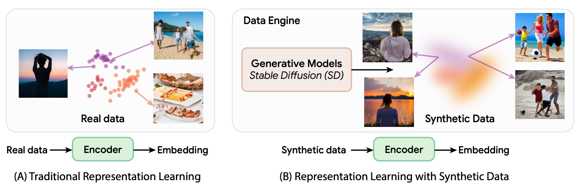
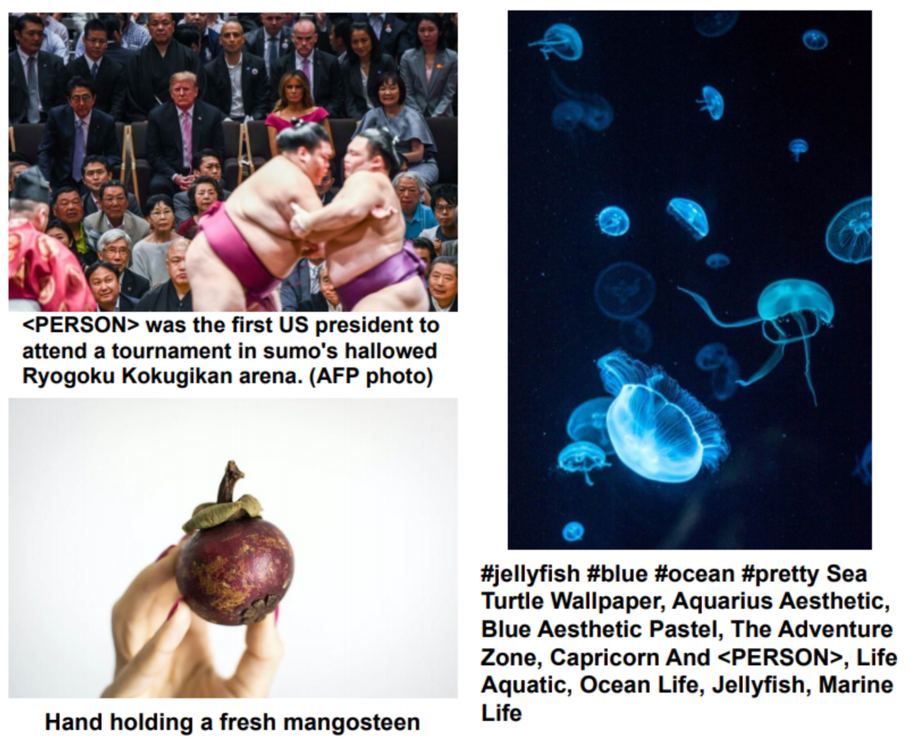
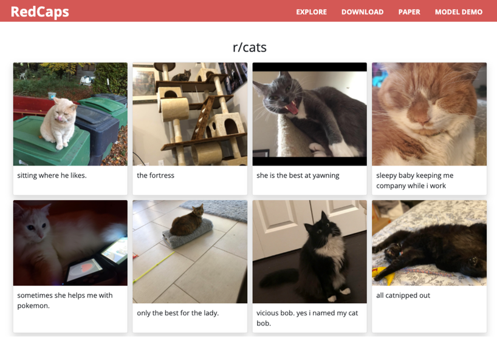
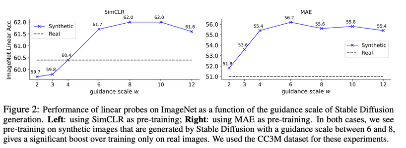
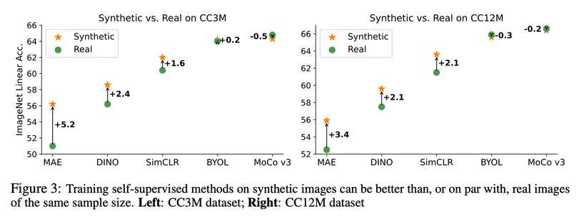
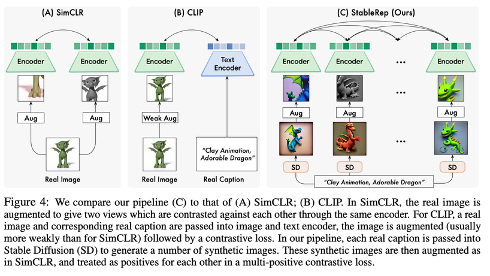
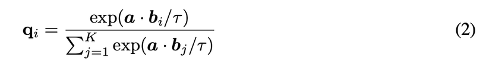
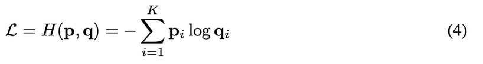
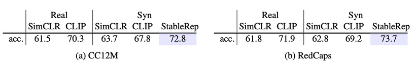
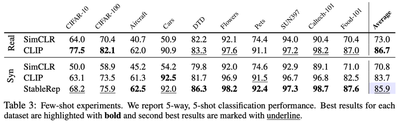

1. training self-supervised methods on synthetic images can match or beat the real image counterpart.

2. by treating the multiple images generated from the same text prompt as positives for each other

they view generative models as datasets that allow to sample images from the data distribution.

1990s : researcher needed to take photos by themselves to create datasets.
2000s : crawled the Internet.
future : synthetic dataset.

datasets

CC12M
 

RedCaps

Left : using SimCLR as pre-training, Right : using MAE as pre-training
pre-training on synthetic images gives a significant boost over training only on real images.

results of other SSL methods

these images were generated using the same prompt, they have similar visual meaning.
so these images suitable for use as multiple positive samples for each in contrast training.

in this method need to consider multi positive samples from one anchor.

1match : indicates wherher the anchor and candidate match
 

### Results                         

