StoryDiffusion: Consistent Self-attention for Long-range Image and Video Generation
===
arxiv 24.05

## Introduction
이미지 한장만 생성하는 것이 아니라 subject과 complex details를 유지한 채 생성하는 것이 목표  
> video generation과 비슷한 줄 알았는데, task 차이가 있다.  
> catoon을 생성하는 것으로 이해하면 될 것 같다.  
> 이 논문에서는 최종적으로 video generation도 진행을 하는데,   
> personalized generation과 video generation을 모두 할 수 있는 task 정의할 수 있을 것 같다.

기존에 IP-Adapter라는 연구에서는 reference image를 사용하였지만, 이로 인해 text condition에 한계가 있었다.  
> 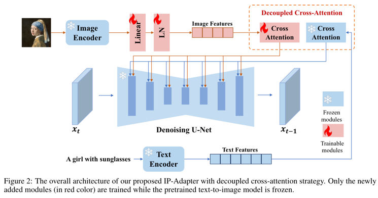  
> 위는 IP-Adapter이다.  
> 이미지가 cross-attention으로 들어가니 text condition이 약해질 수 밖에 없다.

또는 Dreambooth나 Custom Diffusion같은 fine-tuning하는 방법들이다.  
아니면 video diffusion을 사용하는데, temporal attention을 사용하는 것이다보니 너무 무겁다.  
이 논문에서는 생성된 이미지의 전체적인 구조는 self-attention이 주로 관여한다는 점에서 새로운 Consistent Self-attention을 제안한다.  
   
####
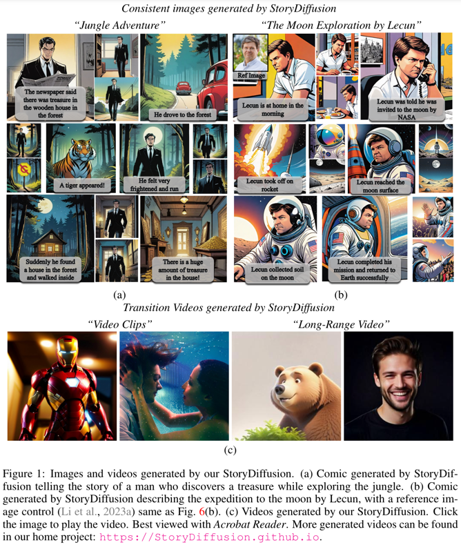
###

## Method
### Training-free Consistent images Generation
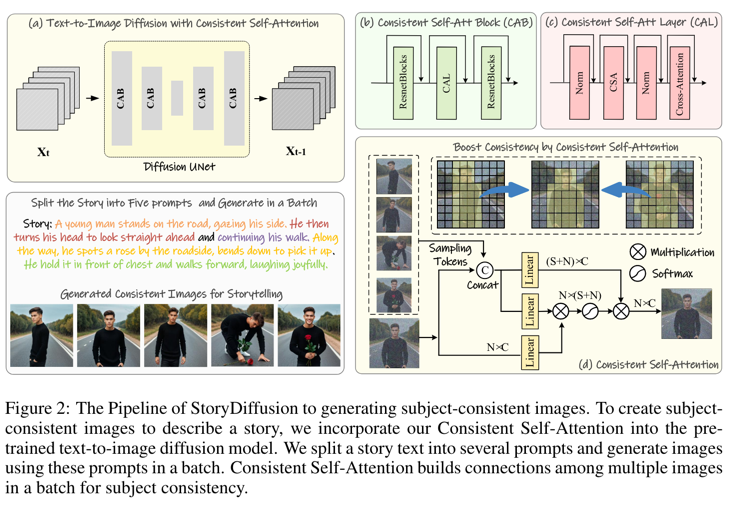
####
1. 생성하고자하는 스토리를 컷별로 나눈다. 여기서 나눠진 문장만큼 배치를 갖는 것이다.
2. 여기서에서 제안하는 Consistent Self-attention을 사용한다.

Consistent self-attention은 기존의 self-attention을 그대로 대체한다.  
정확히는 배치 내의 (디노이징중인 현재 스텝에 해당하는)이미지 중 랜덤 샘플링해서 key, value에 concat해서 같이 사용한다.

### Semantic Motion Predictor for Video Generation
video generation task에서 중간 프레임을 예측하도록 접근하는 연구들이 있다.  
하지만 중간 프레임에 대한 condition을 temporal attention에만 의존하기 때문에 공간적인 정보를 잘 활용하지 못한다.  
> 중간 프레임이 어떻게 구성되었는지에 대한 sematic한 정보가 condition으로 들어가지 않았기 때문에 잘 되지 않는 다는 것으로 이해하였다.  

####
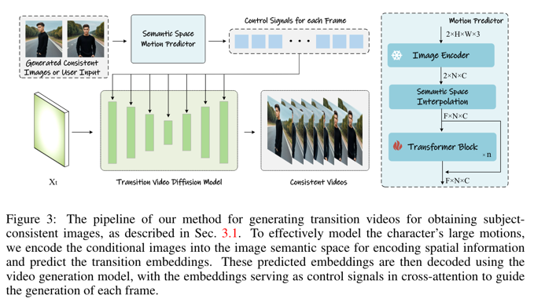
####

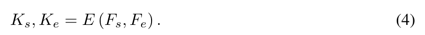  
시작 프레임과 종료 프레임에 해당하는 이미지를 CLIP image encoder로 embedding한다.  

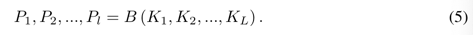  
이를 linear interpolation해서 transformer block에 입력한다.  

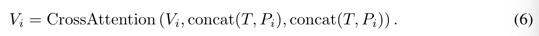  
이렇게 만들어진 predicted image semantic embeddings를 video diffusion에서 cross attention에 condition으로 사용한다.  

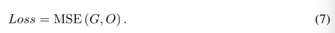  
생성된 중간 프레임과 GT간의 MSE로 motion predictor에 transformer block를 학습한다.  
###

## Experiments
### Consistent Image Generation
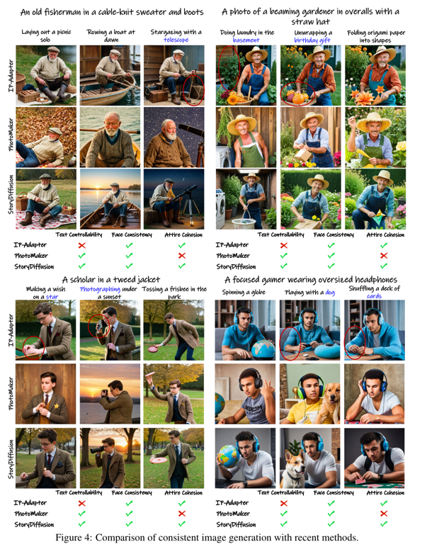  
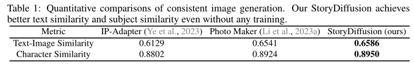  
여기서 Similarity는 CLIP score이다.  
> Character Similarity가 그냥 image끼리 비교하고 이름을 character로 붙인 것인지,  
> 아니면 사람만 분리해서 인코더에 입력한 것인지 자세한 설명은 없다.
####
### Video Generation
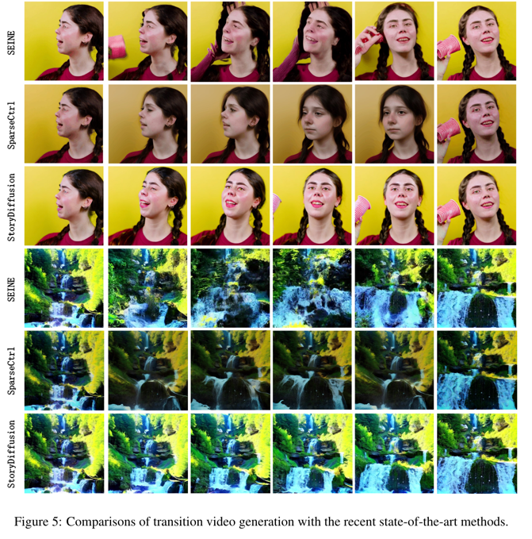  
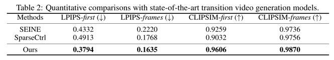  
first는 입력되는 첫 프레임과 생성된 프레임간의 유사도, frames는 생성된 프레임들의 유사도 평균으로 얼마나 잘 유지되면서 생성되었는지를 평가한 것이다.  
####
### Ablation study  
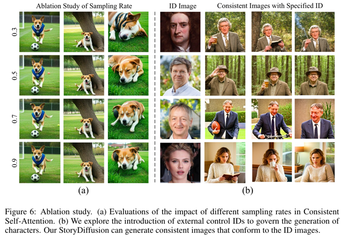  
a. 랜덤 샘플링하는 비율에 따른 비교이다. 1행3열처럼 너무 적게 샘플링하면 잘 유지가 안된다. 경험적으로 0.5이상을 추천한다.  
b. Photomaker와 결합하여 reference condition방식으로도 사용할 수 있다.
