StyleDiffusion: Controllable Disentangled Style Transfer via Diffusion Models
===
ICCV 2023 / arxiv 23.08  
###
## Introduction
Style Transfer에서 Content-Style disentanglement는 가장 기본이자 중요한 문제이다.  
기존 Gram matrix나 GANs은 3가지 문제가 있다.  
1. C-S가 완전히 분리되지 않는다.  
2. CNN기반의 방법은 블랙박스이며, 이로 인해 해석과 제어가 어렵다.  
3. Style Transfer에서 content loss와 style loss가 별도로 모델링되어 있어 C-S 사이의 관계에 대한 학습이 잘 되지 않는다.  

이러한 문제들로 인해 결과의 품질이 감소한다.  
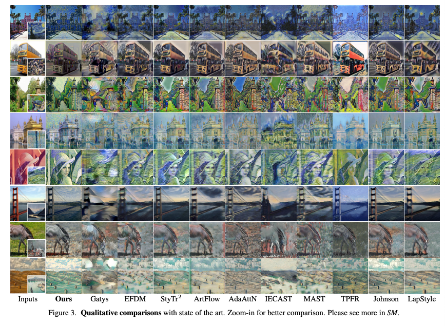  
### 
이 논문의 핵심 접근법은 content는 명시적으로 추출, 스타일은 정의가 불가능하니 암시적으로 학습한다는 것이다.  
이를 위해 이 논문은 Diffusion 기반의 스타일 제거 모듈을 제안한다.  
#
***
## Methods
I_s의 style을 I_c의 content에 transfer  
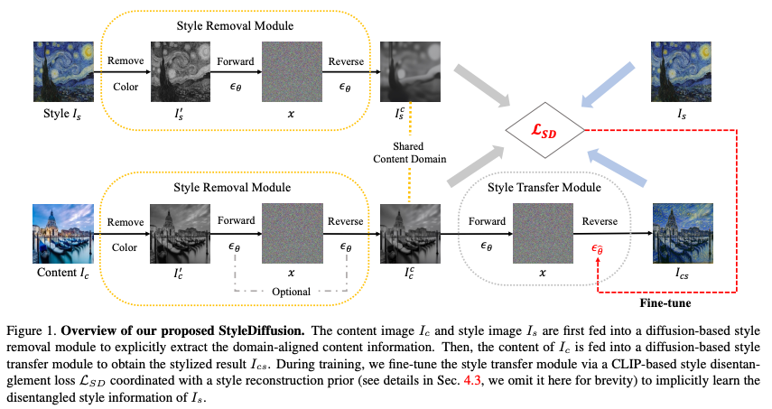  
###
### Style Removal Module
기존에는 C-S 분리를 위해 content를 명시적으로 정의하여 추출하였는데, 이 방법에는 한계가 있다.  
그래서 이 논문에서는 style을 제거하는 방향으로 접근한다.  
1. 색상은 스타일의 중요한 속성이라고 가정하고 RGB to Greyscale을 한다.
    정확히는 ITUR 601-2 luma transform을 한다고 한다.  
    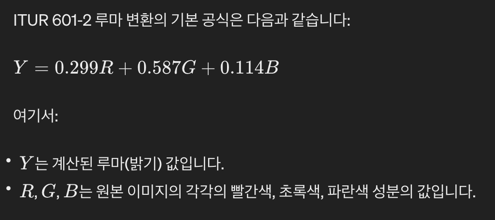   
2. 이후 ADM을 사용하여 domain specific한 정보를 제거한다.  
    여기에서 사용된 인사이트는 ILVR과 CLIP-Diffusion에서 설명하였던 Diffusion은 학습된 데이터의 분포로 출력한다는 점이다.
   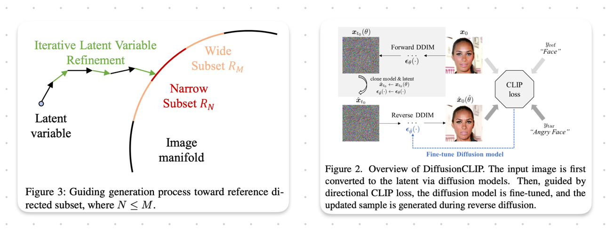  
    이 때, 사진 도메인과 같은 두 입력과 다른 도메인으로 학습된 모델을 사용한다.
    > 즉, content만 뽑는 것은 아니고 사진 도메인으로 일종의 projection하는 것이다.
3. Denoising할 노이즈는 content를 유지하기 위해서 DDIM Inversion을 사용한다.
###
### Style Transfer Module  
기존에는 Auto Encoder + AdaIN 기반의 방법들이 많이 사용되었다.  
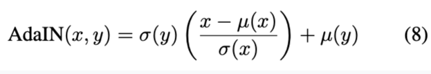  
이 논문에서는 Diffusion을 사용하여 품질을 더 높인다.  
pre-trained 모델을 사용하여 inversion => denoising하면서 제안하는 Loss를 통해서 모델을 fint-tuning한다.  
### 
### Loss function and Fine-tuning

* ### CLIP based Style Disentanglement Loss
이제 I_s에서 추출한 content와 I_s의 차이인 스타일을 추출해야한다.  
이를 위해 단순 뺄셈은 당연히 말이 되지 않는다.  
때문에 별도의 프로젝터를 사용하여 차이를 계산한다.  
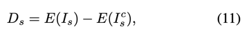  
본 논문에서는 style 도메인의 데이터도 잘 학습되어있는 CLIP의 image encoder를 사용한다.  
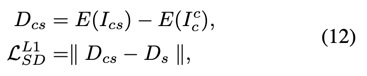  
마찬가지로 생성된 이미지에서의 스타일 차이도 구하여 L1 loss로 사용한다.  
###
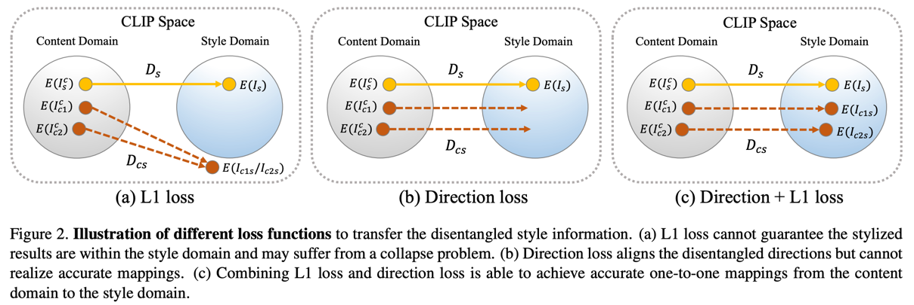  
하지만 거리의 차이를 L1하는 것이기 때문에 원하는 style로 매핑되는 것이 아니다.  
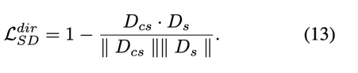  
그래서 방향에 대한 loss를 추가한다.  
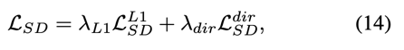  
λL1 : λdir = 10 : 1 로 실험적으로 결정한다.  

* ### Style Reconstruction Prior  
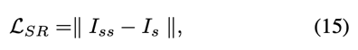  
I_ss은 최종 생성된 I_cs를 reconstruction한 것이다.  
위에 말한 CLIP기반의 loss로 최적화하기 전에 warm-up 느낌으로 사용한다.  
> I_ss와 I_s는 content가 다르다.  
> 그렇기 때문에 위에서 처럼 CLIP을 사용하는게 더 좋을 것 같은데, 언급은 없다.
###
***
## Experiments  
* 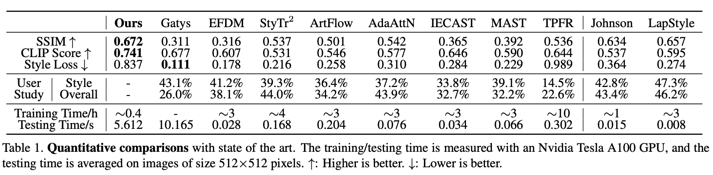
* 기존 방법들보다 성능이 좋다.  
* style loss는 AdaIN에서 사용하는 뮤와 시그마의 차이를 직접 최적화하는 것을 말한다. 다른 방법들은 이 loss를 직접사용했는데, 이 논문에서는 그렇게 하지 않았다고 주장한다.  
  * 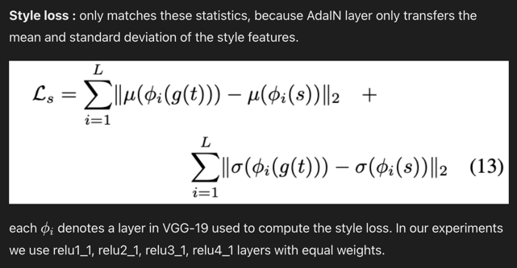
###
* Style removal module에 대한 ablation study  
  * 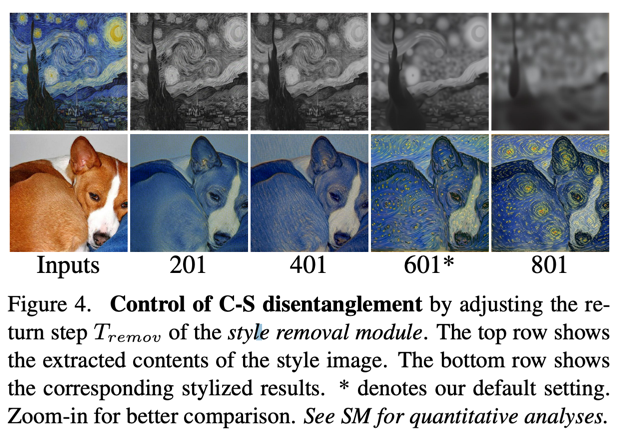  
* Style transfer module에 대한 ablation study
  * 
* Diffusion vs AE
  * 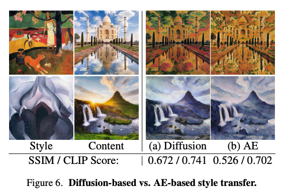  
* Loss ablation study
  * 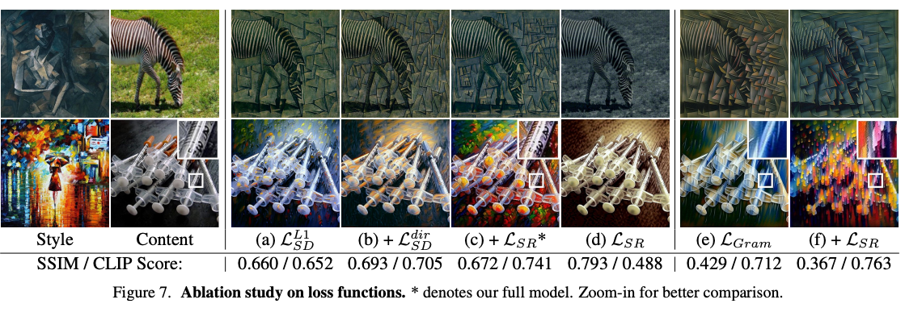

