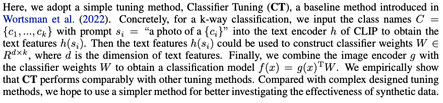
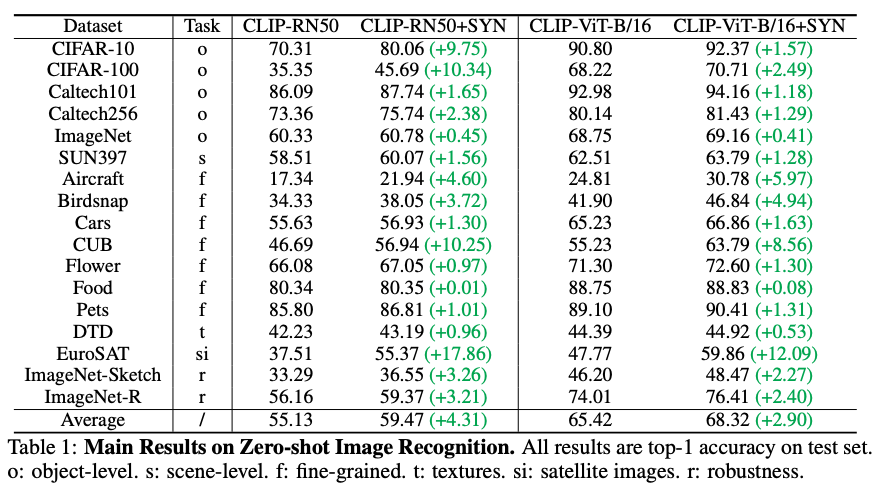
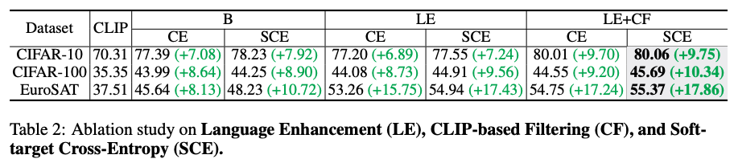
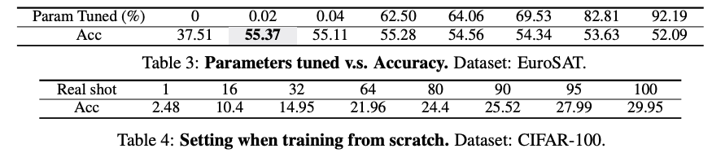
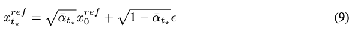
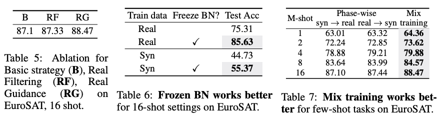
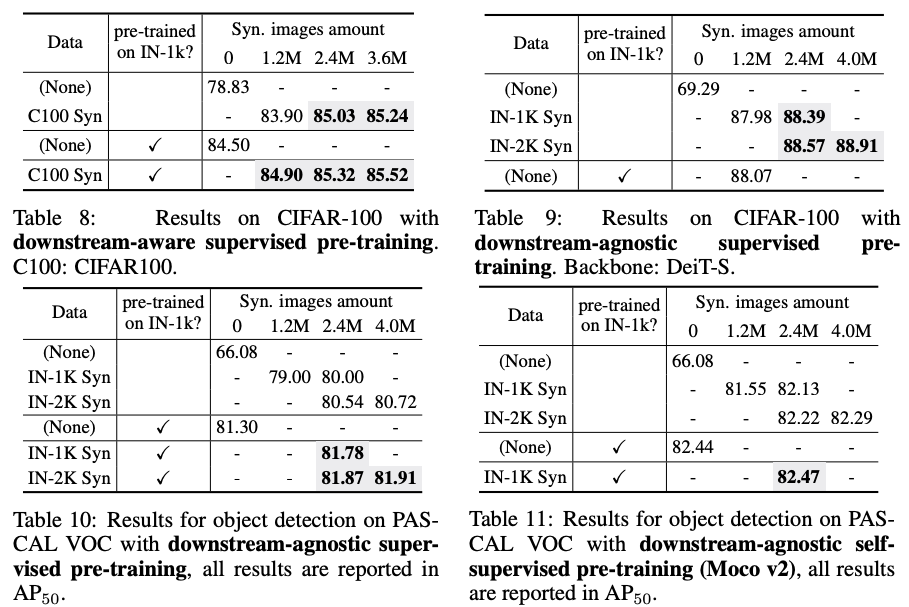

Is Synthetic Data form Generative Models Ready for Image Recognition?
===
ICLR 2023 / arxiv 22.10
####
## Introduction
1. 생성 모델의 생성 데이터가 분류 모델 개선에 준비가 되었는가?
2. 생성 데이터가 transfer learning의 feasible 소스가 될 수 있는가?  

GLDIE와 CLIP을 기반으로 zero-shot, few-shot에서 연구한다.
####
* zero-shot에서 유의미한 성능 향상 확인, 합성 데이터의 노이즈를 줄여 신뢰성을 향상시키는 전략 연구  
* few-shot에서 유의미한 성능 향상 확인, 실제 데이터와 도메인 격차를 해결하는 것이 중요하다.  
* 특히 Pre-train에 사용하는 것이 효과가 좋았다.  
###
## Methods
### Model Setup
  
text encoder를 classifier로 간주하고 내적한 유사도 기반으로 분류하겠다는 것이다.
####
### Zero-shot Image Recognition  
CLIP으로 zero-shot을 하는데 downstream task에서 몇가지 단점이 있다.  
이는 pre-train data에 피할수 없는 노이즈 데이터나 pre-train과 zero-shot간의 label space mismatch 때문일 수 있다.  
> 이렇게만 적혀있고, 어떤 단점을 말하는 것인지 분석이 없다.  
> 단순히 상황에 따라 생각보다 성능이 안나오는 경우가 있다는 말인 것 같다.  

* 기본적으로 label이름으로 데이터 생성 > feature extractor는 frozen, classifier만 학습  
* word-to-sentence T5 모델을 사용해서 prompt augmentation 해서 다양성을 늘린다.  
* 저품질의 이미지가 생성될 수 있기 때문에 CLIP Filter를 사용한다.  
####
   
####

####

* 표3: 0.02는 classifier만 학습한 것이라고 한다.  
    tuning되는 파라미터가 많을 수록 오히려 성능이 감소하는 것은 생성데이터가 실제데이터와의 도메인 차이가 있음을 말한다.  
> 위에서는 classifier가 text encoder를 말하는 것 같았는데, 0.02%밖에 안되나...?
* 표4: Cifar-100 50k 실제데이터로 scratch학습을 직접 했는데, 28.74%였다.  
    즉, 생성데이터가 실제데이터보다 효율이 훨씬 낮다.  
    이건 향후 연구 주제로 남겨둔다...? 
###

### Few-shot Image Recognition  
zero-shot에서 효과가 좋았던 LE+CF를 기본 적략으로 사용한다.
1. 클래스당 800개씩 생성했다.
2. Real Filtering (RF): 실제 few 이미지와 feature가 유사한 합성 이미지만 필터링한다.  
3. Real Guidance (RG): 생성할 때 실제 few 이미지를 가이드해준다.  
   *   
   * 실험적으로 timstep을 16shot에서 15, ..., 1shot에서 50에서 시작하였다.
> Inversion이 아니고 단순히 linear projection한 것이다.  
> 원본 데이터와 동일하게 하려는 것이 아니라 Inversion은 아닌 것 같다.  
####
  
생성 데이터가 few shot에서 성능향상에 긍정적으로 기여한다.  
하지만 실제 데이터가 많아질 수록 성능 향상폭이 감소한다.  
zero-shot에서 말한 것 과 동일하게 도메인 격차의 문제와 실제 데이터와 중복될 가능성으로 인한 것으로 판단한다.  
####
  
* 표5: RG가 더 좋았다.  
* 표7: 실제와 생성데이터를 섞어서 한번에 학습하는게 더 좋았다.  
* 표6: Batch Norm을 고정할 때 도메인 갭을 줄이는 것에 도움이 된다.  
> 표6이 무엇을 말하는 지는 알겠는데, 실험 세팅에 언급이 없다. 다른 표와 비교해도 잘 모르겠다.
###
          
### Pre-training  
* diversity가 중요하기 때문에 LE만 사용
* downstream의 label을 알 수 없는 세팅에서는 ImageNet-1k의 label을 사용
* ImageNet-2k는 label diversity을 넓히기 위해 ImageNet-21k에서 1k와 중복되지 않는 1k를 추가로 가져옴
* sup, self-sup 모두 실험  
* 백본은 언급없으면 ResNet-50, ViT는 DeiT-S  
* 생성 데이터 갯수는 ImageNet-1k의 1,2,3배에 해당하는 1.2M, 2.4M, 3.6M으로 실험한다.
####
  
pre-trained on IN-1k 항목은 생성데이터로 pre-train하기 전에 ImageNet으로 pre-trained weight를 사용한 여부이다.
* 표8,9: ImageNet-1k pretrain => CIFAR-100 transfer  
  * IN-1k weight를 사용하지 않아도 같은 양이 1.2M으로 비슷한 성능나온다.  
  * ViT에서 특히 성능향상에 크게 기여한다.  
* 표10: ImageNet-1k pretrain => PASCAL VOC supervise  
* 표11: ImageNet-1k pretrain => PASCAL VOC self-supervise (Moco v2)
> 3.6이 아니라 4.0M인 이유는 설명이 없다.  
> 4.0M에서 빈 칸은 Moco v2로 1주일 이상 걸려서 안 적었다고 하는데...  
> 아예 표기안한 결과도 있는 것으로 보아 약간의 cherry picking 가능성을 염두하고 봐야할 것 같다.  
