TextBoost: Towards One-Shot Personalization of Text-to-Image Models via Fine-tuning Text Encoder
==
arxiv 24.09

# Introduction
기존 personalization 연구들은 reference 이미지를 3~5장 사용한다.  
이미지를 한 장만 사용할 경우, 해당 이미지에 overfitting하여 텍스트를 반영하지 못하고 reference에 유사하게만 출력한다.  
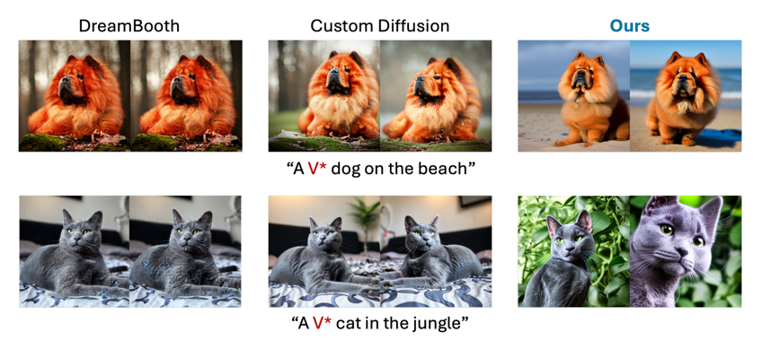  
이를 예방하기 위해 text encoder에 선택적 fine-tuning하는 것을 제안한다.  
- augmentation tokens
- knowledge-preservation loss
- SNR-weighted timestep sampling

## Need for Fine-tuning Text Encoder
이 논문에서는 Stable Diffusion을 foundation model로 판단한다.  
때문에 text condition으로 reference의 foundation model에 내제된 특징을 "capture"하기를 원한다.  
하지만 textual inversion과 같이 토큰 임베딩을 찾는 것은 많은 시간이 필요하고 표현력이 부족한 문제가 있다.  
때문에 text encoder을 fine-tuning하려고 한다.  
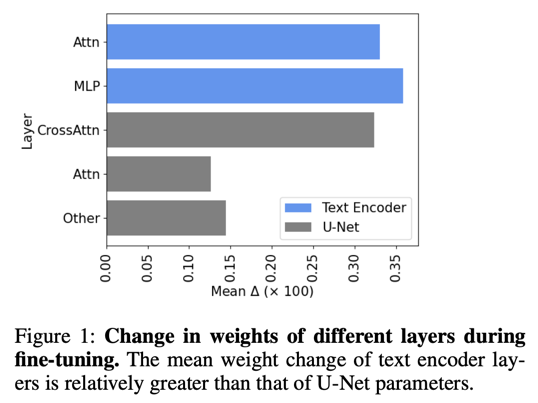  
위는 fine-tuning과정에서 layer별 weight 변화량을 정리한 것이다.  
Costum Diffusion 논문과 동일한 결과를 확인함과 동시에 Text encoder의 영향이 생각보다 큼을 확인하였다.  
이러한 근거로 저자들은 text encoder의 LoRA를 fin-tuning한다.
> 타당한 의견으로 보인다.  
> 생각해보면 이제까지 사용하는 text encoder는 clip이거나 T5이다.  
> 반면 personalization task에서는 *V안에 문장으로 다 설명하지 못할 디테일들을 "capture"해야 하기 때문에 훨씬 어려운 것이다.  
> prompt learning task는 encoder까지 foundation model로 생각한 관점이고,  
> 이 논문은 U-Net(Stable Diffusion)만 foundation model로 생각한 결과로 정리할 수 있을 것 같다.

# Method

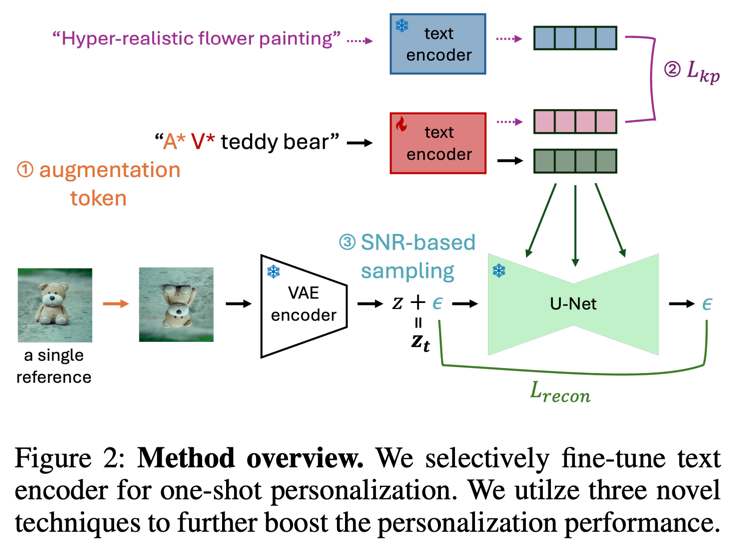

### Augmentation Token
- augmentation leaking 문제 해결  
    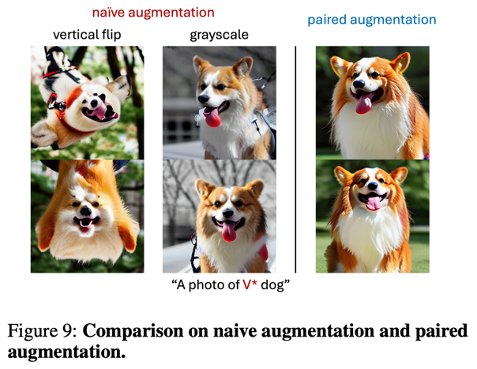  
    augmentation leaking은 이미지만 증강하고 paired text condition에는 증강을 적용하지 않았을 때 발생하는 문제이다.  
    이를 해결하기 위해서 본 논문은 'vertically flipped', 'zoomed in', 'close up'과 같이 model의 원래 임베딩과 conflict되지 않는 token을 사용한다.  
    결론적으로 'A* photo of V*'형태의 prompt를 사용한다.  
    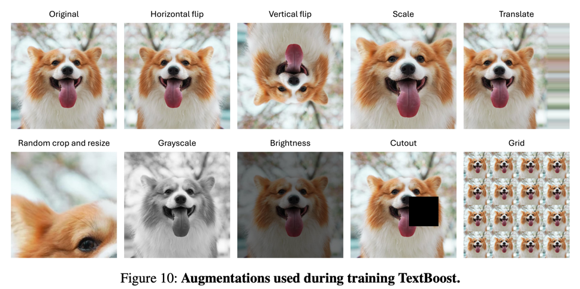  
    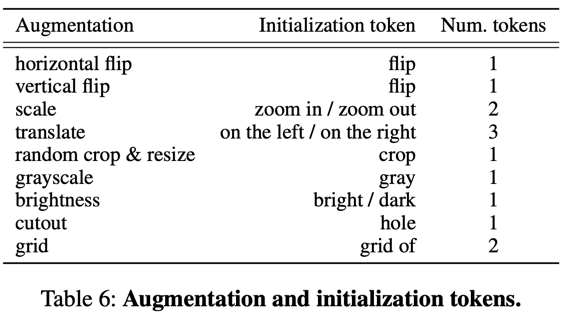

### Knowledge Preservation Loss
- language drift 문제 해결
    기존 dreambooth에서 100~200장 이미지를 생성하여 reconstruction loss term을 추가하는 방식으로 진행하였다.  
    본 연구에서는 text encoder를 학습하는 것이기 때문에 다른 loss를 제안한다.  
    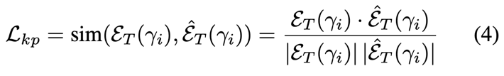  
    미리 정해진 text prompt set을 text encoder 통과시켜서 기존과 동일하게 유지되도록 한다.  
    본 연구에서는 InstructPix2Pix에서 오픈한 캡션들을 사용했다고 한다.
    전체 학습시간 감소와 GPU메모리 효율에 장점이 있다.

### SNR-Weighted Timestep Sampling
저자들은 condition에 대한 표현이 timestep과 밀접한 연관이 있을 것이라고 가정하였다.  
이를 증명하기 위해 기존의 uniform timestep에서 서로 다른 text condition에 의한 출력값을 비교해본 결과 노이즈가 많을 때에 차이가 더 큰 것을 확인하였다.  
이를 기반으로 학습 중 timestep sampling 시 가중치를 주어 노이즈가 많은 상황에 학습을 더 자주할 수 있도록 변경하였다.   
> 맥락적으로 생각해봐도 타당한 것 같다.  
> Diffusion 학습과정에서 노이즈가 클 때는 condition을 표현하는 구조를 잡는 것에 집중하고,  
> 노이즈가 작을 때에는 이미 잡혀있는 구조에서 품질을 높이는 디테일한 작업을 주로 하는 것을 생각하면  
> 위와 같은 방법에 의도를 이해할 수 있다.

# Experiments
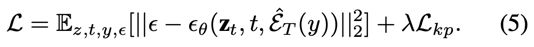

- λ=0.1
- LoRA를 사용하고 rank=4이다.

* 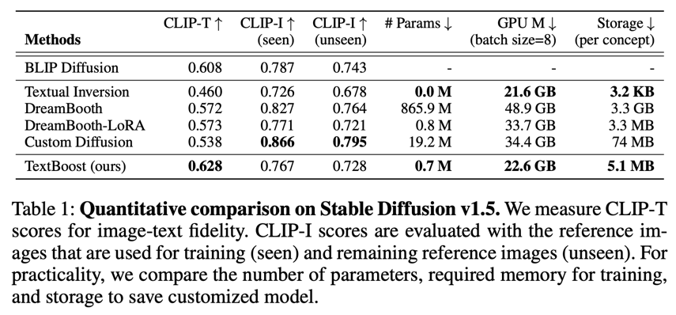
* 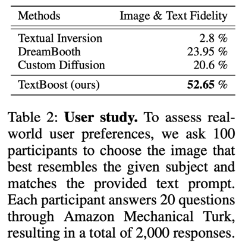
* 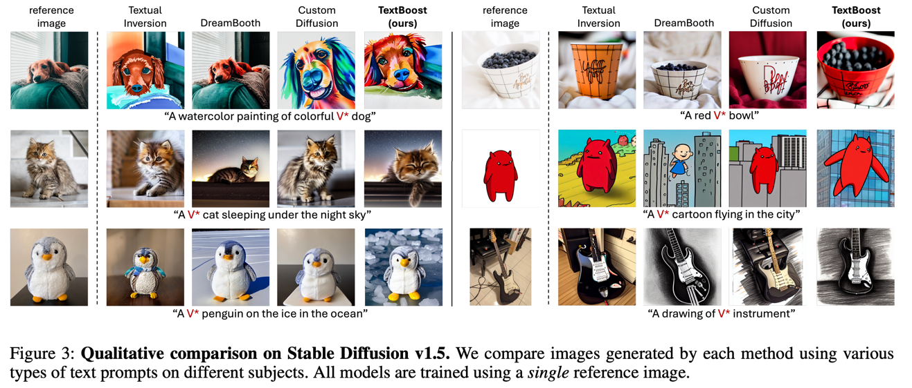
* 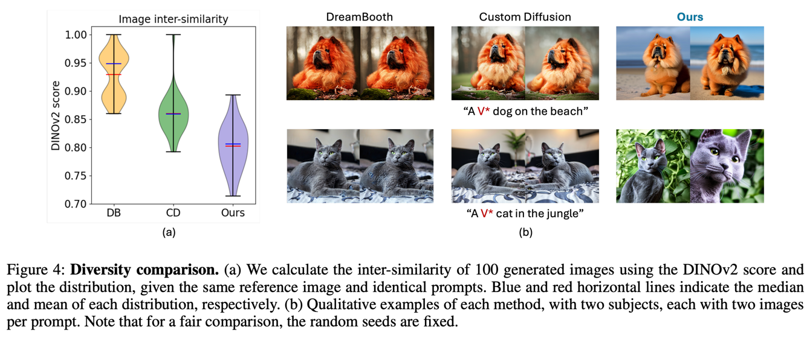
* 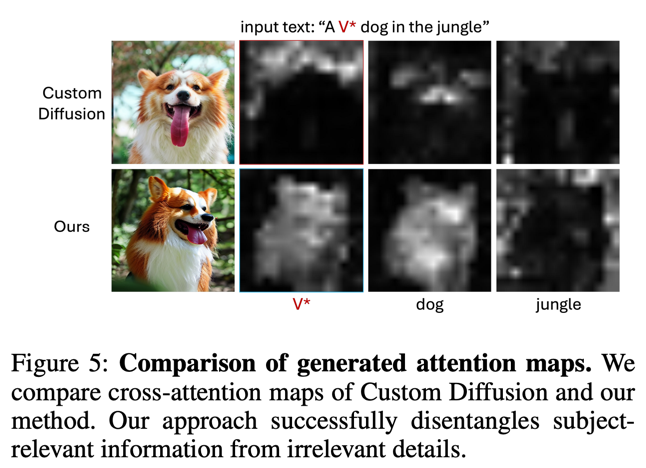
