An Image is Worth 32 Tokens for Reconstruction and Generation
===
arxiv 24.06

## Introduction
기존의 image tokenizer들은 latent space에서 위치에 대한 정보를 유지하기 위해 2D를 사용했다.  
이 논문에서는 이를 더 압축하여 1D로 만드는 것을 제안한다.  
> 논문에서 언급하지 않지만 위치정보가 꼭 차원 크기로 유지하지 않아도 된다는 가정인 것 같다.  
> 일반적인 이미지 생성에서는 속도가 빨라지겠지만 Inpainting같은 방법을 적용하기는 어렵지 않을까 생각된다.  
> 반면 이게 정말 잘 된다면 multi-modal에서 control하는 것이 훨씬 편해지지 않을까 싶다.
   
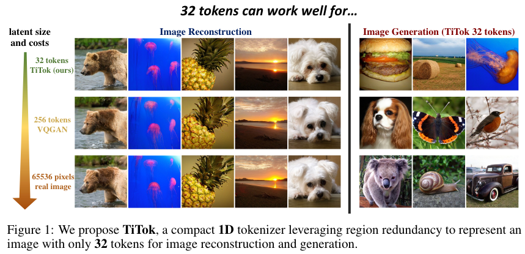  
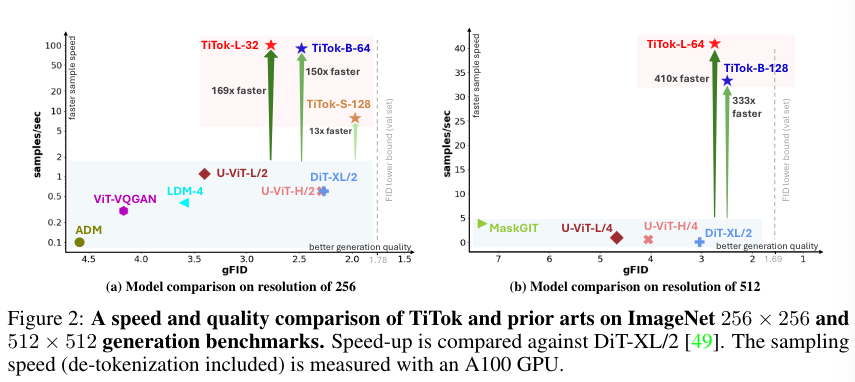  

## Related work
### Image Tokenization
AE > VAE > VQAE > VQGAN 순서로 발전해왔고 이를 기반으로 최근 연구들이 있지만  
모두 2D grid latent representation으로 인코딩하도록 연구되었다.

### Tokenization for Image Understanding  
CLIP encoder가 사용되는 경우가 있다. (captioning, VQA, multimodal)  
하지만 CLIP은 high-level semantic을 학습하였기 때문에 reconstruction에는 적합하지 않다.  
> CLIP은 image-text align을 목적으로 학습했기 때문에 세부적인 디테일은 못 살린다.  

### VQ-VAE
* Enc : encoder, Quant : vector quantizer, Dec : decoder
* input image I ∈ R^(H × W × 3)
* Z_2D = Enc(I), where Z_2D ∈ R^(H/f × W/f × D)
* 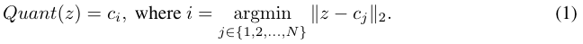  
* 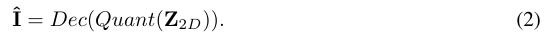  

## Method
### TiTok
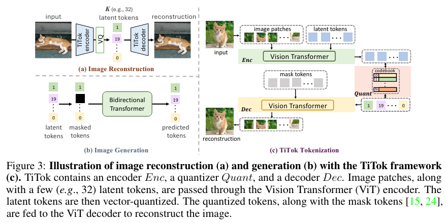  
여기서 TiTok을 제안한다.  
모델은 ViT를 사용한다.  
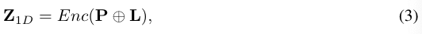  
이미지의 패치들과 K(토큰 갯수)xD 크기의 latent token을 concat해서 입력으로 사용한다.  
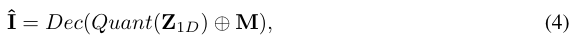  
디코더는 반대로 mask tokens를 concat하여 image patches를 reconstruction하게 한다.  
    
### Two-Stage Training
1. warm-up : MaskGIT의 VQGAN을 decoder로 학습한다.
> MaskGIT을 자세히 읽어봐야할 것 같다.  
> 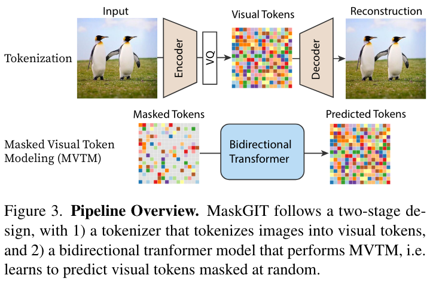
2. 이후 인코더와 tokenizer를 고정하고 디코더만 학습시킨다.

## Experiment
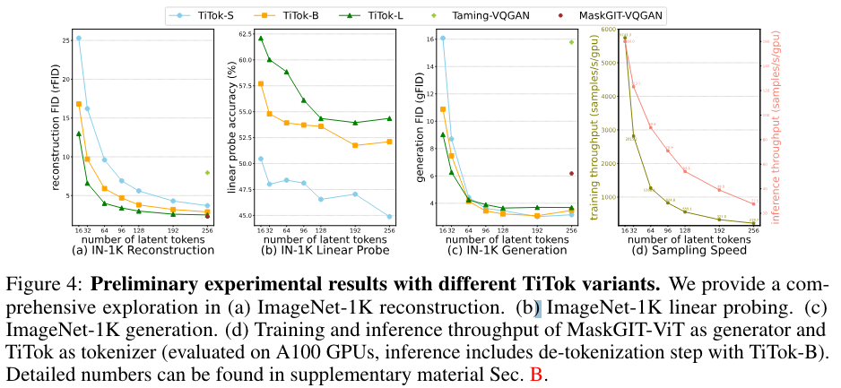
* 토큰 개수가 128개까지 성능도 증가하지만 32개일때가 가장 합리적이다.
* tokenizer 모델 자체의 크기를 키우는 것도 유의미하다.
* 이로인해 학습속도 12.8배, 추론속도 4.5 빠르다.
####
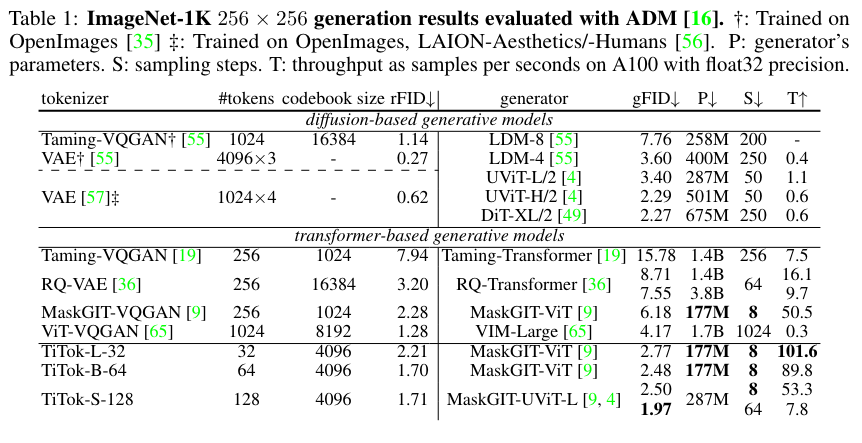  
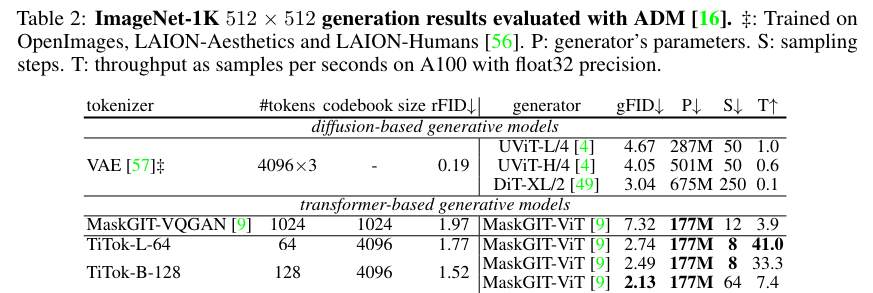  
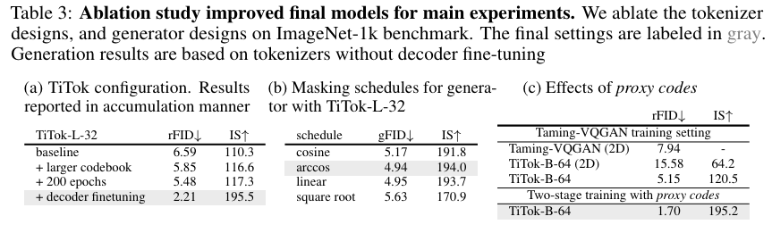

