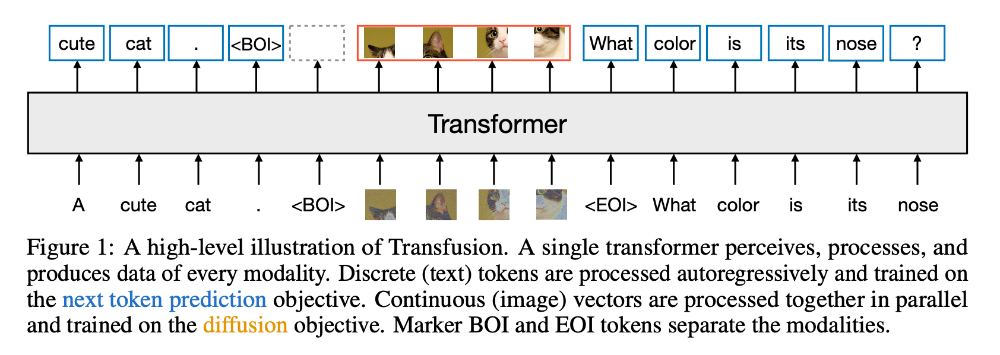
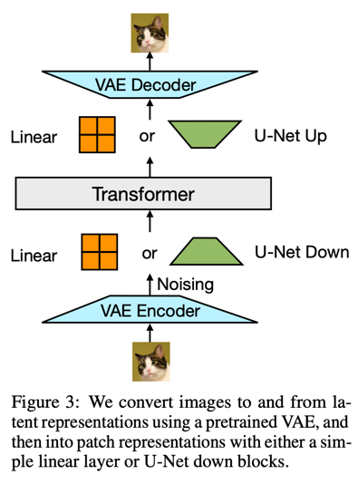
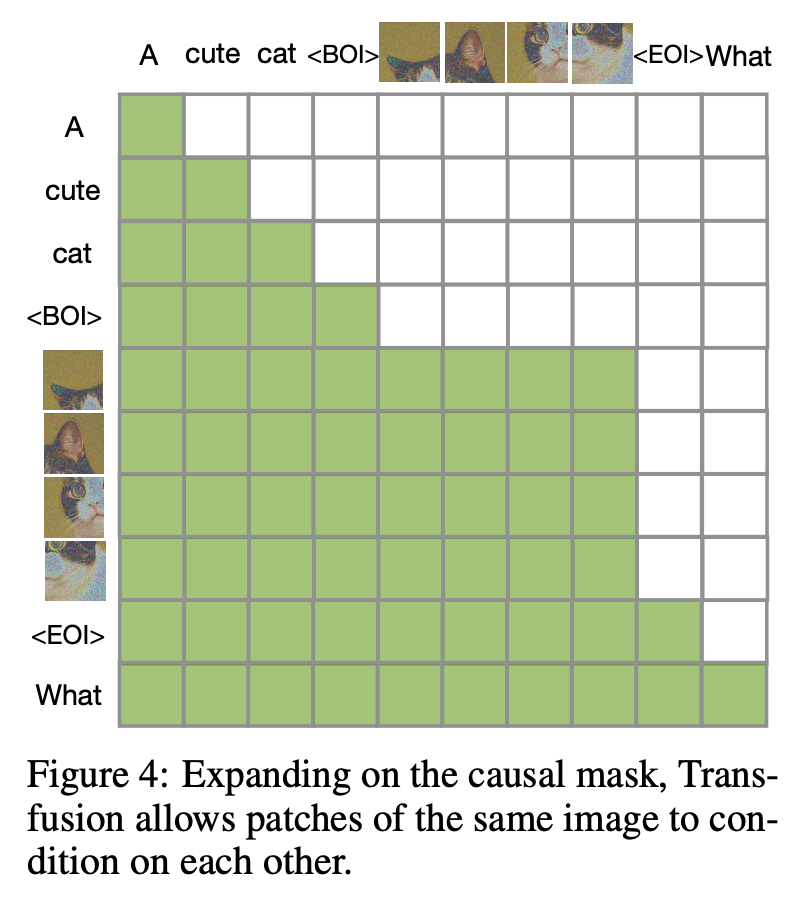
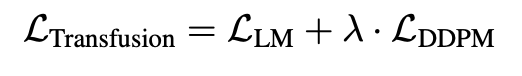

Transfusion: Predict the Next Token and Diffuse Images with One Multi-Modal Model
---
arxiv 24.08 / Meta

## Introduction
이 논문은 multi-modal generation을 시도한 논문이다.  
이산 데이터는 토큰 예측, 이미지는 diffusion으로 생성하는데 각각 다른 loss를 사용한다.  
또한 데이터를 반씩 사용해서 multi-modal token을 시도한 논문이다.

## Method
### Data Representation
* 텍스트는 토큰화하여 정수로 표현된다.  
  * 이 때, fixed vocabulary를 사용했다고 명시되어있다.
* 이미지는 패치단위로 VAE를 사용해 연속 벡터로 표현된다.
  * 이미지 앞 뒤로 BOI, EOI 토큰으로 구분한다.  
  * 기본적으로 VAE는 Latent Diffusion의 것을 사용한다.

### Model Architecture

* 텍스트: 입력 정수 -> 임베딩 행렬 -> 입력 벡터 -> Transformer -> 출력 벡터 -> 어휘에 대한 이산 분포 변환
* 이미지: linear layer와 U-Net을 사용하는 2가지를 실험한다.

### Transfusion Attention

언어 모델과 이미지 모델에서 사용하는 Attention은 구조가 다르다.  
이미지의 경우 bidirectional attention을 사용하기 때문에 이를 적용하여 그림 4처럼 사용한다.  

### Training Objective

두가지 손실을 사용한다.  
> 각각 어떤 loss를 사용했는지 명시는 안되어있지만 DDPM 같이 통상적인 것 같다.

### Inference
BOI 토큰을 만나면 diffusion 모드로 전환해서 해당 토큰을 스텝마다 업데이트하는 방식으로 이미지를 생성한다.  
이미지 생성이 끝나고 EOI 토큰을 만나면 다시 LM처럼 동작한다.

> 다 읽고 보니 논문이 너무 컨셉적인 부분만 작성되어있다.  
> 아마 후속논문을 위한 것 같으니 지켜보자.
