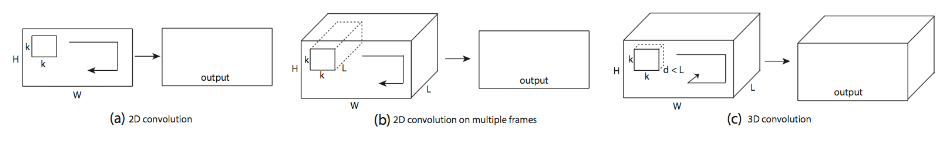
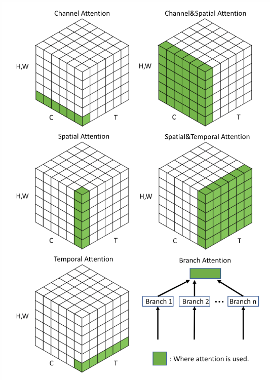
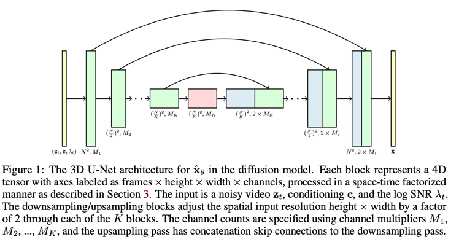
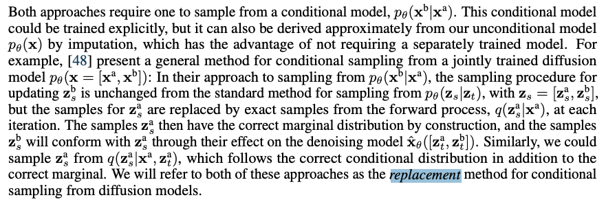
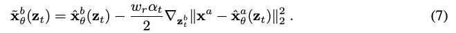
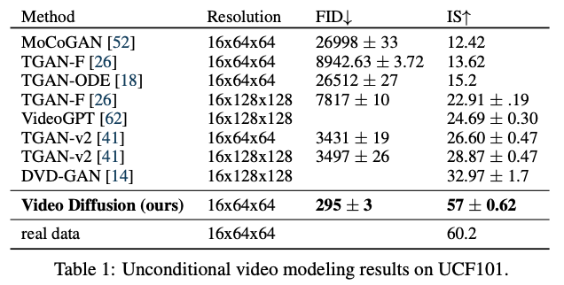
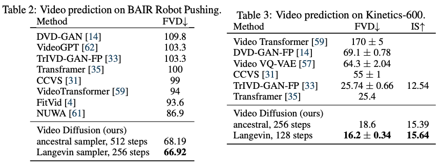
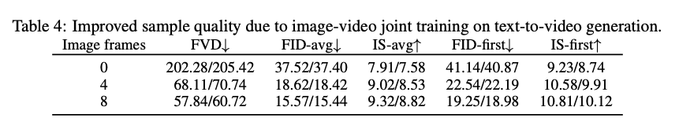
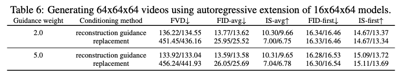

Video Diffusion Models
===
NIPS 2022 / arxiv 22.04 / Jonathan Ho의 논문  
   
Diffusion기반 Text condition video generation의 최초인 것으로 추정되는 논문  
  
## Video diffsusion models  convolution으로
1. Diffusion U-Net의 convolution을 3D  변경한다.
    3x3 convolution을 1x3x3 convolution으로 변경하였다.
   
#
2. temporal attention block을 spatial attention block 뒤에 추가  
      
    여기에는 relative position embedding 사용됨  
      
    이렇게 attention을 분리하였기 때문에 temporal attention block을 마스킹하면 이미지 한 장에 대한 attention으로 사용할 수 있다.     
    이 점을 이용해서 학습하는 것이 품질 향상에 도움이 되는 것을 발견하였다.  
 
## Reconstruction-guided sampling for improved conditional generation
학습할 때는 16개 프레임에 대해서만 학습한다.  
하지만 inference할 때에 더 많은 프레임을 생성하고 싶다면 autoregressive하게 생성할 것을 제안한다.   
#
조건부 샘플링의 목적은 주어진 xa에 대해서 xb를 생성하는 것이다. => p(x_a|x_b)    
  
기존에 이미지에서 사용하던 Replacement방식은 동영상에서는 xa를 잘 유지하지 못하더라.  
> 설명이 복잡하게 되어있는데 xa => Inversion => conditional denoising => xb 를 의미하는 것 같다.  
> 아무래도 기존 방법은 editing에 좀더 초점을 맞춰진 것이고, 동영상에서는 주요 content를 매우 잘 유지하면서 표현만 살짝 바꿔줘야하기 때문인 것 같다.  
#
  
그래서 입력이미지를 reconstruction하는 것을 가이드로 주는 방법을 제안한다.  
위 식을 해석하자면 매 타임스텝마다 reconstruction mse loss를 계산하고 그 gradient를 생성중인 xb에 반영하여 optimize하는 것이다.  
w는 하이퍼파라미터로 클수록 샘플 품질이 좋다고 한다. (CFG scale 같은 느낌인 것 같다.)  
                                                                   
***
## Experiments
https://video-diffusion.github.io/
* 
  * 1번 프레임을 주고 2~16번 프레임을 예측한 뒤에 평균낸 것으로 보인다.  
#
*   
  * FVD: FID의 동영상 버전으로 Inflated 3D ConvNet이라는 action recognition모델을 사용한다고 한다.
#
*   
  * 학습할 때 영상 맨뒤에 같은 데이터셋에서 뽑은 랜덤 이미지를 연결한다.  
    해당 이미지를 학습할 때에는 temporal attention은 마스킹한다.  
    이미지 품질이 더 좋아졌다.  
#
*   
  * 64프레임까지 autoregressive하게 생성하였을 때 replacement 방법과 비교한 것이다.
