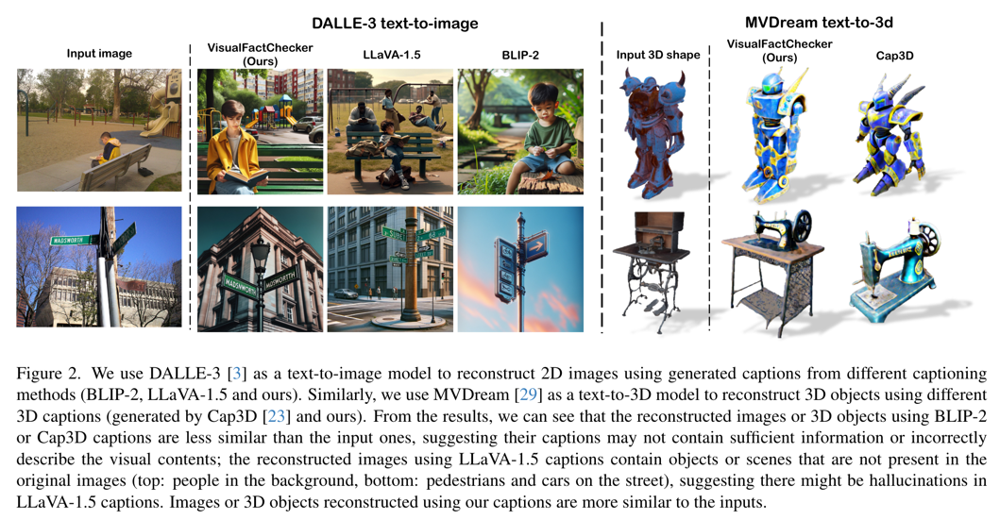
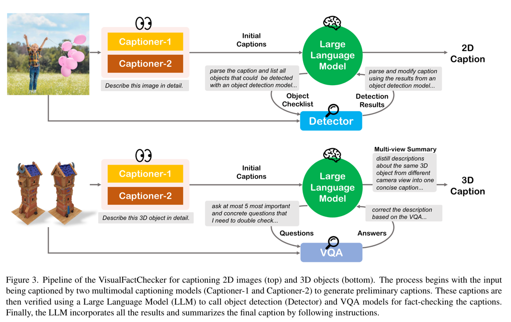
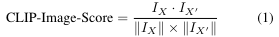
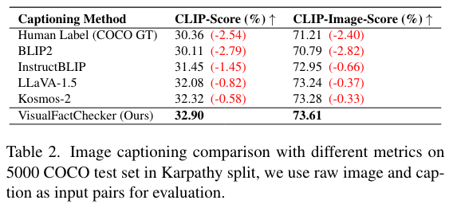
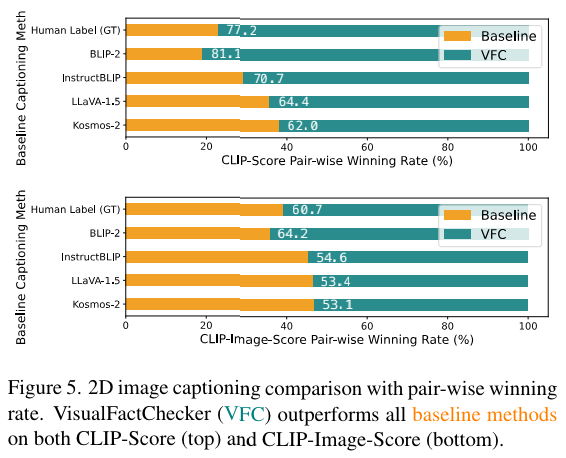
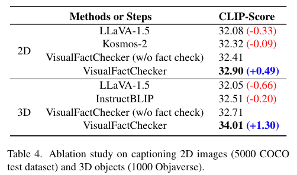

Visual Fact checker: Enabling High-Fidelity Detailed Caption Generation
===
arxiv 24.04 / NVIDIA
####
## Introduction
기존 캡셔닝은 detail 부족, hallucination, instruction following 부족의 한계가 있다.  
이를 해결하기 위해 LLM기반으로 캡션을 검토하고 수정하는 파이프라인을 제안한다.  

####

####
## Method
  
### 2D Image Captioning
1. LLaVA와 Kosmos2를 사용해서 캡션들을 제안한다.
2. 이를 LLM(GPT-4 or Llama2)를 사용해서 검증한다.
    * 1번에서 만든 캡션들을 하나로 요약한다.  
    * detector를 통해서 객체의 존재 여부를 검증한다.
3. 존재하지 않는 객체는 hallucinaiton으로 간주하고 제거한다.
4. 이 과정에서 프롬프트에 따라서 배경을 제거하는 것과 같이 의도적으로 스타일을 바꿀수도 있다.
> 이러면 detector가 잘되야 되는 거잖아...
### 3D Object Captioning
여기에서는 Detector대신의 VQA를 사용한다.  
논문 상에는 Kosmos2의 암묵적인 detector에 의존적이기 때문이라고 나온다.
> 3D에서는 각 객체의 존재 여부보다는 보여지는 객체의 속성을 제대로 이해하는 게 중요하기 떄문에 그런듯

LLM을 사용하여 3D모델 재구성에 영향을 미치는 5가지 질문을 생성하여 VQA를 하고, 이 결과를 사용하여 캡션은 수정한다.  

## CLIP-Image-Scroe
이 논문에서는 평가 지표로 CLIP-Image-Score라는 것을 제안한다.  
추론된 캡션을 사용하여 생성된 reconstruct 이미지와 원본 이미지를 CLIP image encoder를 통해서 비교하는 것이다.  
  
> 기존의 De-Diffusion같은 경우는 loss긴 하지만 mse를 사용한다.
> 여기에서는 픽셀 값이 완전 똑같은 것이 아닌 의미론적으로 같도록 평가하고자 하는 것이다.  
> 물론 이 방법도 생성모델의 성능의 의존적이다.  

이렇게 했을 때, hallucinations의 여부를 평가하기에 좋다고 한다.  
원본의 없는 객체를 있다고 하거나, 있는 객체를 놓쳤는지 여부를 평가하는 것이다.  

## Experiments
  
    

