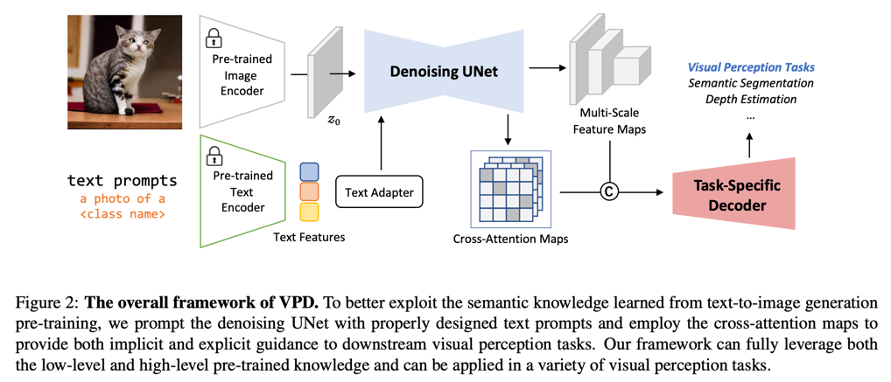
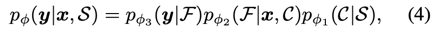
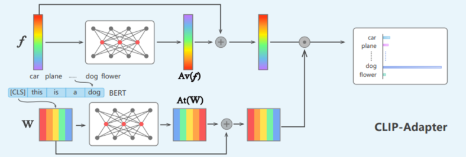
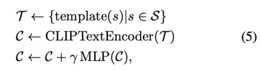
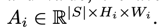
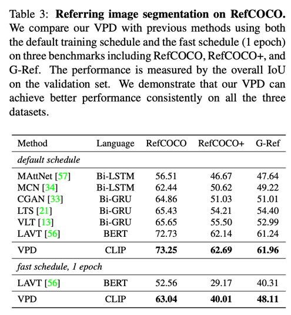
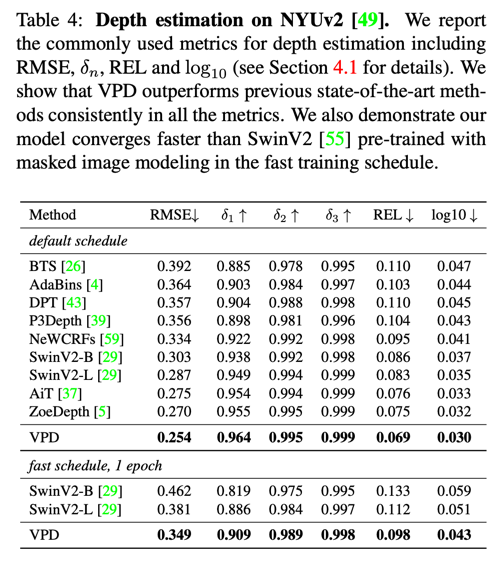
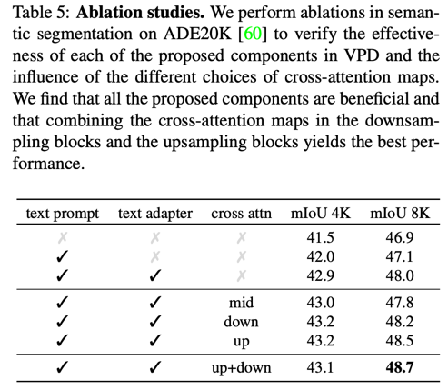
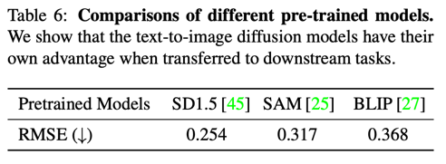

Unleashing Text-to-Image Diffusion Models for Visual Perception
===

Text-to-Image Diffusion은 이미 충분한 high level knowledge를 가지고 있다. 
a처럼 각 단어마다 어텐션이 뚜렷하게 구분되기 때문에 이를 이용하여 visual perception task를 수행하는 것을 제안한다.

* S: set containing all the category names of the task.
* C: text features
* F: set of feature maps

### 1. pϕ1(C|S)

기본적으로 "a photo of a [CLS]"를 사용한다. 
하지만 여기에서는 segmentation과 같은 downstream task에 사용하는 것이기 때문에 classification으로 학습된 기존 text encoder를 그대로 사용하기에는 domain gap이 있다. 
그래서 CLIP-Adapter처럼 MLP를 사용하여 text embeding을 보정한다.

> CLIP-Adapter에서 제안하는 것은 이미지와 텍스트에 각각 MLP를 붙이는 것이다. 
> 이 논문에서는 text에만 붙이고 있고, 물론 prompt learning을 하는 것도 아니다.

template은 "a photo of a"를 말하는 것이고, 인코더로는 [EOS]토큰이 사용된다고 한다. 
이 디자인은 텍스트 인코더에 pre-trained knowledge를 최대한 유지하면서 domain gap을 줄일 수 있었다고 한다.

### 2. pϕ2(F|x, C)

여기서 헷갈릴 수 있는데 Denoising process가 아니다!  
attention map만 뽑아내면 되기 때문에 t=0인 하나의 스텝에 대해서만 추론을 하는 것이다.  
U-Net의 출력부분의 4개의 레이어에서 각각 뽑은 attention map을 사용한다. (각각 8x8, 16x16, 32x32, 64x64)  
즉 

### 3. pϕ3(y|F)

segmentation head로는 Panoptic feature pyramid networks(CVPR 2019)를 사용한다.  
논문에서 주장하는 바는 ϵθ가 이미 충분한 capacity를 가지고 있기 때문에 헤드를 매우 가볍게 디자인 해도 된다고 한다.

Prompt-to-Prompt에서 관찰한 것처럼 attention map과 condition text간의 cross-attention은 좋은 로컬리티를 갖는다.  
이 점에서 착안하여 attention map을 downstream task의 입력으로 사용한다.  

같은 레이어끼리 평균낸다.  
  
> 하나의 객체만 텍스트에 포함되어있는 것이 가정인 것 같다. 그러니 평균내도 되는 것 같다.  
> 그리고 차원이 s인 것을 보니까 검출하는 카테고리들에 대해서 다 한번씩 돌려보고 attention map을 뽑는 것 같다.

이것을 F와 concat해서 prediction head의 입력으로 사용된다. 

## Experiments
  
  
  
  
  
