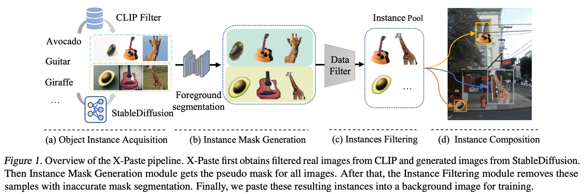
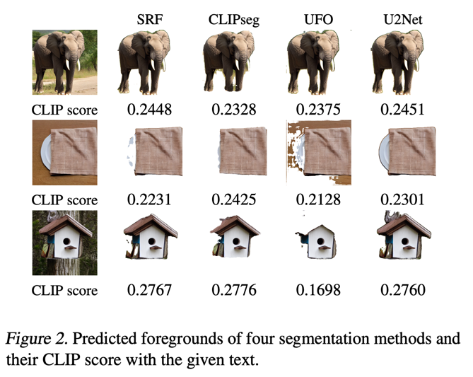
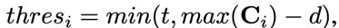
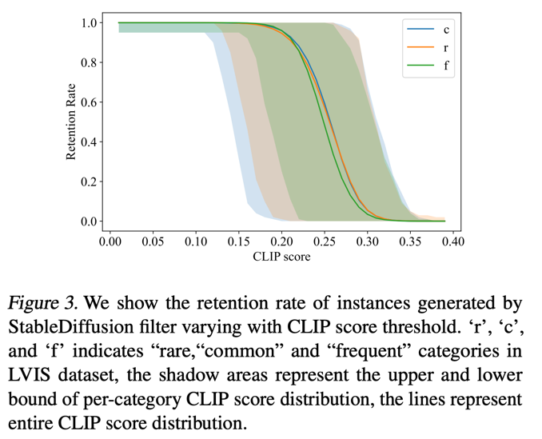
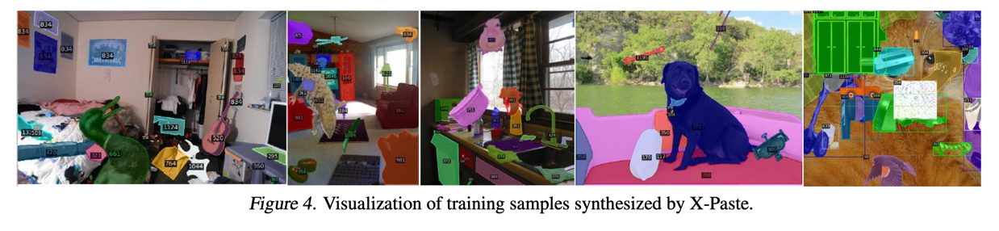
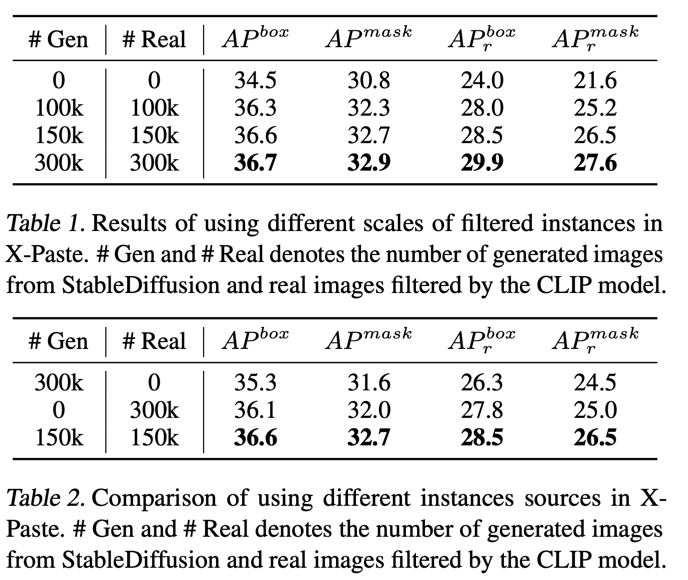
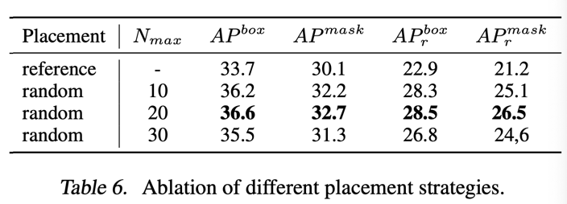

X-Paste: Revisiting Scalable Copy-Paste for Instance Segmentation using CLIP and StableDiffusion
===
ICML 2022, arxiv 22.12

  
Diffusion Classifier랑 비슷하다.  
근데 segmentation이다.  
이 당시 segmentation에서 copy-paste 방식의 augmentation이 유행이였던 것 같다.  
이 논문에 의하면 "Copy-Paste"시리즈의 논문들이 있다.  
기존의 방법들은 3D CG 모델로 만드는데 여기에 사용되는 컴퓨테이션도 그렇고 완벽한 자동이라고 할 수 없다.  
하지만 이 논문은 Stable Diffusion과 CLIP을 이용해서 쉽고 직관적인 방법을 제안한다.  

## Object Instance Acquisition  
1. SD로 "a photo of single [cls name]"을 생성한다.  
2. 웹 크롤링 후 CLIP이나 Florence로 필터링한다.  
   기존에는 모델들이 close-set으로 학습되었기때문에 필터링이 불가능했다.
3. 그리고 mask를 만들어야 하니까 배경이 단조로운 것들만 남긴댜.  
   가장 많은 픽셀에 있는 색상 +-5 범위에 속한 값이 40%이상인 이미지만 사용한다.

## Instance Mask Generation  
  
모델을 4개나 사용한다.  
하나의 이미지에 대해서 4개의 모델로 돌린 후, CLIP score로 가장 높은 것을 선택한다.  
> 그러면 접시는 잘못 고른 거 아닌가...?  
> 아 손수건인 것 같다. 그래야 말이 된다.  
> 근데 논문에는 안 알려준다.  

## Instance Filtering  
1. 위에서 마스킹된 결과가 전체 이미지에 5%미만 or 95%이상이면 신뢰하지 않고 버린다.  
2. CLIP score 기준 threshold 이상인 것들만 사용한다.  
     
   t는 하이퍼파라미터, d가 뭔지 설명이 없다.  
   의도는 class마다 CLIPscore의 범위가 다르니까 adaptive하게 해주고 싶은 것 같다.  

이러한 Copy-paste 방식은 long-tail 데이터셋에서 rare한 카테고리에 해당하는 충분한 diverse를 제공해준다.  
  
생성된 이미지에 대해서 클래스별 CLIP score 분포이다.  
r, c, f는 LVIS 데이터셋 기준 해당 클래스의 갯수에 대한 것이다.  
즉 생성된 데이터는 imbalance 문제가 없다는 것이다.  

## Instance Composition  
  
원본 데이터셋에서 해상도대비 객체들의 크기 비중에 대한 분포를 미리 뽑아두고  
그 분포를따라 paste할 객체의 크기를 정한다.  

## Experiments  
  
* 데이터가 많을수록 좋다.  
* 섞어쓰는게 좋다. Real만 쓰는 경우 imbalance때문에 성능이 낮다.

  
* 객체가 너무 많아도 안 좋다.
