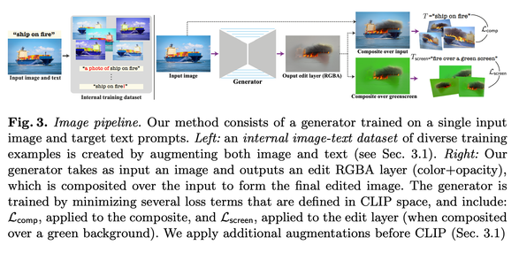
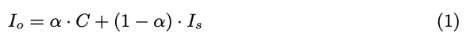
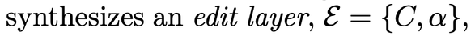
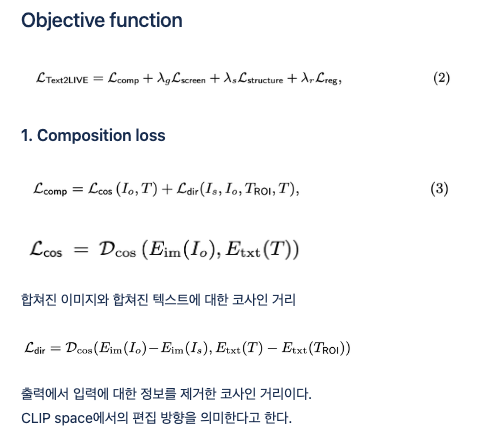
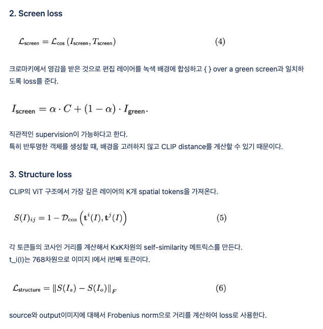
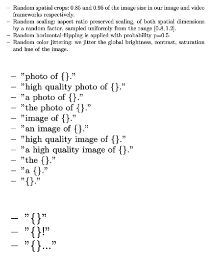
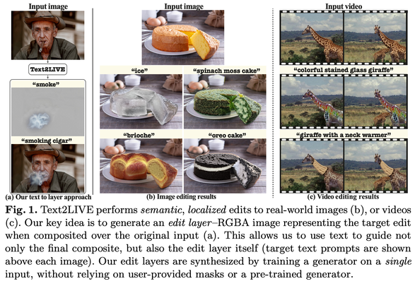
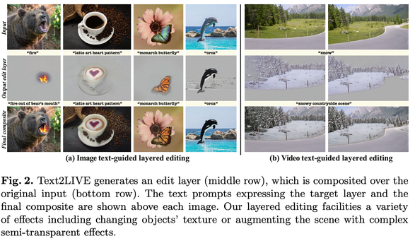

Text2LIVE: Text-Driven Layered Image and Video Editing
==
ECCV 2022

smoke 때문에 읽게 되었다 (이미지에 대한 내용만 정리함) 
알파맵을 예측해서 생성한 객체의 불투명도를 조절하겠다. 
1. text기반의 편집할 위치를 가이드할 수 있다. (입력 마스크를 사용하지 않는다.)
2. “편집된” 이미지를 출력하는 것이 아닌 RGBA레이어를 통해 편집을 한다.
3. 입력 이미지와 텍스트에 다양한 augmentation을 적용
4. 동영상 편집

I_o가 프롬프트 T를 잘 표현하도록 하는 입실론을 생성하는 것이다.

프롬프트 T는 2가지를 사용한다.
1. T_screen: 그린 스크린 위에 합성될 목표 편집 레이어에 대한 설명
2. T_ROI: 원본 이미지에서 관심 영역, 편집할 위치를 설명 

T: “fire out of the bear’s mouth” 
T_screen: “fire over a green screen” 
T_ROI: "mouth"

