Zoom-to-Inpaint: Image Inpainting with High-Frequency Detailss
==
CVPR workshop 2022 (20.12)

Reconstruction error에 대해서 해결하려고한 연구
객체생성을 타겟으로 하지는 않음

* SR 모델을 사용해서 고해상도에서 고주파영역에 대한 세부정보를 보정
* progressive learning strategy for inpainting
* gradient loss for inpainting

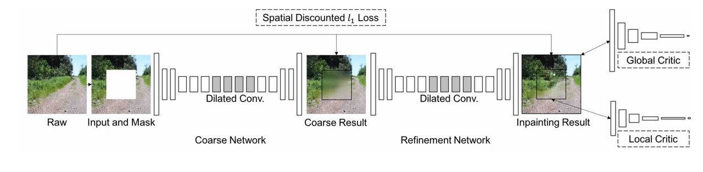
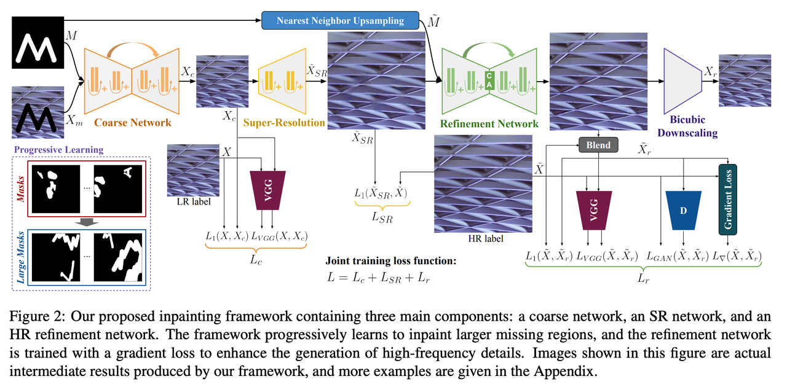
2 stage에서 Refinement를 HR(high resolution)에서 수행하여 고주파 영역을 디테일하게 복원하는 것이 메인 컨셉이다.

### Coarse Network
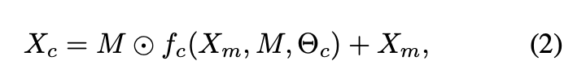
coarse network에 출력된 이미지에 원본의 배경을 덮어씌운다.
하지만 이렇게만 하면 모델이 배경 영역에 대한 reconstruct를 시도하지 않는다.

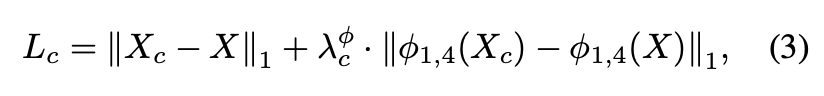
앞 항은 pixel-wise similarity
뒤 항은 VGG의 1, 4 레이어에서 나오는 feature에 대한 similarity

### Super-resolution Network
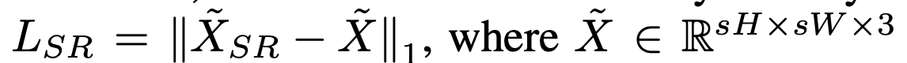
원본인 HR이미지와 SR의 출력 이미지를 직접 pixel-wise로 계산한다.

### High-resolution refinement Network
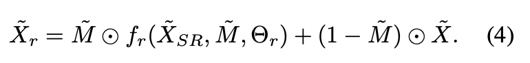
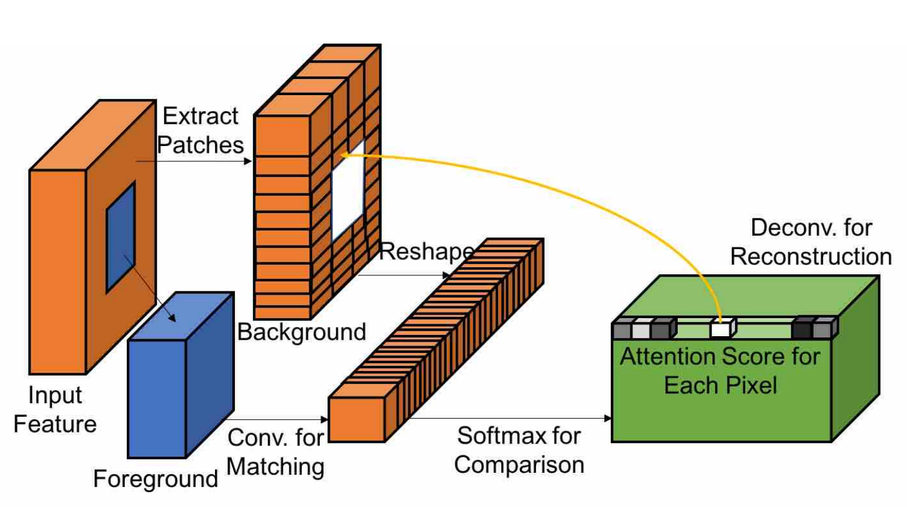
여기서 마스크는 contextual attention layer에 사용된다.
contextual attention layer는 DeepFill에서 제안된 것으로 여기에서는 refine network의 인코더와 디코더의 bottle neck부분에서 사용된다.

### Gradient Loss
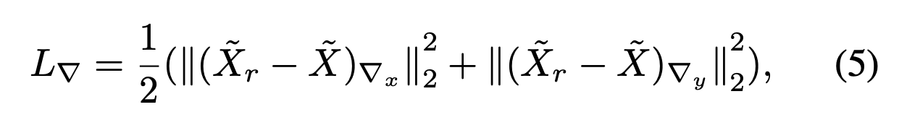
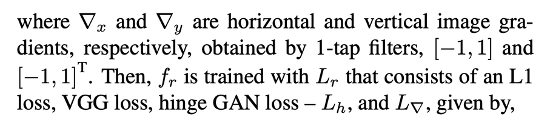
수평, 수직 방향으로 최종이미지와 원본이미지에 차이에 대한 그라디언트를 계산한다.
이를 통해서 고주파 세보정보를 손실로 추가한다.

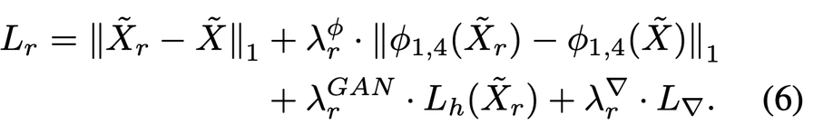
최종적으로 refinement network에서 사용되는 손실이다. (pixel, feature, GAN, gradient)
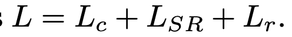
3개의 네트워크를 각각 pre-train 해준 후에 end-to-end로 통채로 학습한다.

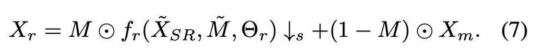

최종적으로 refinement network의 출력에 마스크를 씌워서 다운샘플링 한 후에 원본과 blending해준다.

### Progressive learning for image inpainting

마스크를 크게주면 수렴하는데 오래걸린다.

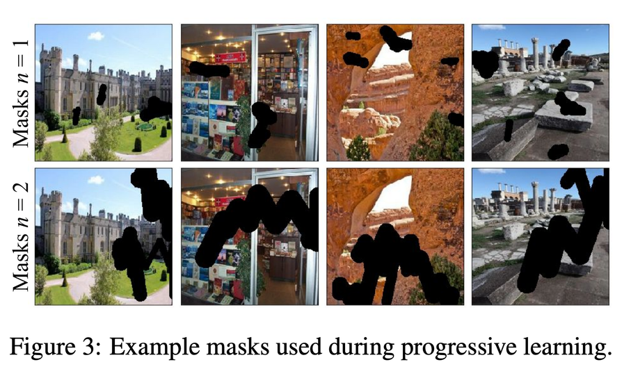
그래서 여기에서는 마스크를 일정 에폭마다 점차 증가하면서 학습한다.
n=2의 마스크를 직접학습하면 2M정도 학습했는데,
점진적으로 하면 n=1에서는 80K, n=2에서는 1.2M 만큼 학습했다고 한다.
