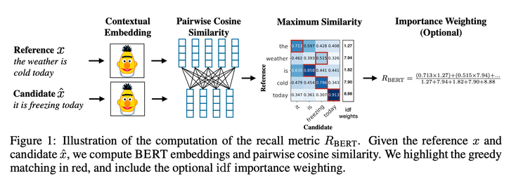
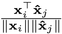
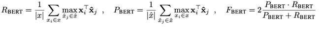
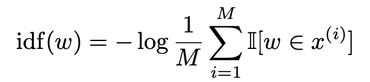
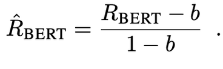

previous metrics

### BLEU (Bilingual Evaluation Understudy)

* 표면적인 형태의 일치에만 초첨을 맞추기 때문에, 의미는 같이만 표현이 다른 경우 낮은 점수를 준다.
* "people like foreign cars"와 "consumers prefer imported cars”는 점수가 낮게 나온다.
* BERTscore는 문맥화된 토큰 임베딩을 사용하여 유사성을 계산한다.

### METEOR (Metric for Evaluation of Translation with Explicit ORdering)

* Stemmer, Lemmatizer라는 방식의 단어를 변형시키는 기술이 필요하다.

* running이나 runs, ran을 모두 run으로 변화한 뒤에 평가를 하는 것이다.

* BERTscore는 이러한 단어의 변형을 BERT 임베딩이 이미 학습하고 있기 때문에 필요가 없다. 104개 언어에 대해서 사용 가능하다.

### Embedding-based Metrics

* 단어 단위로 임베딩하여 비교한다.

* 문맥을 고려하지 않기 때문에 과일 apple과 기업 apple을 구별하지 못한다.

* BERT는 문맥을 이해할 수 있다.

### Learned Metircs

* 특정 task에 맞춰서 사람이 annotiation한 뒤에 supervise learning으로 평가 모델을 만든다.

* BERT는 특정 task에 맞춰서 학습하지 않기 때문에 문제 없다.

1. Sentence tokenization for BERT

2. Embedding generation from BERT

3. Similarity measurement using consie similarity   

4. BERT score calculation          

* Importance weighting (optional)rare words can be more indicative for sentence than common words

Inverse Document Frequency (IDF)    

* w : word
* x^(i) : reference sentences
* M : number of sentences
* I[·] : 1 if (w in x^(i)) else 0
The rarer the word, the higher the value.

Baseline rescaling  
Theoretically, it is a value in [-1, 1], but in practice it is observed in a limited range due to the embedding nature of BERT.So they adjust the range for readability.    

b : average BERT score   
compute on 1M data which not related pair sentences.so, b means expectations value of worst case.and they said after this operation is “typically” between 0 and 1.
