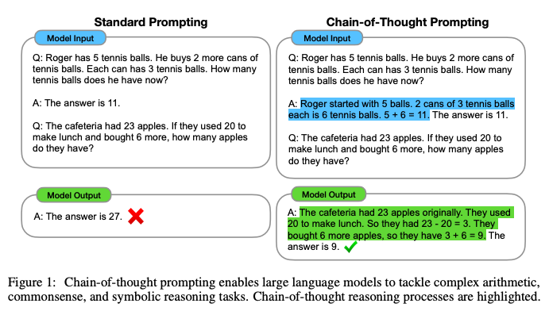
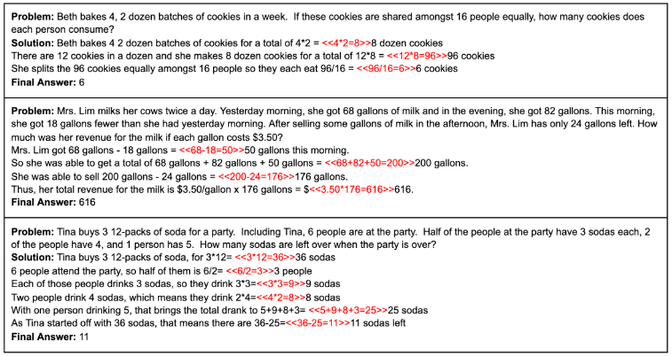

Chain-of-Thought Prompting Elicits Reasoning in Large Language Models
===
NIPS 2022 / arxiv 22.01
###                       
LLM을 dowstream task에 사용하기 위해서 기존에는 2가지 방법을 사용한다.  
1. 산술 추론을 위해서 중간 추론 과정로 자연어를 사용하는 방법  
  
    => 하지만 데이터셋 만드는 것도 어렵고, 입-출력이 복잡해진다.
2. few-shot으로 예시 프롬프트를 주는 방법  
  
    => 실질적으로 성능의 한계가 있다.

####
  
이 논문에서는 <input, chain of thought, output> 3가지로 구성된 프롬프팅을 제안한다.  
위 두가지를 혼합한 것으로 생각하면 된다.  
모델 입력 자체에 풀의과정과 예시 task를 같이 입력해주는 것이다.  
  
결과적으로 특정 task에 대한 fine-tuning한 SOTA보다 더 성능이 좋다.  

###  
## Chain-of-Thought Prompting  
이러한 방법을 사용할 때 얻는 이점은 다음과 같다.  
1. 문제를 해결하기 위해 중간 단계로 분해할 수 있으므로, 더 많은 추론 단계가 필요한 문제를 해결할 수 있다.
2. 모델이 내뱉는 답에 대한 추론과정을 디버깅할 수 있다.  
3. 이론적으로는 인간이 언어를 통해 해결할 수 있는 모든 추론 작업에 적용 가능하다.  
4. few-shot 프롬프팅를 사용함으로 충분히 큰 모델을 쉽게 사용할 수 있다.  

###
## Arthmetic Reasoning  
math word problem benchmarks를 사용한다.  
 
####

* 모델이 작으면 오히려 비논리적인 중간 과정을 생성해서 성능이 떨어졌다.  
* GSM8K가 문제가 더 복잡한데 이럴 경우 성능 향상에 더 도움되었다. (중간 과정이 많은 경우)  
* fine-tuuning하는 방법과 동등 이상이다.  
####
  
* 방정식만 출력하게 했을 떄 성능향상이 적다. 즉, 자연어기반의 표현이 도움이 된다.  
* 변수를 .으로 출력하였음에도 SOTA(fine-tuning)와 비슷하다. 자연어가 도움이 된다.    
* 답만 먼저 출력하고, 디버깅을 위해 풀의를 뒤에 출력하게 했지만 성능향상이 적다. 순차적 생성이 도움이 된다.  
###
## Commonsense Reasoning  
수학에 특화되지만 상식 추론에도 효과가 좋다.  
아래는 CSQA의 예시이다.
  
####
  
전체적으로 동일한 양상을 보였다.  
심지어 Sports Understanding이라는 데이터셋(스포츠와 관련되어 그럴듯한지 판단)은 upper bound인 사람을 뛰어넘었다.    

CSQA에서는 성능향상이 미미했다.

####
## Symbolic Reasoning  
* 마지막 글자 연결: "Amy Brown" => "yn"을 하는 task로 "AB"를 뽑는 것보다 어렵다고 한다.  
* 동전 던지기: "현재 동전 앞면, A는 뒤집었고 B는 뒤집지 않았습니다. 여전히 앞면인가?" => "아니요"

이러한 데이터 외에 OOD로 더 문제를 어렵게 하여 실험한다.  
예를 들면 2단어 이름으로만 예시를 주고 3,4단어로 된 이름을 준다거나,  
동전 던지기에서 잠재적 뒤집기(potential flips ???) 횟수에서도 똑같이 실험한다.  
이 때 성능이 더 향상함을 통해 일반화에 장점이 있음을 주장한다  
  
####
