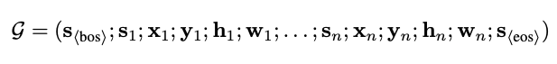
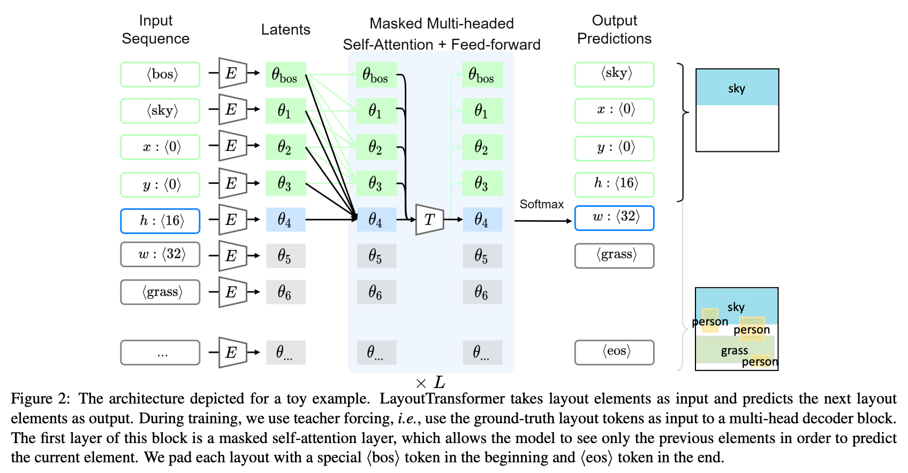
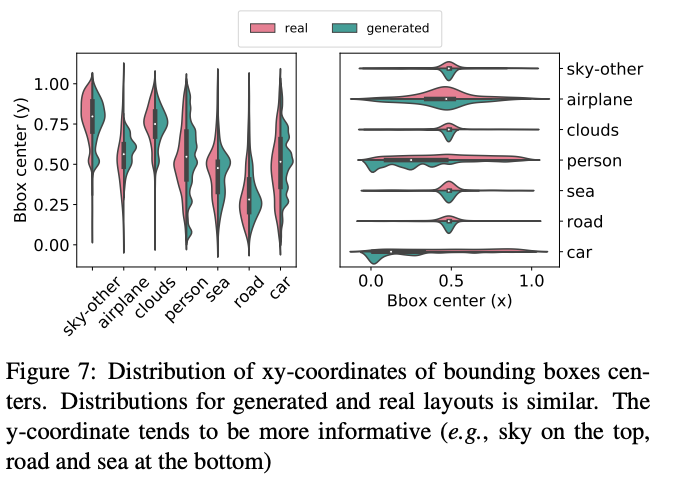
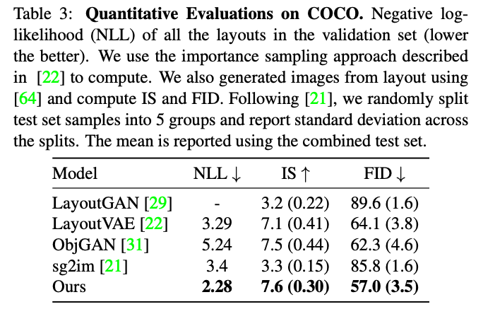

LayoutTransformer: Layout Generation and Completion with Self-attention 
===
ICCV 2021 / arxiv 20.06 / 78 Citations (24.04.12)
####
## Introduction
사람이 시각적인 인지를 하는 것에는 두가지 요소가 있다. 
* 인식: 장면의 시각 신호 또는 모습
* 이해: 장면의 스키마를 파악, 객체 간의 상황별 관계를 분석하는 것

즉, "사실적인 장면"이라는 평가에는 객체간의 관계와 위치도 중요하다.  
Layout Generation은 이러한 "배치"를 예측하는 task이다.  
####
  
여러 도메인에서 사용될 수 있는데 각 도메인마다 primitive의 특징을 달라질 수 있다.  
기본적으로는 원점으로부터 위치 벡터, bbox로 표현된다.  
####
## Approach
### Layout Representation  
각 인스턴스마다 n개의 노드(각 primitive)를 가진 그래프 G로 정의한다.    
각 노드에 연관된 정보를 d차원의 feature vector s_i로 projection한다.  
결과적으로는 총 5n+2개의 벡터로 한 인스턴스를 표현할 수 있다.  

####
### Model architecture and training  
   
####
이렇게 만들어진 벡터들을 Transformer Decoder와 유사하게 구성된 네트워크를 통해 auto-regressive하게 생성한다.  
학습할때는 teacher forcing을 사용한다. (효율을 위해 전 스텝은 GT를 쓰는 방법)  

####
> 그러면 생성순서가 중요하지 않을까싶다.  
> 그림2에서도 하늘이 물론 평균적인 분포가 위쪽이니까 위에 생성하겠지만, 잘못 생성되면 다른 객체들도 엉뚱하게 생성될 수 있을 것 같다.  
> 이에 대해서 논문에서는 향후 연구로 남겨두었다.
####
## Experiments  
  
생성된 bbox 분포가 실제 데이터의 분포와 근접하다.  
####
  
Layout-to-Image generation을 한 결과이다.  
> IS나 FID는 뭐 지금 시점에서 더 좋은 모델이 많아서 크게 의미없지만, 이쪽 task도 평가 metric이 명확하지 않은 것 같다.  
> 물론 이 task 논문을 처음 본 것이라 이후 최신 논문들도 봐야 알 것 같다.  
