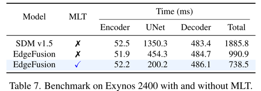
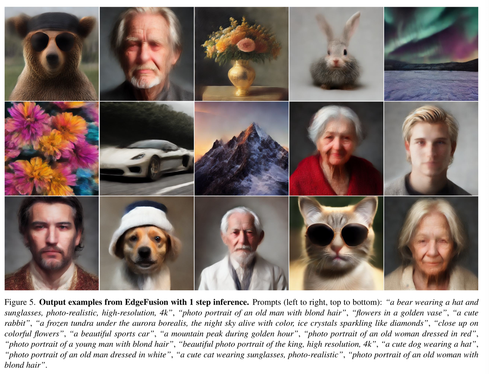
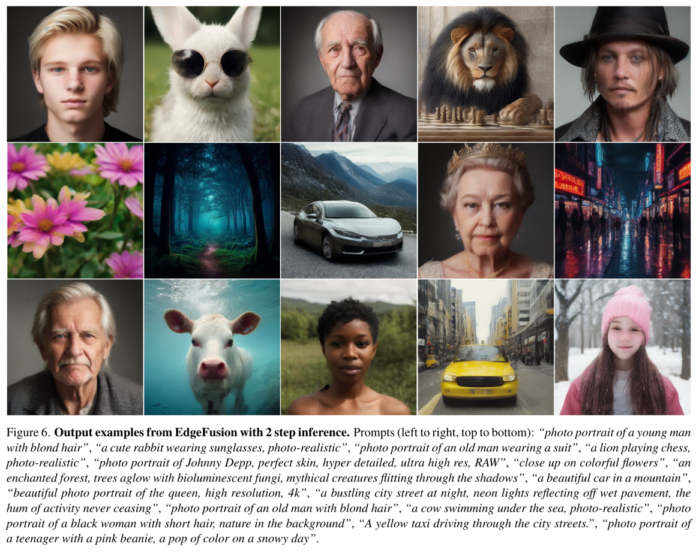

EdgeFusion: On-Device Text-to-Image Generation
====
arxiv 24.04 / Nota AI 논문  
####
Stable Diffusion이 좋긴한데 너무 무겁다.  
이를 NPU에 사용하기 위한 기존 연구방향은 3가지이다.
1. architectural reduction
2. few-step inference
3. leveraging AI-generated data

모델은 동저자의 [BK-SDM](./Quantization/BK-SDE/main.md)을, Diffusion process는 LCM(Latent Consistency Model)을 사용한다.  

## approach
### Advanced distillation for LCM
우선 BK-SDM Tiny에 LCM을 적용하였지만 결과가 만족스럽지 못하다.  
그래서 BK-SDM에서는 SD v1.4을 사용하지만 여기에서는 Realixtic Vision V5.1을 teacher 모델로 사용한다.

### Improved data quality
* L-orig 
  * LAION 데이터셋의 캡션 품질이 낮은 데이터들이 많이 포함되어있다는 것은 익히 논의되던 내용이다.  
* L-pp
  * 때문에 전처리 작업을 진행하여 44% 감소.
    * 중복 데이터 제거
    * 300pixel 미만 제거
    * 잘린 이미지 제거 (?)
      > utilize a model to optimize image cropping by selecting the best option among center crop and two crops from the image’s longer side extremes, reducing the occurrence of cropped subjects  
       라고 되어있다.
* L-pps
  * Sphinx라는 LLM 모델사용해서 캡션 생성
* Synt
  * SDXL과 GPT4를 사용해서 데이터 62,300개 생성
  * 수동 선별을 통해 29,900개 사용
  

### Deployment on NPU
* Model-level tiling (MLT)
  * 
* Quantization
  * 인코더 디코더는 FP16
  * U-Net에서 가중치는 INT8, 활성화함수는 INT16
> 역시 안해본 영역이라 공부가 필요할 것 같다.  
> 이쪽 분야 좀더 공부하고 나중에 다시 보자.

###
## Results
  
> coco로 FID를 계산하기 때문에 coco가 이상적인 분포가 아닐 수 있다고 설명한다.  
> FID의 한계점이 있다는 것은 개인적으로 동의하지만, coco에 대한 해석은 논의가 필요해보인다.  
> 정성적인 결과를 보면 너무 "aesthetic"하게만 생성된다. 이게 "photo realistic"하지는 않다고 개인적으로 생각한다.  
> 물론 그렇다고 FID의 대안이 없다는 것이 문제이긴 하다.
                                  
  
  
  
아래는 LCM inference step에 따른 정성적 비교이다.  
> 확실히 아직 LCM이 전체적으로 blur하게 생성하는 경향이 있다.  
> 이 부분에 대해서도 해결하는 approach가 기대된다.
* 1 step inference
  * 
* 2 step inference
  * 
* 4 step inference
  * 
