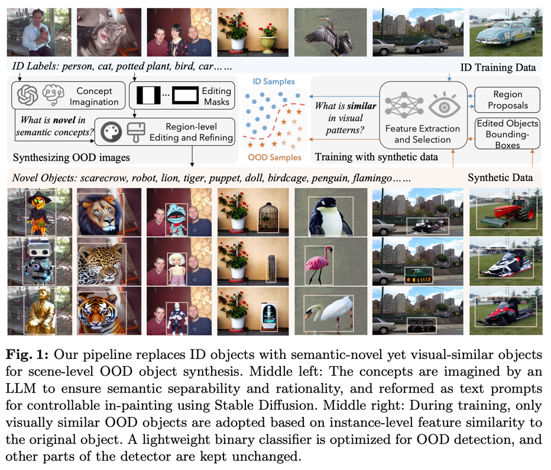
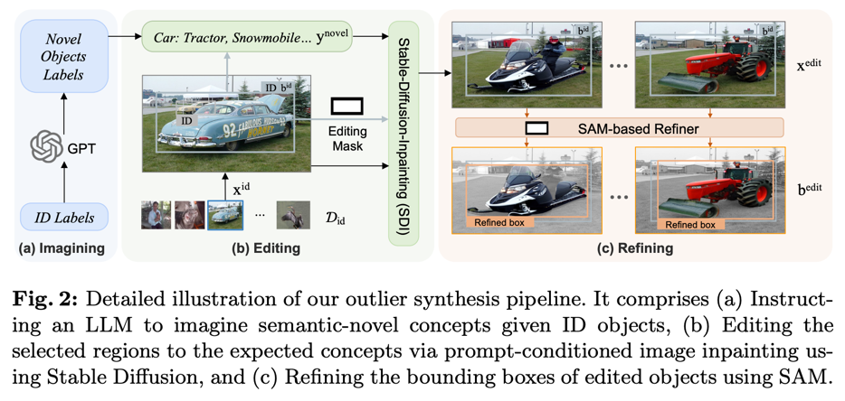
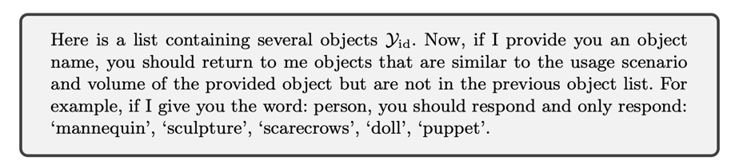
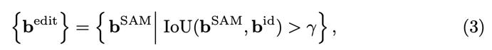
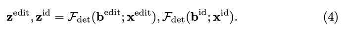
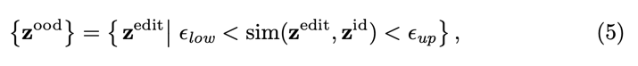
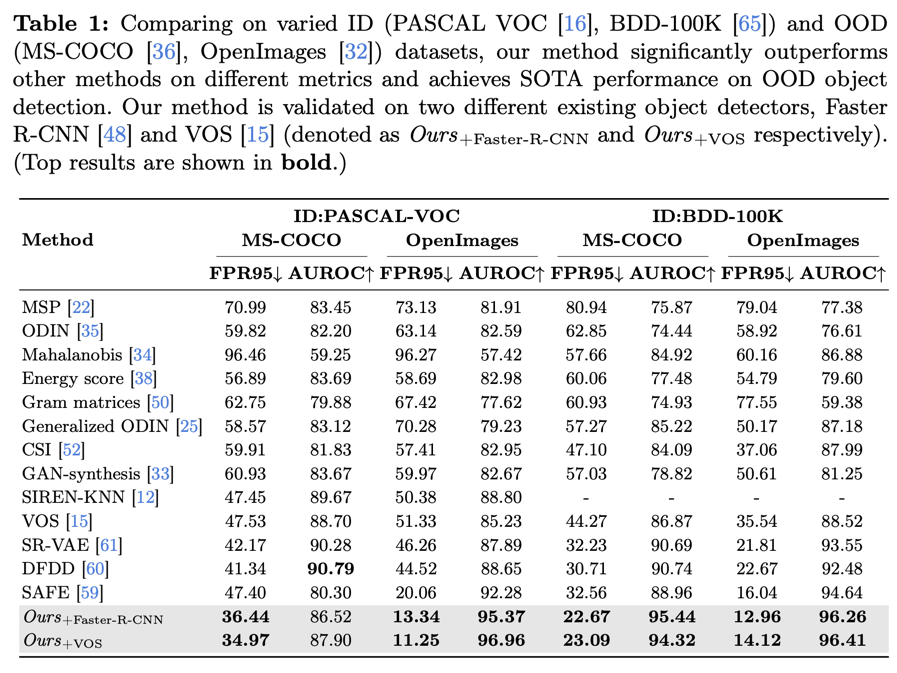
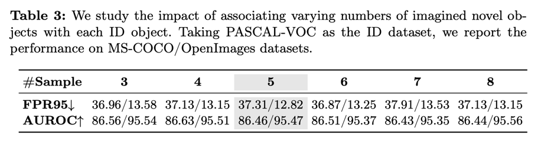
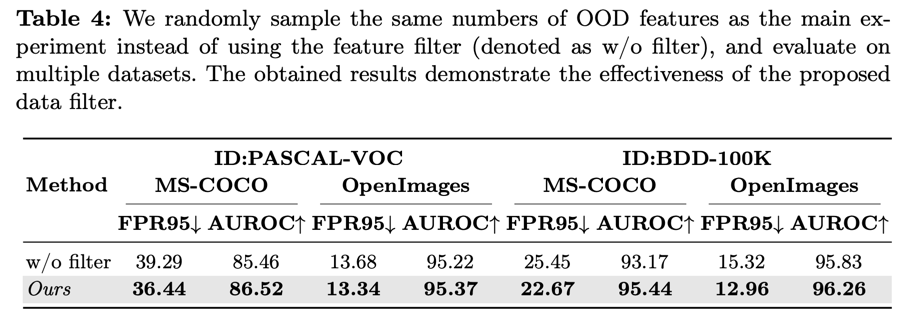
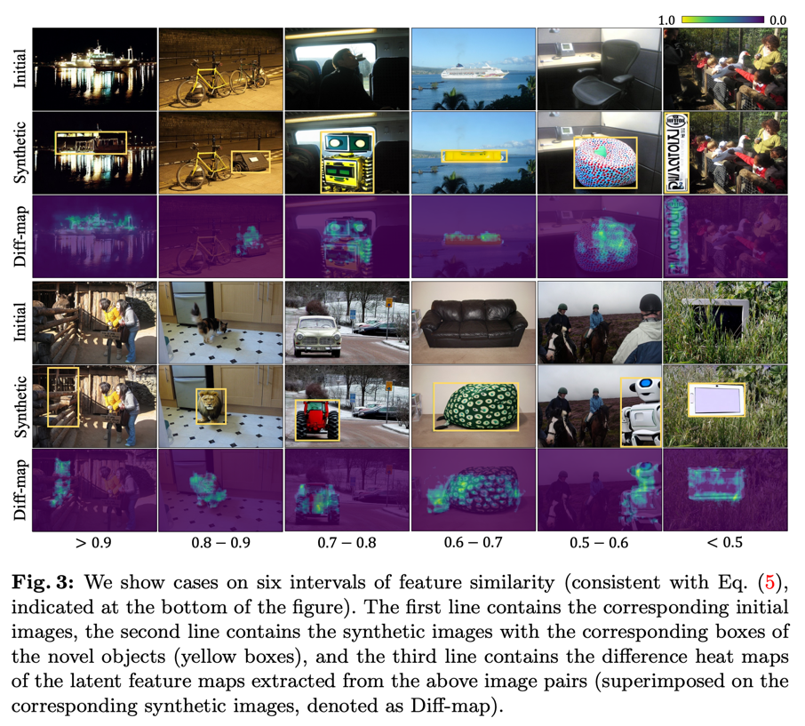

Can OOD Object Detectors Learn from Fundation Models?
---
arxiv 24.09

# Introduction

기존에 OOD에 synthetic data를 사용하는 연구들이 있다.  
하지만 기존에는 label이 closed-set에서 선택되어서 사용되었다.  
이 논문에서는 "LLMs to Imagine novel concepts with semantic novelty"를 사용해서 open-world synthetic data를 만들어서 사용하는 것을 제안한다.  
이 후, SAM-based Refiner를 사용하여 데이터를 정제하는 것을 제안한다.

# Method

## Synthesizing Semantic-novel Objects in Scene Images
* 입력되는 ID와 scene context와 contextual compatibility가 있는 hard OOD 샘플을 LLM(여기에서는 GPT-4)이 출력하도록 한다.
  
* Stable Diffusion Inpainting을 사용해서 객체를 변경한다.
* 이후 SAM으로 bbox를 refine한다.  
    
  이 때, IOU threshold를 두어서 위치가 많이 바뀌었거나 misalign 케이스를 제거한다.
> misalign이라는 표현은 이 논문에서 나온 표현은 아니다.  
> 생성모델에서 condition이 생성결과에 반영되지 않고 배경과 자연스럽게만 생성되는 error를 말하는 표현이다. 

## Mining Hard OOD Samples and Model Training
* 원본 데이터와 생성된 데이터의 객체영역의 feature를 뽑는다.
  
* 두 feature간의 cosine similarity를 기준으로 샘플링한다.  
  이는 context를 유지하면서 novelty를 가진 데이터만 사용하기 위함이다.
  
* 간단한 MLP로 구성된 이진분류기를 위 두 z로 학습하여 decision boundary를 정의할 떄 사용한다.

# Experiments

  

