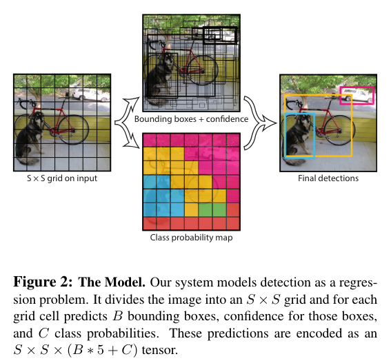
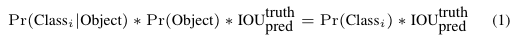
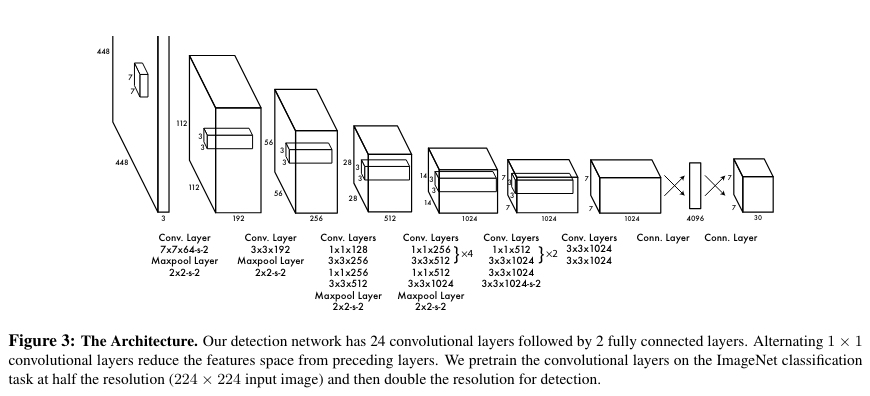
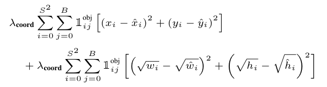
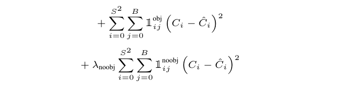
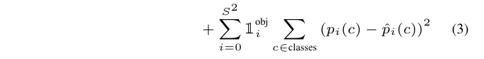
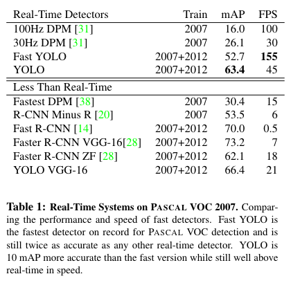
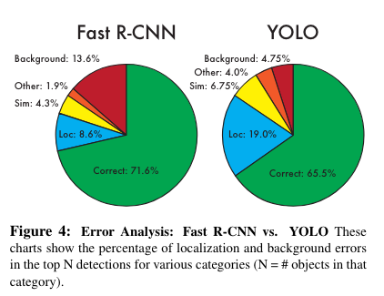

You Only Look Once: Unified, Real-Time Object Detection
===
CVPR 2015 / arxiv 15.06
### Introduction
* Classification으로 문제를 풀었던 R-CNN계열 대신 Regression으로 문제를 정의하여 bbox와 class확률을 직접 예측
* 속도 향상
* 배경 오류 감소
####
## Unified Detection
  
* SxS로 grid 나눔, 각 그리드를 중심으로 객체 탐색
* confidence = probabilities(object) * IOU 로 정의
  * 박스안에 물체가 없으면 0, 확실하게 있다면 IOU가 되도록 의도
* 각 cell별로 conditional class probabilities를 구한다.
  * 
* 최종 모델 출력 텐서는 SxSx(B*5+C)이다.

## Training
### Localization loss

* λ_coord : 배경에 해당하는 cell들이 많기 때문에 객체가 있는 cell에 가중치 (논문에서는 5 사용)
* 각 cell에서 B개의 bbox중에 confidence가 높은 1개만 학습에 사용
### Confidence loss

* λ_noobj : 객체가 없는 cell에 영향력을 줄이기 위해 사용 (논문에서 0.5 사용)
### Classification loss

## Inference
* 예측된 bbox들에 NMS 적용
  * 인접한 cell이 같은 객체를 예측하기 때문에 겹치는 bbox가 많고, 이를 삭제함 
  * 논문에서는 S=7, B=2로 설정했으니 98개가 예측됨

## Limitations
* 그리드 기준이고, 하나의 클래스만 예측하기 때문에 작은 객체에 약함
* bbox 형태가 학습셋에서 보지못한 경우 일반화 어려움
* 다운샘플링을 많이 하기 때문에 feature가 coarse함
* 작은 bbox에서 error의 영향력이 더 크기 때문에 localization이 부정확한 경우가 있다.
      
## Experiments

