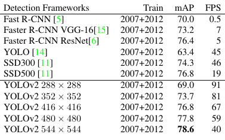
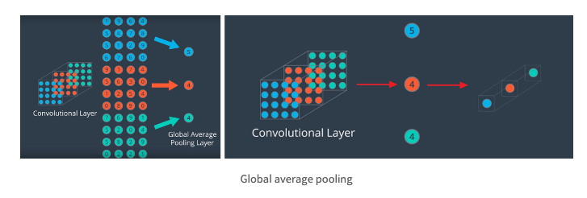
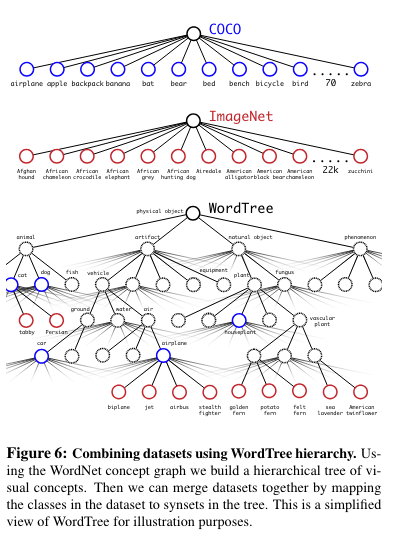

YOLO9000: Better, Faster, Stronger
===
CVPR 2016, arxiv 16.12
####
### Introduction
* classification 데이터도 같이 사용해서 더 많은 객체를 탐지하고자하는 목적

## Better
* Batch Normalization
  * 모든 conv 레이어에 batch norm을 추가
  * Dropout 레이어 제거
  * mAP 2향상, dropout 제거해도 overfitting 발생하지 않음
* High Resolution Classifier
  * pre-train시에 사용되는 입력 해상도 증가 (224 -> 448)
  * mAP 4% 향상
* Convolutional with Anchor boxes
  * anchor box를 예측하는 것으로 문제 단순화함
  * mAP : 69.5% -> 69.2%, recall : 81% -> 88%
* Dimension Clusters
  * anchor box의 종횡비를 데이터셋의 실제 bbox의 분포를 기준으로 k-means 클러스터링으로 정함
* Fine-Grained Features
  * 13x13인 feature로는 작은 물체를 예측하기 어렵기 때문에 중간 feature를 사용
  * 26x26x512 -> 13x13x2048로 만들어서 concat하여 13x13x3072로 사용
* 

## Faster
* Darknet-19
  * 마지막 레이어의 fc layer를 global average pooling으로 바꾸어서 파라미터 감소
  * 
* Training for classification
  * 백본을 ImageNet으로 학습
* Training for detection
  * 이후 전체를 coco와 voc로 학습

## Stronger
* Joint training
  * COCO와 ImageNet의 클래스 분류가 다르다. (개 / 세부 견종)
  * 때문에 이를 트리형태로 정리하여 상위 범주에 대해서 loss를 계산하도록 한다.
  * 

