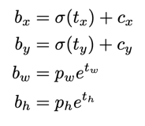
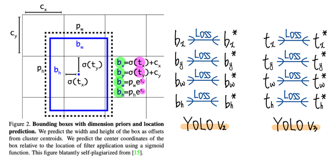
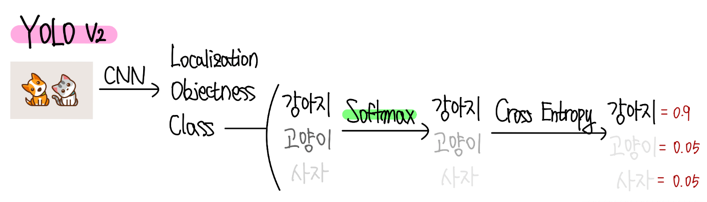
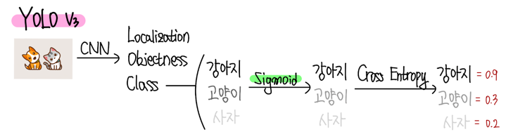

YOLOv3: An Incremental Improvement
===
arxiv 2018
####
figure 참고 : https://ffighting.net/deep-learning-paper-review/object-detection/yolo-v3/
####
### Introduction 
큰 향상의 연구는 하지 않았고, 간단한 tech report이다.

### Bounding Box Prediction
  
기존에는 모델이 예측한 offset을 bbox좌표로 변환해서 loss에 사용하였는데, 예측한 값을 그대로 사용하는 것으로 변경  

### Class Prediction
box의 내부가 multilabel일 경우, softmaxfmf sigmoid로 바꾸어서 BCE로 loss를 사용하는 것이 더 타당하다.  
                                                                 

### Predictions Across Scales

## 일단 저장
