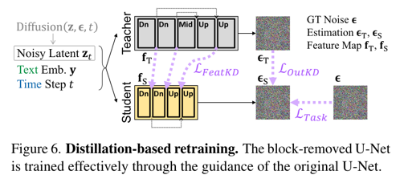
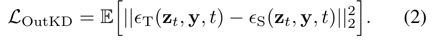
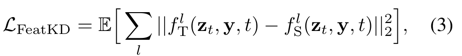
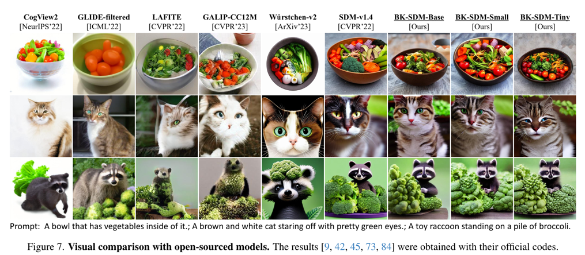
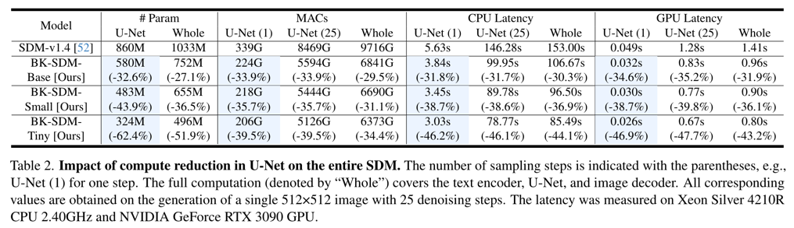

BK-SDM: Architecturally Compressed Stable Diffusion for Efficient Text-to-Image Generation
====
ICML 2023 / arxiv 23.05 / Nota AI
####
Stable Diffusion을 KD를 사용해서 Quantization하는 연구  
  
현재 SD에서 U-Net이 제일 무거운 부분이다.
                     
####
## Compression Method
### Compact U-Net architecture  
  
* Fewer blocks in the down and up stages  
  * 각 block에서 2번째 residual-attention을 제거,
  * Up satge에서는 skipp-connection을 사용해야하니까 3번째는 남겨둠
* Removal of the entire mid-stage
  * mid stage가 생각보다 중요한 역할을 하지 않는다는 발견을 근거로 제거함
    * 동저자의 "Cut inner layers" 논문에서 논의됨  
    * 
  * 성능과 약간의 trade-off가 있다고 한다. (표2)
* Further removal of the innermost stages
  * 큰 resolution에서의 영향력이 크기 때문에 아예 가장 안쪽 layer를 제거함
  * 

### Distillation-based retraining

* task loss
  * 기존 diffusion loss와 동일 
  * 
* Out KD loss
  * U-Net의 최종 출력 비교
  * 
* Feature KD loss
  * 레이어간의 중간 feature 비교
  * 

### Results

