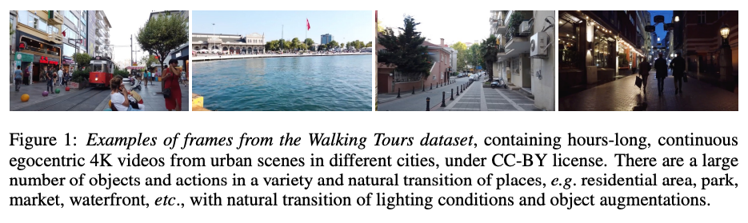
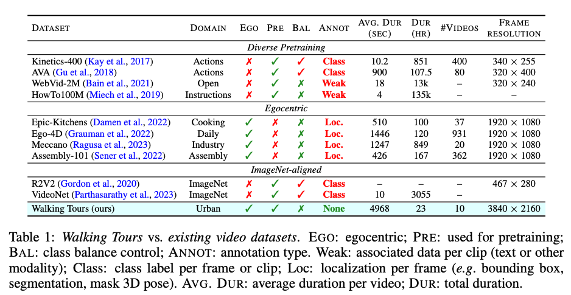
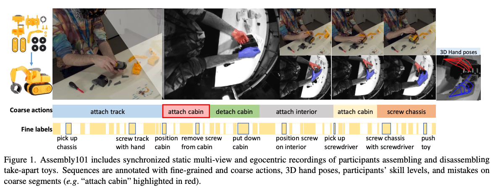
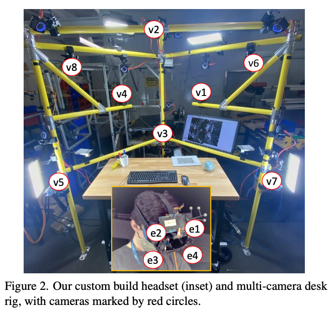
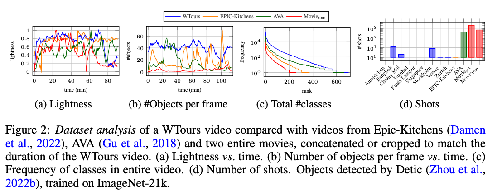
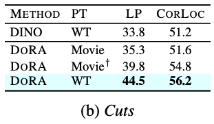
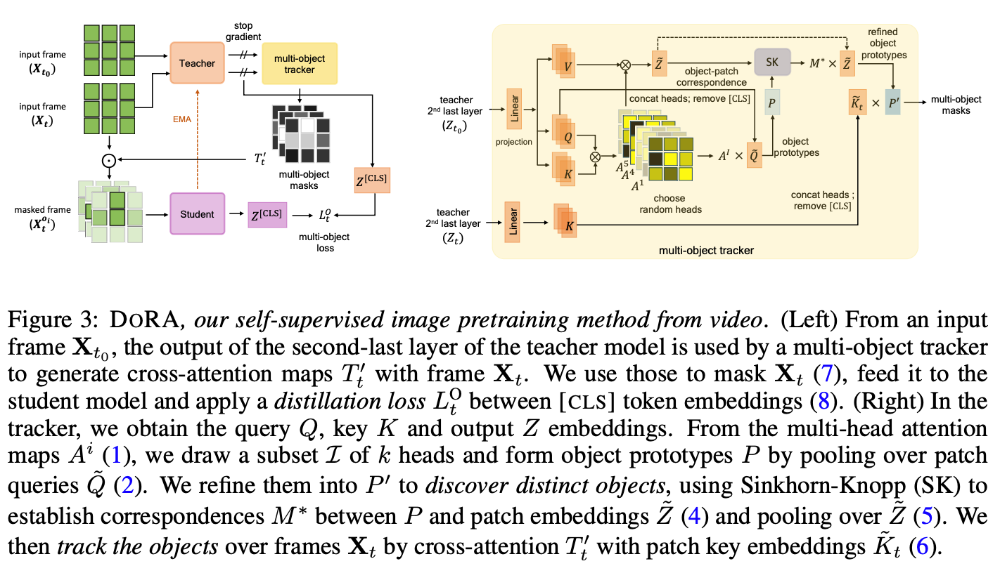

Is ImageNet worth 1 video? Learning strong image encoders from 1 long unlabelled video
===
ICLR 2024, arxiv 23.10  
####
사람이 시각 시스템을 배우는 것은 수면을 기준으로 구분된 영상을 통해 배운다고 생각할 수 있다.  
* 편집되지 않은 1~3시간짜리 walking tours dataset을 제안한다.  
* 객체 중심이 아닌 이 영상을 통해 self-supervise 학습을 하는 DoRA를 제안한다.  

이렇게 했을 때 "tracks to learn to recognize"한 end-to-end 학습이 가능하다.  
***
## Walking Tours Dataset  
### Dataset collection and properties  
  
* 유투브에서 수집한 60프레임 4k 여행 영상 10의 사파리 영상부터 다양한 도시에서 촬영된 영상  
  * 각 영상안에는 여러 객체와 행동들이 묘사되어있다.  
  * 시간에 따른 조명이 자연스럽게 점진적으로 변화한다.  
  * 도심>시장, 주거>공원 등으로 장소의 전환이 자연스럽다.
  * 자세, 물체의 상대적 위치, occlusion 등의 자연스러운 다양한 augmentaion이 적용되어있다.  

이러한 점들이 이 데이터셋의 매력적인 요소이다.  
당연하게도 이것들에 대한 labeling은 거의 불가능하기 때문에 un-supervised로 학습해야한다.  
####
### Comparison with other video datasets  
  
* 기존에는 대부분 짧고 저해상도 영상이다.  
* 기존 ego centric 데이터는 길고 고품질이긴 하지만 상당한 수작업이 들어간다.  
  * 
  *   
* 기존에 walking tour 영상도 있긴한데 공개되어 있지 않고, self-sup도 아니다.
####
### Dataset analysis  
  
* 기존 데이터셋들에 비해서 점진적인 밝기 변화를 가진다.  
* 다른 데이터셋보다 클래스나 객체 수가 더 많다.  
  * 이로 인해 다른 데이터셋보다 더 풍부한 의미론적인 내용을 포함하고 있다.
* 장면에 전환도 다른 데이터셋보다 현저히 적다.  
  * 장면 전환이 적다는 것은 그만큼 object tracking에 유리하다는 것이다. 영화 데이터셋으로 비교해본 결과 성능의 차이가 있음을 확인했다.
  *   
####
## Attention-based Multi-object tracking  
  
### Preliminaries  
* t0, t시점의 프레임이 입력 > hw/p^2개의 패치로 분할
* 여기에 CLS 토큰을 붙여서 총 n+1개의 embedding을 사용
* DINO를 따라서 EMA update
### Discovering objects with muli-head attention  

