DASO: Distribution-Aware Semantics-Oriented Pseudo-label for Imbalance Semi-Supervised Learning
===
SSL은 unlabeled 데이터의 분포를 알 지 못한다.
그런데 기존 연구들은 unlabel 데이터의 분포를 label과 같다고 가정한다.
하지만 이러한 가정은 실제 시나리오에서는 보장되지 않는다.

따라서 이 논문은 이러한 가정을 사용하지 않고 bias를 완화하는 방법을 제안한다.

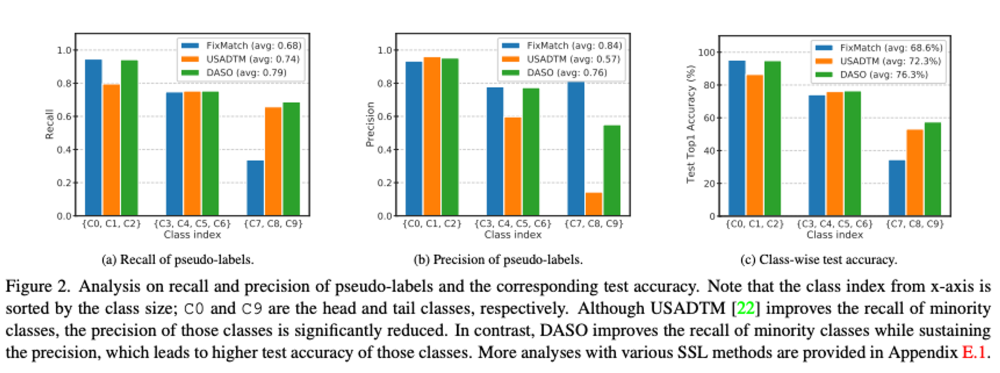

c0~c9으로 갈수록 데이터 양이 적은 클래스이다.

- Linear Classifier (FixMatch)
    - tail에 해당하는 데이터에 대해서 Recall은 낮은데 Precision이 높다.
    - 이는 미탐이 많다는 의미이고, 이는 불균형 데이터에 대해서 잘 대응하지 못하는 결과이다.
- Similarity Classifier (USADTM)
    - 반대로 tail에 해당하는 데이터에 대해서 Recall은 높고 Precision은 낮다.
    - 이는 오탐이 많다는 의미이고, 반대로 minor class에 대해서 편향되었다는 말이다.

  > 내 생각…                   
  Similarity Classifier로 protonet과 USADTM을 언급하고 있다.    
  protonet은 contrastive, USADTM은 triplet loss를 사용하고 있다.      
  이 경우 major class가 positive로 계산될 때보다 negative pair로 계산되는 횟수가 더 많다.     
  이로 인해서 major class에 대한 similarity를 낮게 보도록 편향되어 학습이 된 것 같다.

그래서 이 논문에서는 이 두가지를 잘 혼합하는 방향으로 연구를 진행한다.

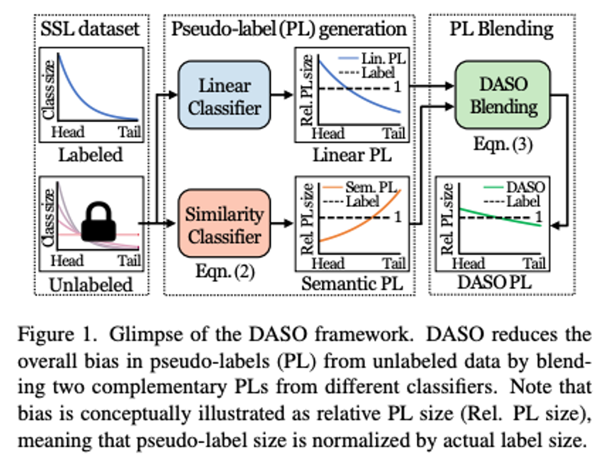

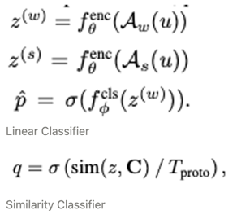

### Balanced prototype generation

불균형한 클래스로 인해 프로토타입까지 bias될 수 있다.
저자들은 이를 예방하기 위해 2가지 방법을 사용한다.

1. 고정된 prototype 큐 사용
   Similarity Classifier에서 class prototype set을 사용한다.
   각 class에 대한 고정적인 크기의 큐를 준비한다.

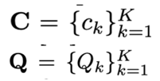

   각 c_k는 Q_k의 평균으로 만들어진다.
   큐가 다 차게되면 오래된 것부터 버린다.
   이렇게 했을 때에 각 c_k는 동일한 양에 데이터로 부터 구해지기 때문에 bias를 예방할 수 있다.

2. EMA 사용
   인코더를 EMA로 학습한다.

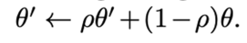

### Distribution-aware blending

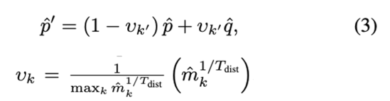  
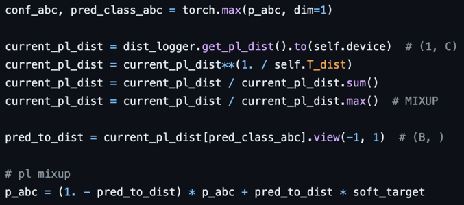    

최근에 최종적으로 결정된 p^’들이 모여있는 것이 mk, 코드상에 dist_logger이다.
최근에 p^’들을 기준으로 많이 분포되어있을 수록 v_k는 1에 가깝게 설정된다.
즉, 많은 분포의 데이터일 수록 similarity(=semantic) classifier의 결과의 비중을 늘려준다.

### Semantic alignment loss

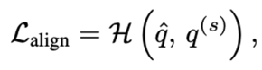

각각 soft augmentation, strong augmentation을 준 경우의 feature에서 similarity classifier 결과이다.
이 둘을 align하여 similar한 샘플은 similar한 feature을 가지게 한다.

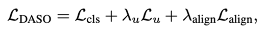

## Experiments

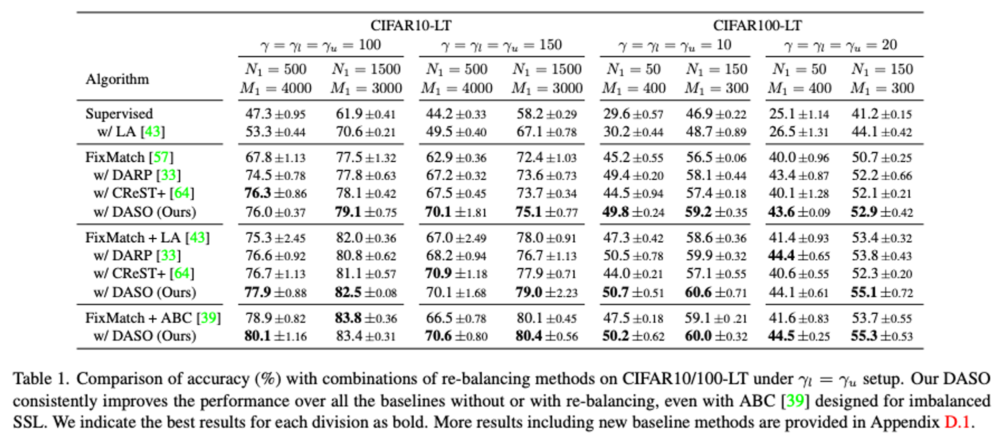

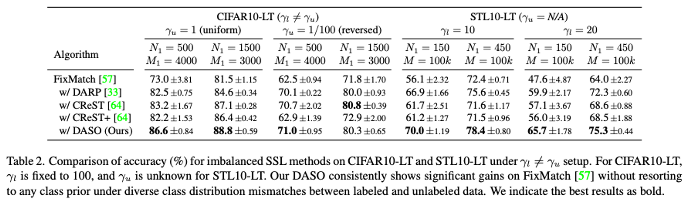

labeled와 unlabeld의 분포가 같은 경우와 다른 경우에 대해서 실험하였다.
N1은 labeled에서 head클래스에 해당하는 데이터 갯수 (M은 unlabeled)
감마는 max_k/min_k이다. 1이면 밸런스하다는 의미

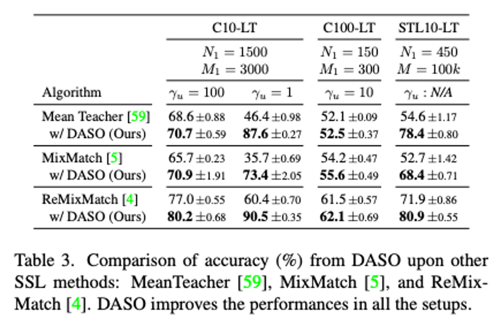

다른 모델들에도 적용할 수 있다.    

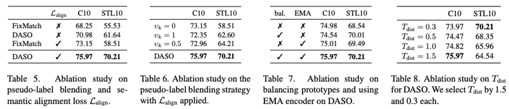

5. FixMatch는 similarity classifier를 사용하지 않은 경우
6. v_k를 dynamic하게 하지 않은 경우
7. 큐를 사용하는 경우와 EMA를 사용하는 경우
8. 하이퍼파라미터 튜닝

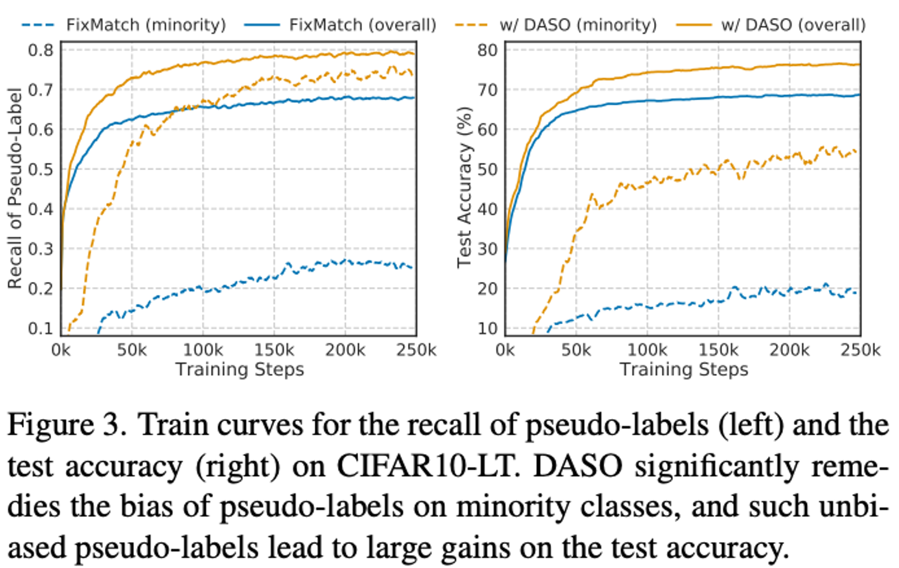

Recall과 Accuracy 측면에서 모두 좋다.
minority는 tail쪽 20%의 클래스에 대해서만 테스트한 결과이다.

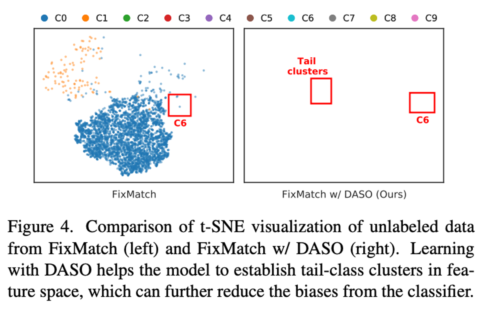

뭔가 이상한 그림이 있는데, 오류가 있는 것 같다. (arXiv에도 이렇게 되어있음, v1에는 이 그림이 없음)
그래서 찾아보니 논문 설명하는 블로그에서 발견하였다.

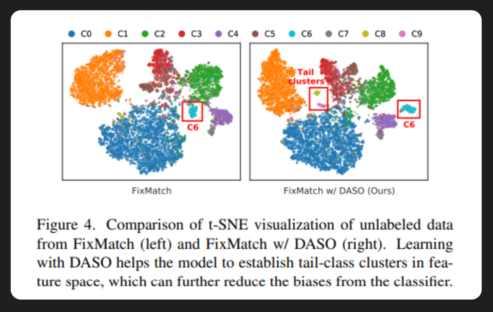

tail에 해당하는 c8, c9이 FixMatch에서는 퍼져있었는데, DASO에서는 구분되었다.
