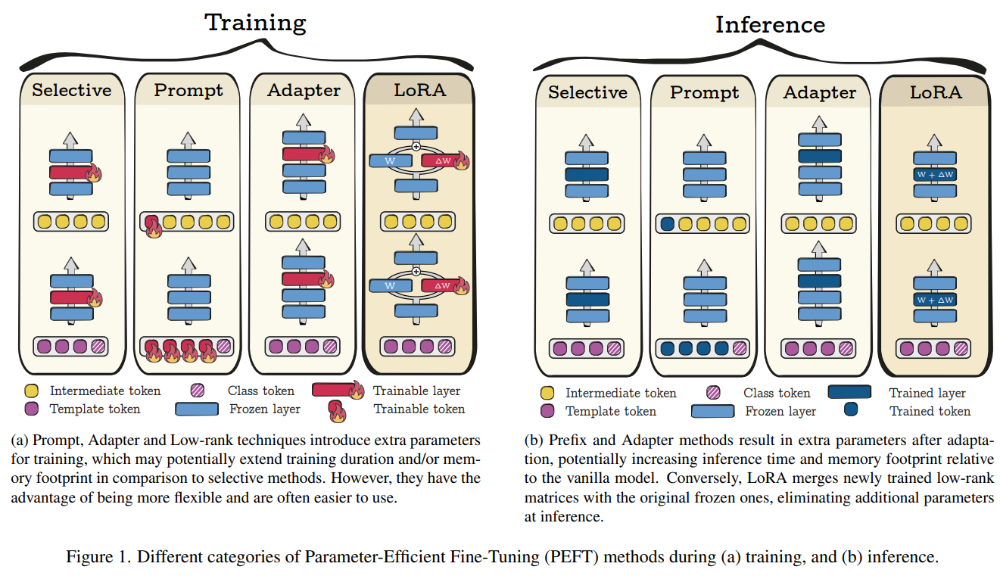
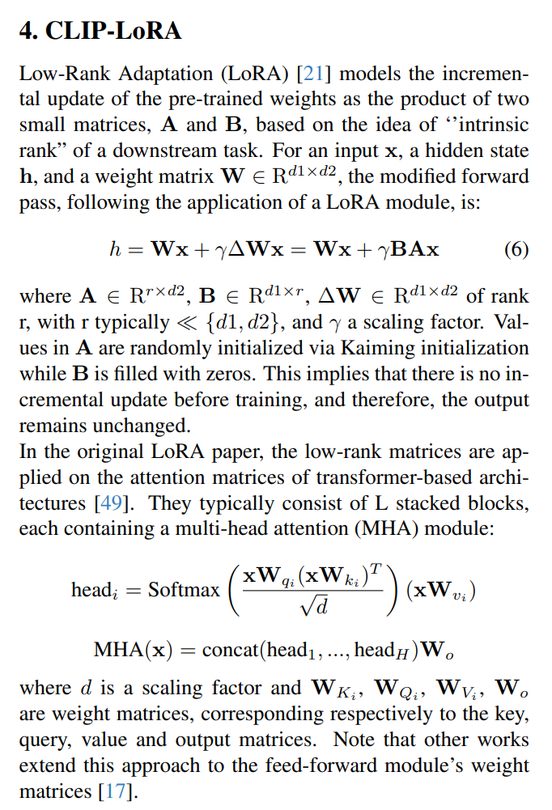
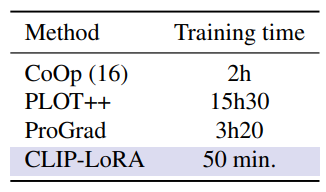
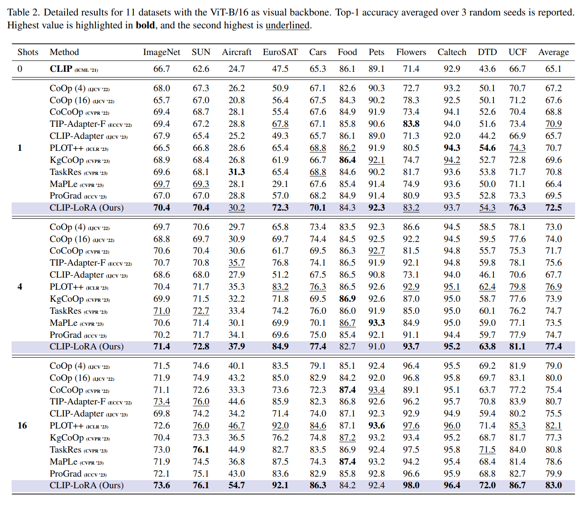
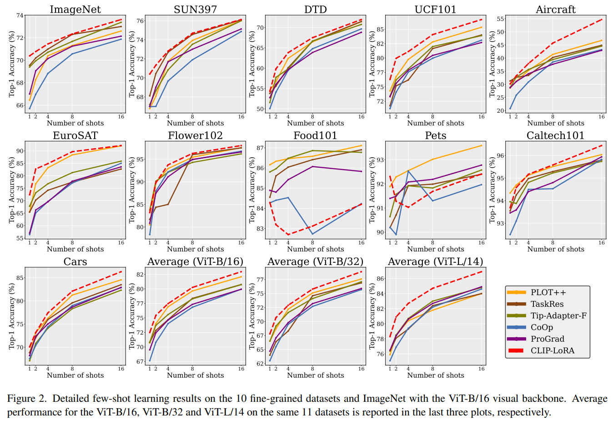

Low-Rank Few-Shot Adaptation of Vision-Language Models
===
CVPR 2024, 24.05 

# Introduction
  
[CLIP](../CLIP/main.md)을 특정 domain이나 task에 맞게 사용하려는 수요는 계속 있다.  
1. Selective
    * 특정 레이어만 학습하는 것인데, 당연히 catastrophic forgetting을 막기에는 역부족이다.
2. Prompt
    * 모델은 건드리지 않고 추가적인 token을 optimize하는 것인데, 아무래도 optimize가 잘 안된다.
3. Adapter
    * 레이어를 추가해서 해당 레이어만 학습하는 방식인데, 하이퍼파라미터에 의존적이다.
> 내 경험상 Adapter가 저렇게 직렬로 추가하는 것보다는 encoder쪽에 추가하는 형태를 대부분이였던 것 같다.
4. LoRA
    * NLP쪽에서도 PEFT라고 똑같은 맥락으로 LLM을 사용해보려는 시도들이 있다. 하지만 LoRA가 나오면서 민주화되버렸다.  
    그래서 우리도 LoRA로 CLIP을 tuning하려고 한다.  

# CLIP-LoRA
  
> 사실 CLIP알고 있고, LoRA를 알고 있다면 딱 생각한 그대로이다.  
> 진짜 simple하면서도 CLIP fine-tuning 계열 중에선 가장 reasonable한 것 같다.  

  
심지어 학습속도도 빠르다

# Experiments
  
  
