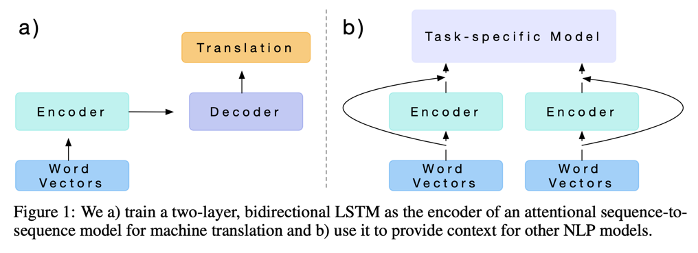
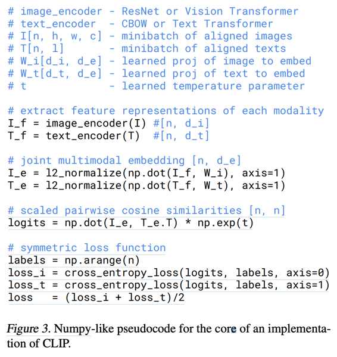
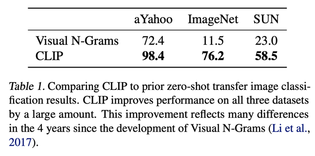
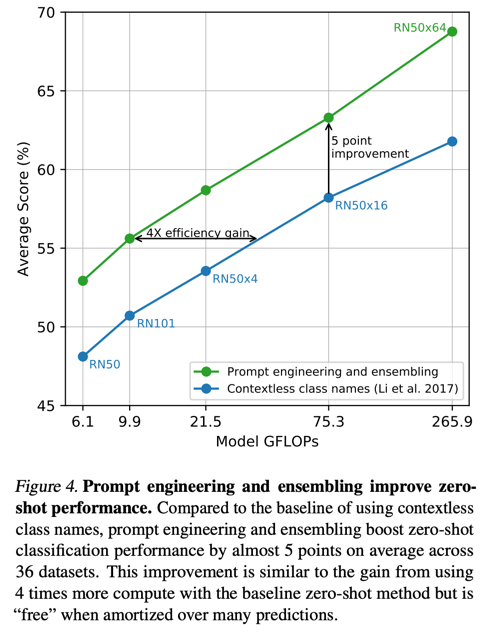
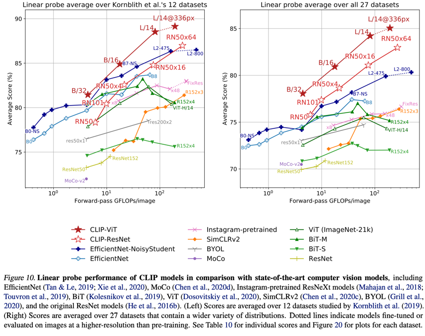

Learning Transferable Visual Models From Natural Language Supervision
===
ICML 2021 / arxiv 21.03 / 12996 citations (24.04.09 기준)
####
## Introduction
* 단순히 label을 사용하는 것을 넘어 text를 기준으로 이미지를 학습하겠다.  
* Contrastive learning을 통해 4억 쌍의 데이터를 학습한다.  
####
## Aproach
### Natural Language Supervision  
  
* Learned in Translation: Contextualized Word Vectors(2017)
* 이 논문은 Vision의 백본과 같이 NLP에서도 embedding space를 활용할 수 있다는 것이다.  
* 이를 위해서 웹 크롤링된 방대한 자연어를 학습하는데, 이를 통해 "표현"을 학습하고 zero-shot transfer가 가능하게끔 한다.  
* 즉 CLIP에서 하고 싶은 것은 NLP와 Vision의 embedding space를 하나로 통합하는 것이다.  
####
### Creating a Sufficiently Large Dataset  
기존 데이터셋은 양이 적거나 텍스트가 파일명이나 메타데이터로 되어있다.  
그래서 500,000개의 쿼리로 쿼리당 최대 20,000개를 크롤링해서 데이터셋을 구축했다.  
####
### Selecting an Efficient Pre-Training Method
  
각 encoder에서 나온 feature의 유사도를 사용해서 Contrastive learning을 한다.  
이를 통해 각 modal에 대해 동시에 align된 encoder를 얻을 수 있다.  
기존의 Image captioning같은 text를 GT로 예측하는 학습과는 다음과 같은 차이가 있다.  
* 밀고 당기는 과정에서 이미지와 텍스트의 개념적인 연관성을 더 잘 학습한다.  
* vocabulary space 크기에따른 영향이 없기 때문에 효율적이다.  
* downstream task에서 활용하기 용이하다.  
####
## Experiments  
* τ=0.07에서 시작
* minibatch size : 32768
* ResNet 50x64는 v100 592개로 18일
* ViT는 v100 256개로 12일
* class 갯수 : 32768
####

####
자연어를 바로 사용하기 때무에 단순히 class이름으로만 하는 것은 문제가 있다.    
흔히 알고 있는 crane(건설용, 학)이나 boxer(개 품종, 운동선수)가 대표적인 예이다.  
이를 해결하기 위해 Pets데이터셋은 "A photo of a {label}, a type of pet."과 같이 추가적인 설명을 해준다.  
위성 이미지의 경우는 "A satellite photo of a {label}"을 사용한다.  
  
####

