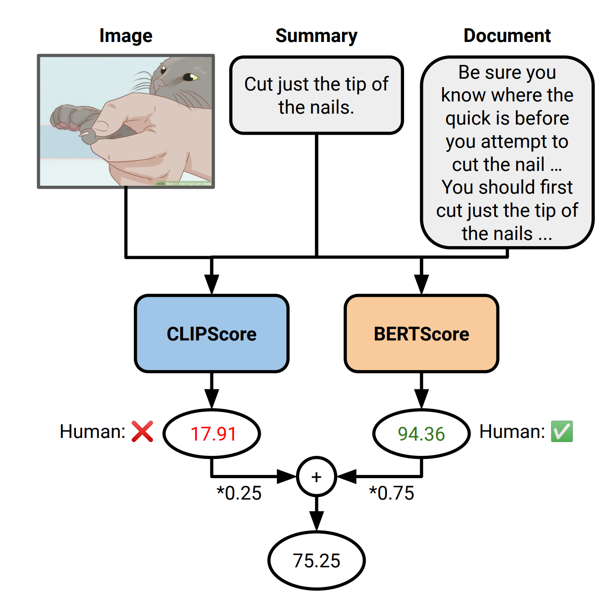
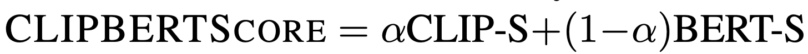
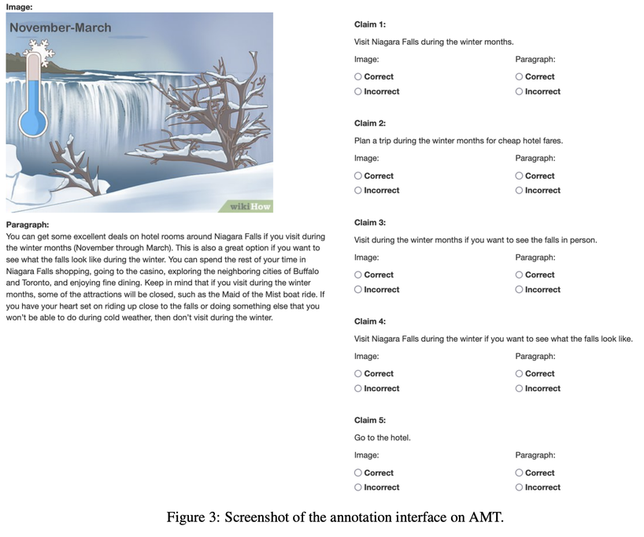
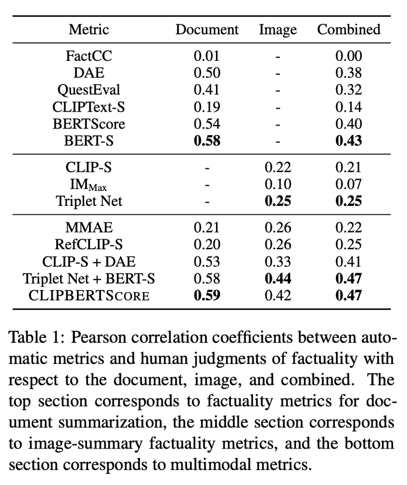
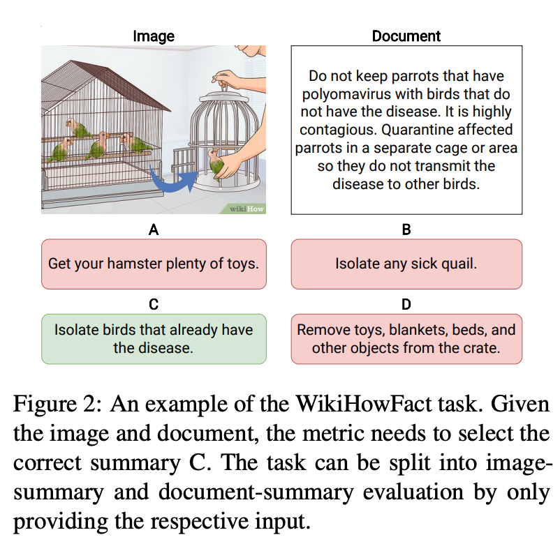

they want to measuring both relation of image-text and text-summarization.
It’s weighted combination of their proposed CLIPBERT score.

1. they propose multimodal summarization metric based on a combination of CLIPScore and BERTScore

2. create MuFaME benvhmark

3. present detailed study of their metric and factuality metric evaluation banchmarks and present strong empirical evidence of its robustness

4. demonstrate two useful dowstream

    a. Multimodal Visual Guidancechoose a picture that best represents description

    b. Self-Critical Sequence Training with CLIPBERTscore Rewardoffer clipbertscore as a reward for reinforcement learning

* Multimodal Factuality Meta-Evaluation (MuFaME) benchmark

they use WikiHow summarization dataset.
this dataset has been extensively studied for document summarization.

Summarization model

document summarization model : T5, PEGASUS
multimodal summarization model : CLIP-BART, MOF

* Human judgments

They used AMT to prove the validity of their metrics.

* WikiHow Factuality task

they propose this task that evaluates how well the metric can choose the correct summaries over incorrect ones.
 

