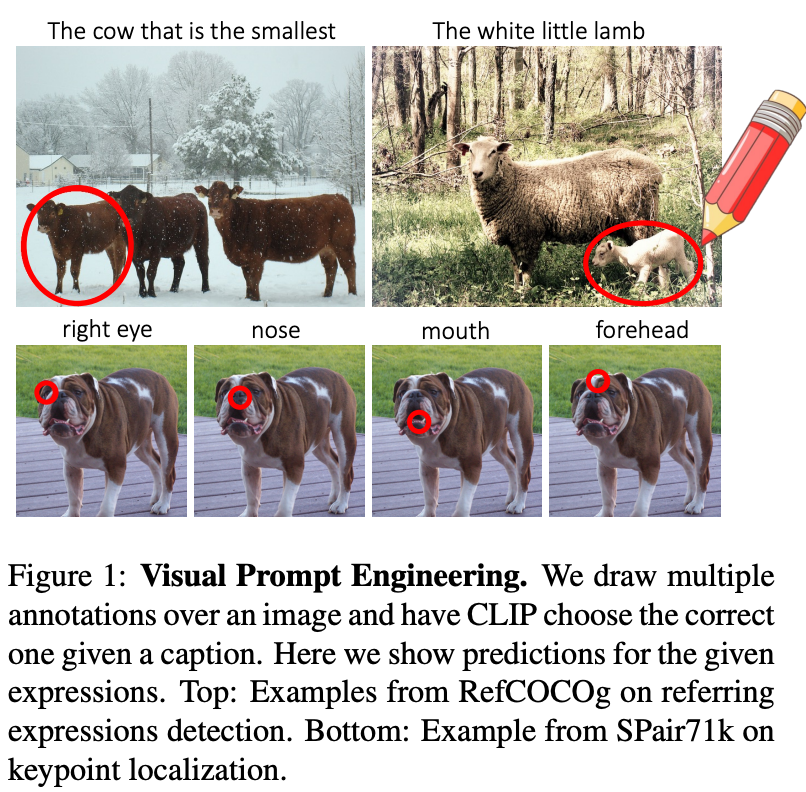
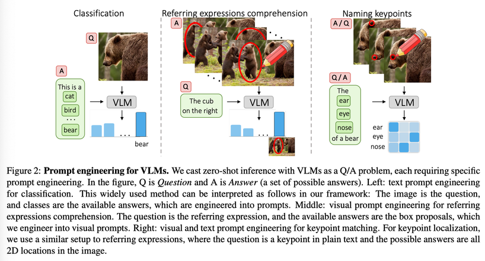
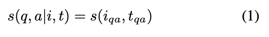
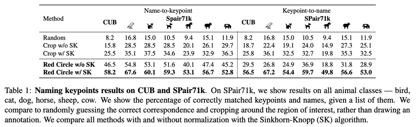
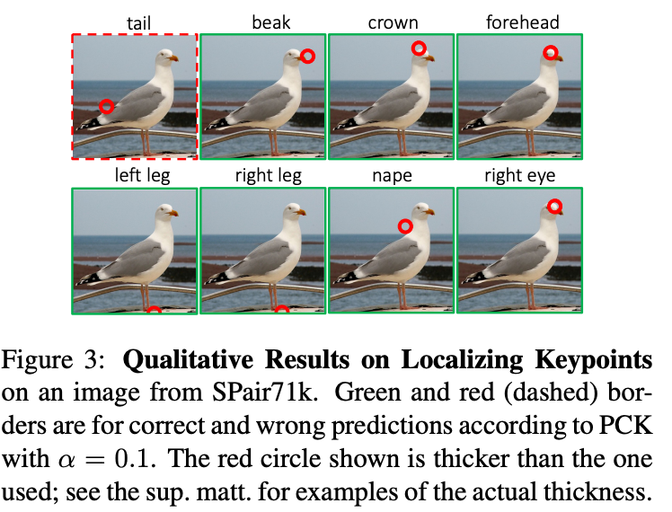
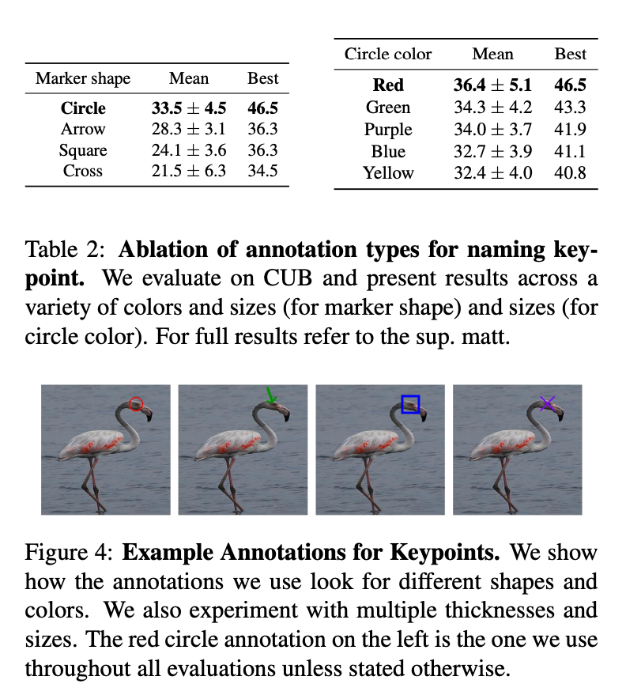
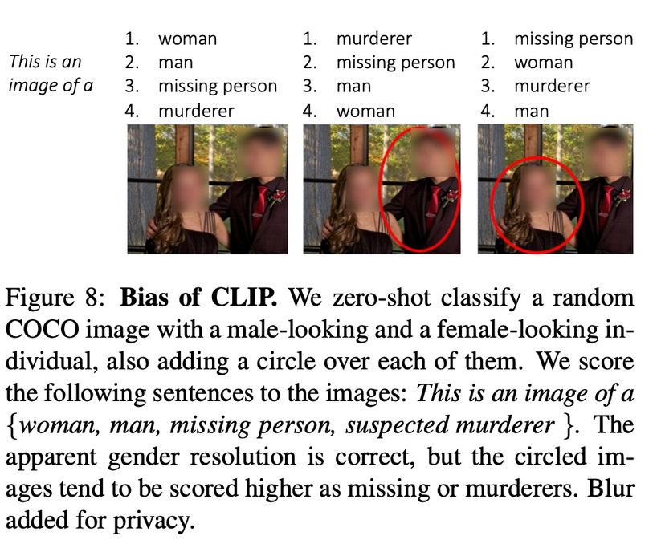

Motivation 1: I've never heard the phrase "visual prompt engineering". So I was intrigued.

Motivation 2: This method is better than just cropping when calculate the similarity between vision and text.

## Introduction

they discovered an emergent ability of CLIP, where, by simply drawing a red circle around an object, they can direct the model’s attention to that region.

this method is one of the “Visual prompt”
they said marking is better than cropping the object.
because this method can preserve background information.

when training VLMs, there are many images are marked by red circle  in the train dataset.
so, CLIP was learned “red circle is important object!”

but this have problems.
for example marking on person, than model would characterize the person as a criminal or as a missing person.

## Prompt engineering

VLM can be used for zero-shot classifications that don't require fine-tuning.

for example, Q is “is there smoke coming out of your car?” and A is each regions of image, than we can use the model as a smoke detector by utilizing the similarity for each area.
(this is my idea….)

another idea: Q is “this is a smoke” and A is marking by red circle which made from gt bbox. and calculate similarity to use threshold for synthetic data sampling.

### CUB is birds classification datasetthat have detail annotation about site of birds like wing or beak(부리)
           

