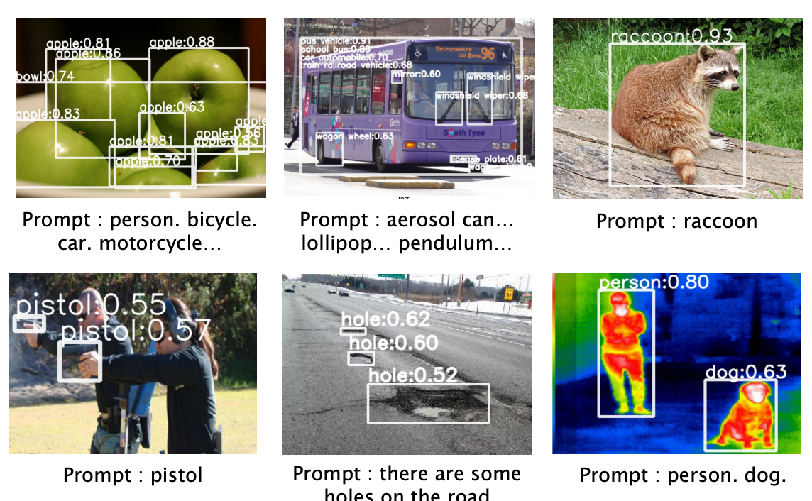
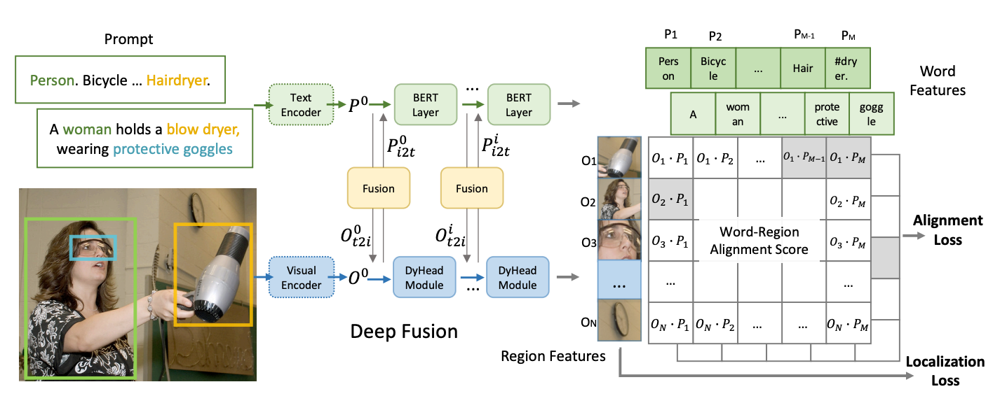
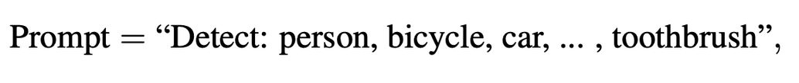
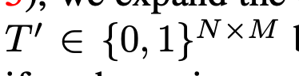
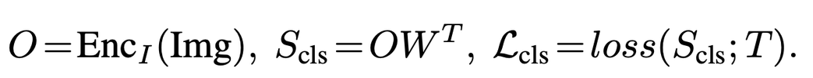
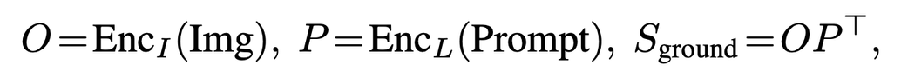
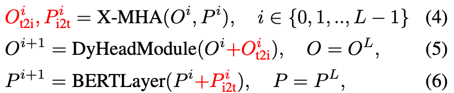
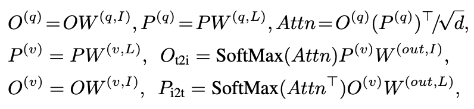
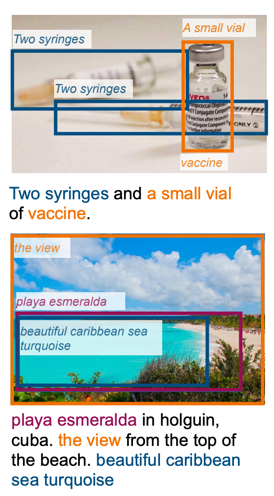
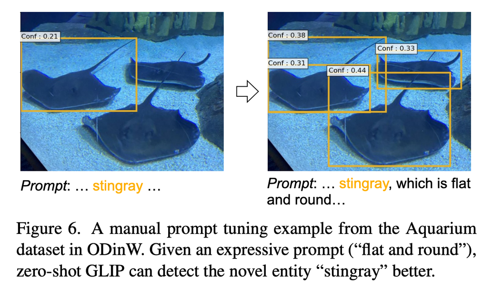

GLIP : Grounded Language Image Pretraining
===
CVPR 2021 / arxiv 21.12
###
  
prompt 기반으로 detecting을 하려는 논문  

CLIP이 open vocabulary로 할 수 있게 한 것처럼 instance 수준에서도 가능하게 하려고 한다.

기존의 Phrase Grounding이라는 task가 있고, Object Detection과의 차이는 입력으로 prompt가 들어가고, 학습된 class 중에서 고르는게 아니라는 점이다.

### 데이터 전처리

NLP-parser (NLP with python이라는 책에서 나왔다고함)을 사용해서 문장에서 명사구만 추출함
이 텍스트를 입력으로 넣게 된다.

이렇게 했을 때에 단어 갯수가 항상 많아진다.
1. traffic light 같이 두 단어로 이루어진 경우
2. toothbrush같이 합성어(?)인 경우
3. Detect: , 같은 특수 토큰
4. 맨 끝에 들어가는 [NoObj] 토큰

각 region 정보들과 명사구에 대한 binary matrix를 사용하여 match시켜서 loss를 계산한다.

### Alignment

word feature와 region feature를 cosine 유사도로 계산함

### Deep Fusion

이미지와 텍스트의 관계를 보기 위함이기에 promt의 Q를 K처럼 곱해주는 방식으로 어텐션을 계산함

### Pre-training

Grounding Data의 경우 student가 teacher를 뛰어넘을 수 있다 라고 말한다.

Teacher(=GLIP)은 사람이 만든 grounding 데이터와 디텍션 데이터로 학습한다.
이 후 웹 크롤링한 이미지-텍스트 데이터들에 대해서 pseudo label을 만든다.
Student는 이 만들어진 데이터를 포함하여 학습한다.
 

