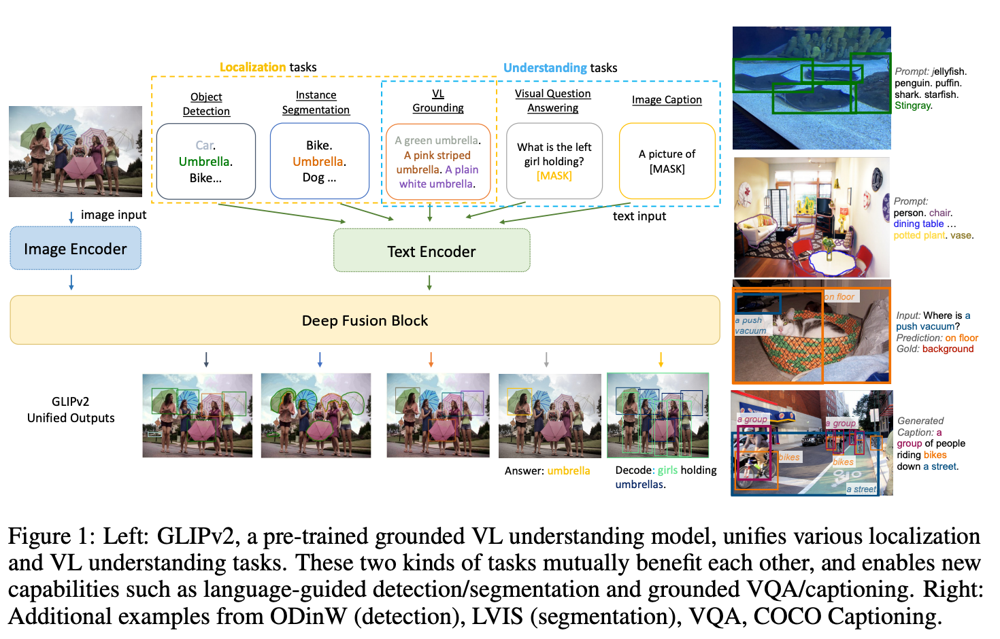
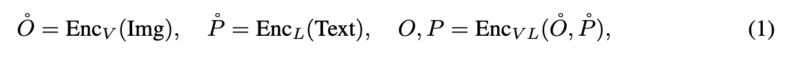
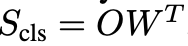
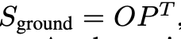
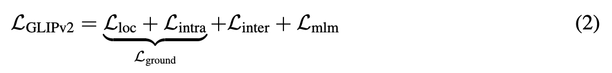
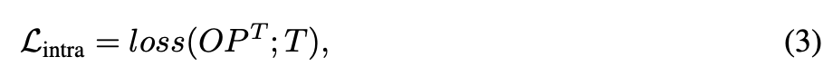
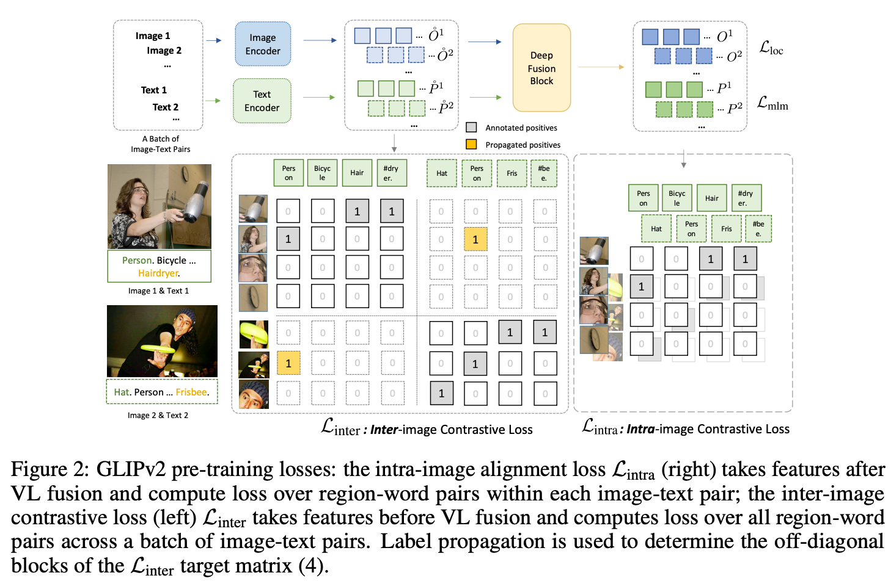
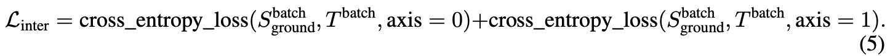

GLIPv2: Unifying Localization and Vision-Language Understanding
===
NIPS 2022 / arxiv 22.06
###
GLIPv2 = GLIP + VL understanding (VQA, image captioning…)

### A Unified VL Formulation and Architecture

it is straightforward to add lightweight task-specific heads for various VL tasks.

Following GLIP, GLIP v2 uses the classification-to-matchin g trick to unify detection and grounding.
                 

W is the weight matrix of the box classifier

their difference is the input text format
object detection : string of concatenated candidate object labels
phrase grounding : natural language sentence

### GLIPv2 Pre-training

L_ground : VL reformulation of the object detection task
L_inter : real-word contrastive loss
L_mim : standard masked language modeling loss, proposed in BERT

T : target affinity matrix

if a region is annotated as “person”, it should be a positive pair with all “person” phrase in detection type texts.
1. other “person” phrase in the batch is a positive.
2. but, “person” phrase in GT is not use positive.
   because “person” phrase in GT carry contexts that are unique to that image-sentence pair.
