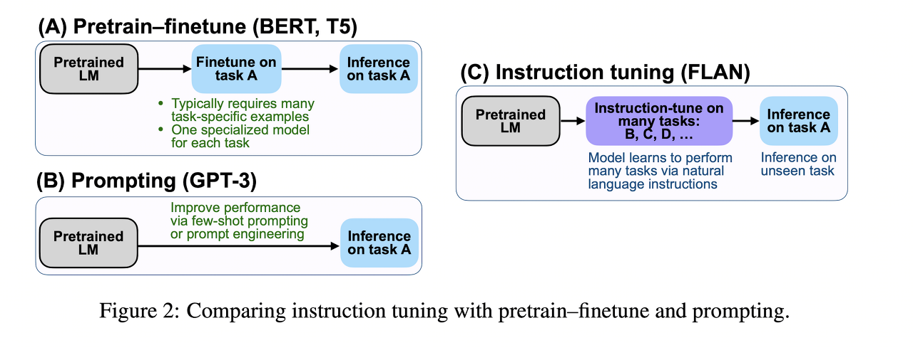
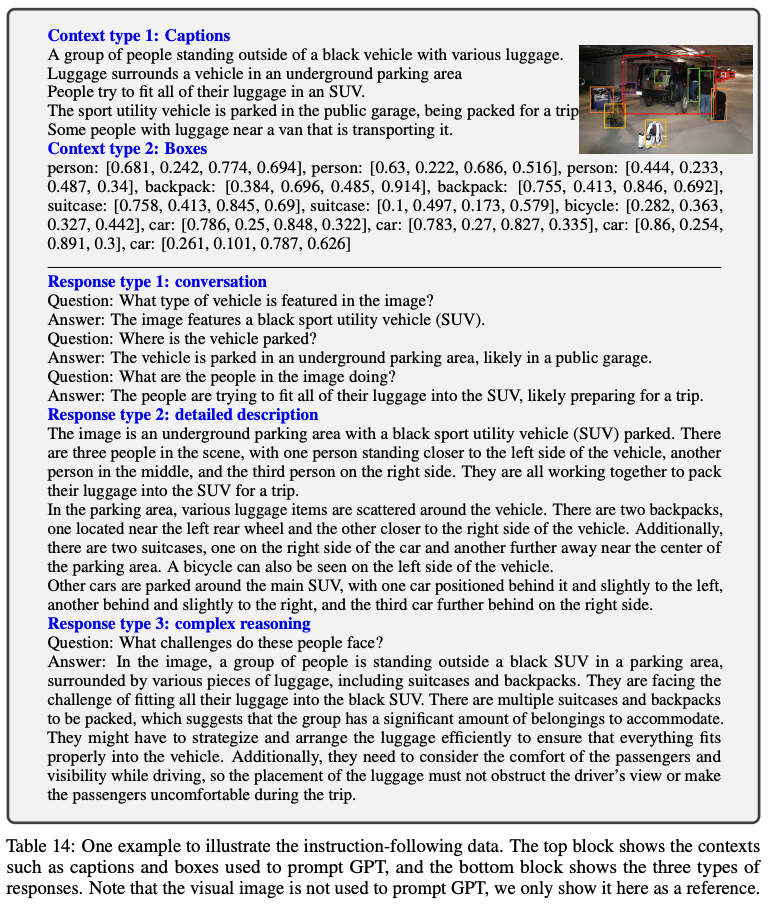
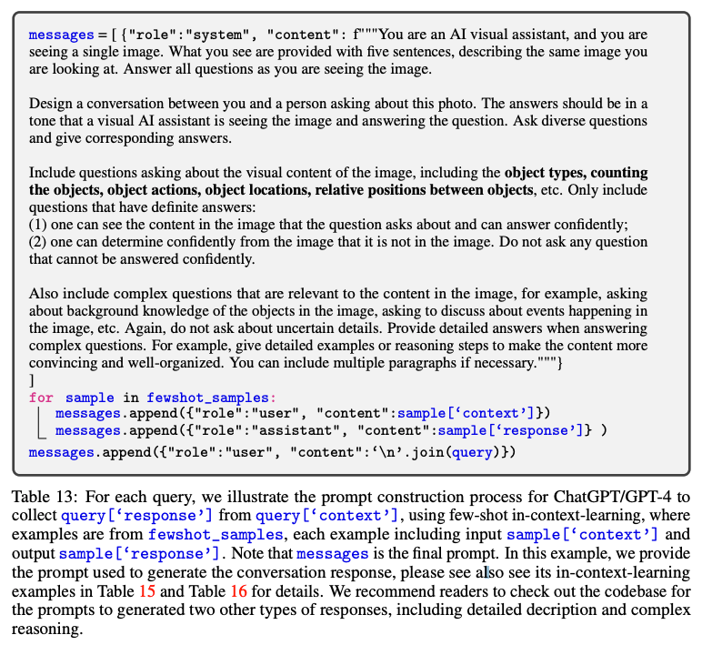
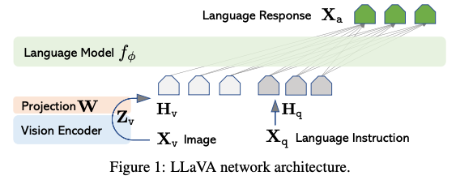
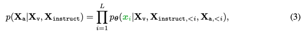
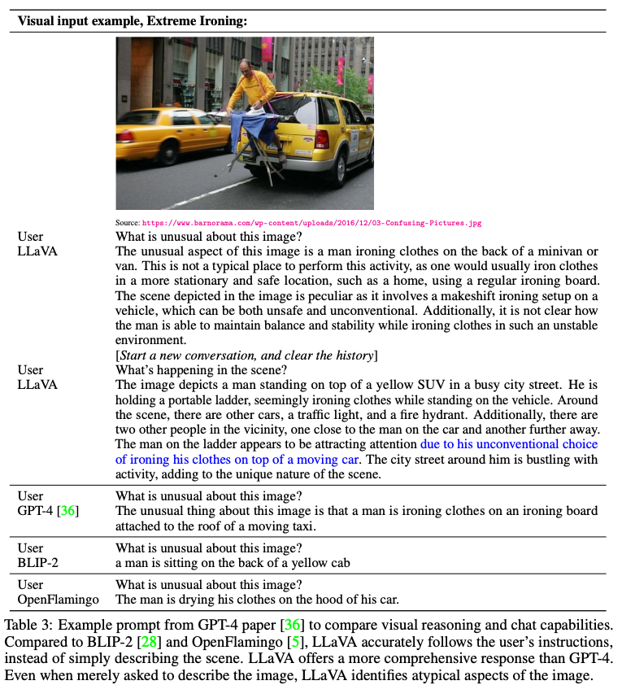
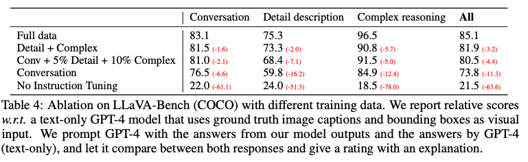
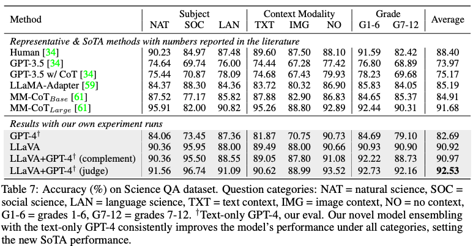
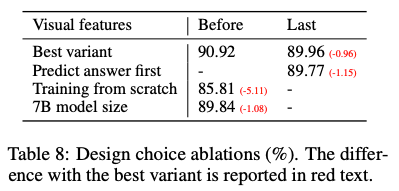

Visual Instruction Tuning
===
NIPS 2023 / arxiv 23.04 / 976 Citations (24.04.11)
####
## Introduction
multi-modal foundation model을 만드려는 노력들이 있지만 현재까지 언어는 이미지를 설명하는 것에만 사용된다.  
때문에 VQA와 같은 downstream task로의 transfer에 한계가 있다.  
이 논문은 LLaMA의 instruction-following samples에서 영감을 받아 multi-modal에 적용한 연구이다.  
####
## Related Work
### Instruction Tuning  
  
 * fine-tuning : downstream task를 위해 supervised로 추가 학습하는 것
 * prompt learning : few-shot 컨셉으로 예시 질답을 같이 입력하는 방식
 * Instruction tuning : 특정 task를 instrucion으로 표현하여 supervised로 학습한다.  

즉 Instruction을 "따르도록" 학습하기 때문에 unseen task에 대한 zero-shot 성능이 더 좋아진다.  
####
## GPT=assisted Visual Instruction Data Generation  
image-text pair 데이터셋은 많은데 instruction 데이터셋은 부족하다.  
이를 위해서 GPT를 사용하는데, GPT는 text만 입력으로 받으니 아래와 같은 트릭을 사용한다.  
COCO 데이터셋을 사용하여 객체의 bbox 정보를 활용한 것이다.  
  

####
## Visual Instruction Tuning  
### Architecture  
  
* Vision Encoder로는 CLIP ViT-L/14를 사용하며, freeze시키고 뒷단에 linear layer만 학습한다.  
* Language Model은 LLaMA를 기반인 Vicuna를 사용한다.  
### Training
각 이미지에 대한 대화 데이터가 있을 때 아래와 같이 auto-regressive training을 한다.
  
####
2 stage로 학습한다.   
1. image-tesxt feature allignment를 위해서 linear layer만 학습한다.  
    이 떄, 대화문이 아닌 간단한 설명을 하도록 한다.
   ("Describe the image concisely", "Provide a brief description of the giveen image")
2. Vision Encoder는 freeze, linear layer와 LLM을 instruction following 학습한다.
   * Multimodal Chatbot  
        위에서 만든 데이터로 fine-tuning한다.  
        대화문은 multi-turn, 다른 타입은 single-turn
   * Science QA
        질문과 context(image or text)와 객관식 답으로 이루어진 benchmark
        single-turn으로 학습하였다.  
####
## Experiments  
### Multimodal Chatbot  
  
* 80K밖에 안되는 이미지로 학습했는데 GPT-4와 유사한 결과를 보인다.
* BLIP이나 OpenFlamingo는 질문에 대한 대답이 아닌 전체적인 caption만 생성한다.  
####

정량적인 평가로는 GPT를 사용한다.  
이 논문에서 사용한 GPT로 생성된 답변은 일종에 upper bound이기 때문에 이 답변과 모델의 답변을 같인 GPT-4에 입력하여 점수를 매기게 한다.  
####
### ScienceQA
  
####
### Ablations
  
* Visual features: CLIP의 마지막 layer를 그대로 사용했을 경우 성능이 감소한다.  
    이는 clip의 마지막 레이어가 이미지의 전반적인 내용에 집중하기 때문이라고 말한다.
* Chain-of-thought: CoT를 사용했을 때 수렴속도가 빠르긴하지만 최종 성능에는 영향이 없다.  
* Pre-training: stage를 나누는 것이 성능 향상에 기여한다.
* Model size: 13B -> 7B로 모델을 줄였을때 성능이 감소한다.
